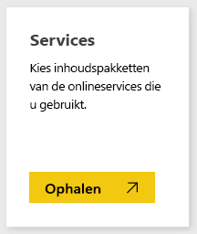
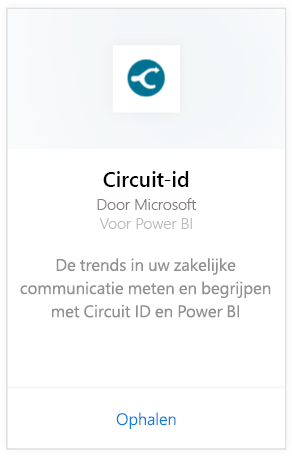
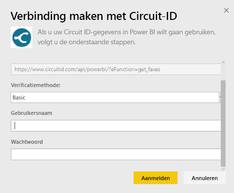
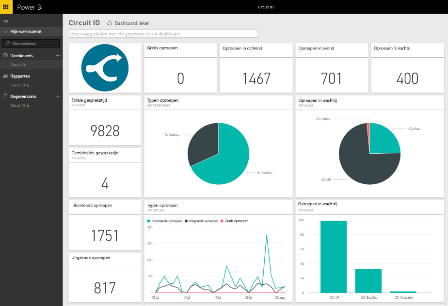

# Verbinding maken met Circuit-ID met Power BI
Het analyseren van uw communicatiegegevens van Circuit ID is eenvoudig met Power BI. Power BI haalt uw gegevens op en bouwt vervolgens een standaard dashboard en gerelateerde rapporten op basis van die gegevens. Nadat u de verbinding hebt gemaakt, kunt u uw gegevens verkennen en het dashboard geheel naar wens aanpassen. Gegevens worden elke dag automatisch vernieuwd.

Verbinding maken met het [Circuit ID-inhoudspakket](https://app.powerbi.com/getdata/services/circuitid) voor Power BI.

## Verbinding maken
1. Selecteer **Gegevens ophalen** onder in het linkernavigatievenster.
   
    
2. Selecteer in het vak **Services** de optie **Ophalen**.
   
    
3. Selecteer **Circuit ID** \> **Ophalen**.
   
    
4. Selecteer Basis en geef uw gebruikersnaam en wachtwoord op voor de authenticatiemethode. Druk vervolgens op Aanmelden.
   
    
5. Nadat de gegevens in Power BI zijn geïmporteerd, ziet u een nieuw dashboard, rapport en gegevensset in het navigatiedeelvenster aan de linkerzijde. Nieuwe items zijn gemarkeerd met een geel sterretje.
   
    

**Wat nu?**

* [Stel vragen in het vak Q&A](consumer/end-user-q-and-a.md) boven in het dashboard.
* [Wijzig de tegels](service-dashboard-edit-tile.md) in het dashboard.
* [Selecteer een tegel](consumer/end-user-tiles.md) om het onderliggende rapport te openen.
* Als uw gegevensset is ingesteld op dagelijks vernieuwen, kunt u het vernieuwingsschema wijzigen of de gegevensset handmatig vernieuwen met **Nu vernieuwen**

## Volgende stappen
[Wat is Power BI?](power-bi-overview.md)

[Gegevens ophalen voor Power BI](service-get-data.md)

