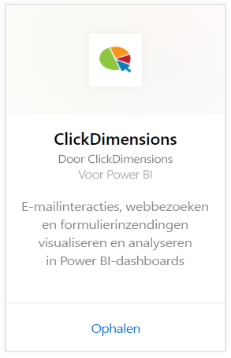
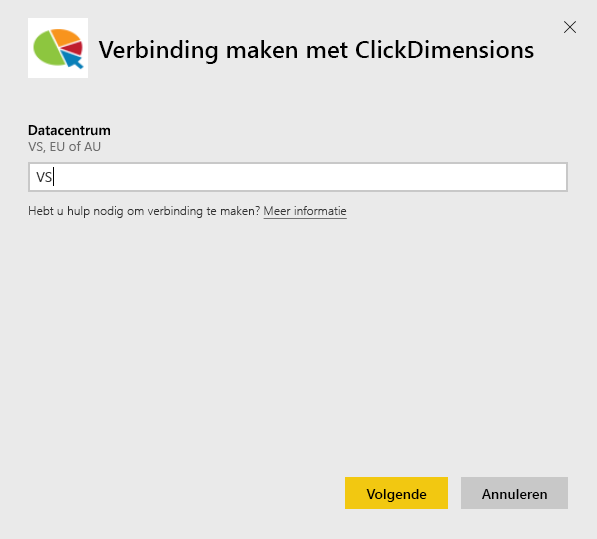
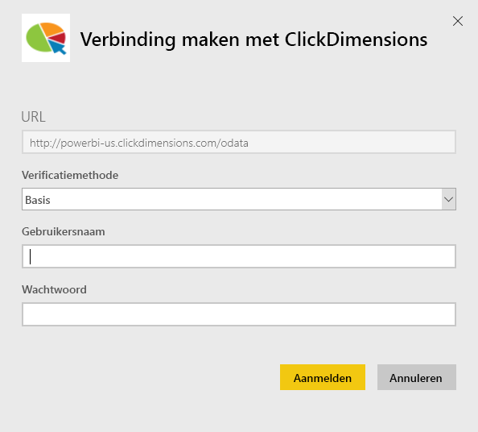
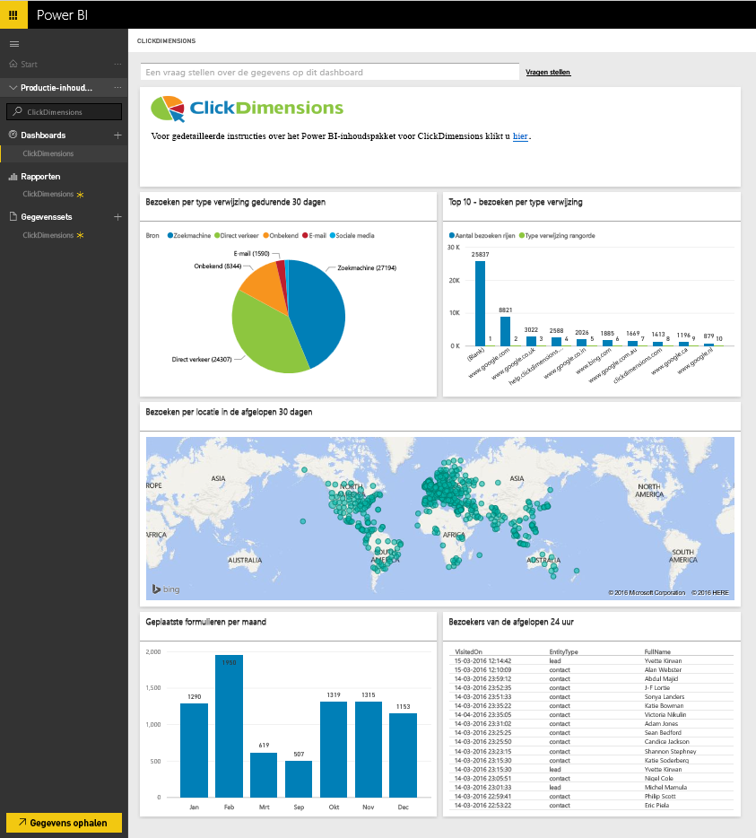
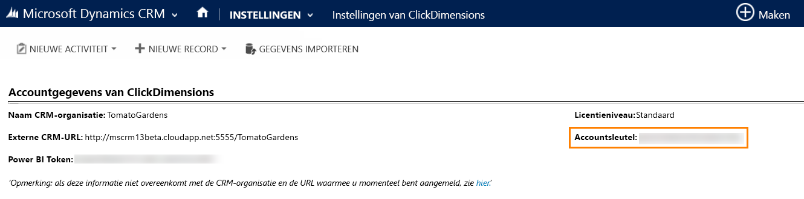
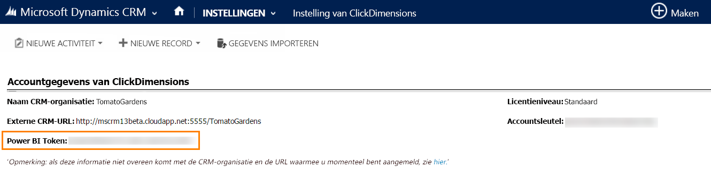

# Verbinding met ClickDimensions maken via Power BI
Met het ClickDimensions-inhoudspakket voor Power BI kunnen gebruikers hun marketinggegevens van ClickDimensions gebruiken in Power BI om managementteams meer inzicht te bieden in het succes van hun verkoop- en marketinginspanningen. Visualiseer en analyseer e-mailinteracties, webbezoeken en formulierinzendingen in Power BI-dashboards en rapporten.

Maak verbinding met het [ClickDimensions-inhoudspakket](https://app.powerbi.com/getdata/services/click-dimensions) voor Power BI.

## Verbinding maken
1. Selecteer **Gegevens ophalen** onder in het linkernavigatievenster.
   
   
2. Selecteer in het vak **Services** de optie **Ophalen**.
   
   
3. Selecteer **ClickDimensions** \> **Ophalen**.
   
   
4. Geef de locatie op van uw datacenter (VS, EU of Australië) en selecteer **Volgende**.
   
   
5. Selecteer voor **Verificatiemethode** de optie **Basis** \> **Aanmelden**. Voer desgevraagd uw ClickDimensions-referenties in. Hieronder vindt u meer informatie over [hoe u deze parameters kunt vinden](#FindingParams).
   
    
6. Nadat uw aanmelding is goedgekeurd, wordt het importeren automatisch gestart. Nadat het importeren is voltooid, bevat het navigatiedeelvenster een nieuw dashboard, rapport en model. Selecteer het dashboard om uw geïmporteerde gegevens weer te geven.
   
     

**Wat nu?**

* [Stel vragen in het vak Q&A](power-bi-q-and-a.md) boven in het dashboard.
* [Wijzig de tegels](service-dashboard-edit-tile.md) in het dashboard.
* [Selecteer een tegel](service-dashboard-tiles.md) om het onderliggende rapport te openen.
* Als uw gegevensset is ingesteld op dagelijks vernieuwen, kunt u het vernieuwingsschema wijzigen of de gegevensset handmatig vernieuwen met **Nu vernieuwen**.

## Systeemvereisten
U moet het datacentrum voor uw account opgeven en zich aanmelden met uw ClickDimensions-account om verbinding met het Power BI-pakket te maken. Als u niet zeker weet welk datacentrum u moet opgegeven, neemt u contact op met uw beheerder.

## Parameters zoeken
De accountsleutel vindt u in CRM-instellingen \> ClickDimensions-instellingen. Kopieer de accountsleutel in de ClickDimensions-instellingen en plak deze in het veld Gebruikersnaam.  

  

Kopieer het Power BI-token in de ClickDimensions-instellingen en plak dit in het veld Wachtwoord. Het Power BI-token vindt u in CRM-instellingen \> ClickDimensions-instellingen.  

  

## Volgende stappen
[Aan de slag in Power BI](service-get-started.md)

[Gegevens ophalen in Power BI](service-get-data.md)

