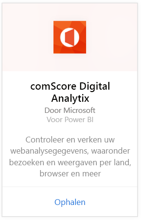
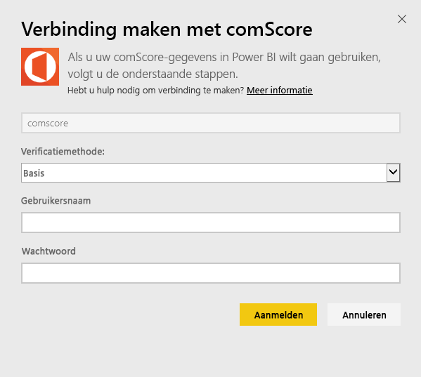
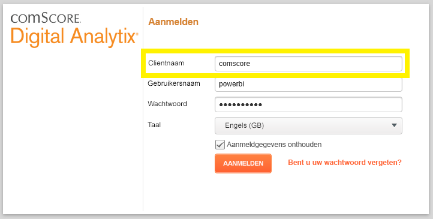
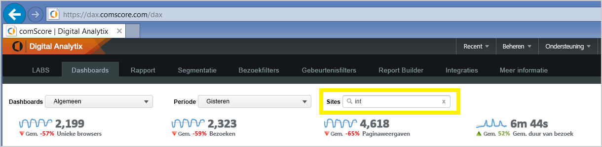

# Verbinding met comScore Digital Analytix maken via Power BI
Visualiseer en verken uw comScore Digital Analytix-gegevens in Power BI met het Power BI-inhoudspakket. De gegevens wordt een keer per dag automatisch vernieuwd.

Verbinding maken met het [comScore-inhoudspakket voor Power BI](https://app.powerbi.com/getdata/services/comscore).

>[!NOTE]
>U hebt een comScore DAx-gebruikersaccount en toegang tot comScore API nodig om verbinding met het inhoudspakket te maken. Zie hieronder voor [meer informatie](#Requirements).

## Verbinding maken
1. Selecteer Gegevens ophalen onder in het linkernavigatievenster.
   
   
2. Selecteer in het vak **Services** de optie **Ophalen**.
   
   
3. Selecteer **comScore Digital Analytix** \> **Ophalen**.
   
   
4. Geef het datacentrum, de client-id van comScore en de site waarmee u verbinding wilt maken op. Zie het gedeelte [Uw comScore-parameters zoeken](#FindingParams) hieronder voor meer informatie over de manier hoe u naar deze waarden kunt zoeken.
   
   
5. Geef uw gebruikersnaam en wachtwoord voor comScore op om verbinding te maken. Meer informatie over het zoeken van deze waarde vindt u hieronder.
   
   
6. Het importproces wordt automatisch gestart. Nadat het importeren is voltooid, bevat het navigatiedeelvenster een nieuw dashboard, rapport en model. Selecteer het dashboard om uw geïmporteerde gegevens weer te geven.

**Wat nu?**

* [Stel vragen in het vak Q&A](power-bi-q-and-a.md) boven in het dashboard.
* [Wijzig de tegels](service-dashboard-edit-tile.md) in het dashboard.
* [Selecteer een tegel](service-dashboard-tiles.md) om het onderliggende rapport te openen.
* Als uw gegevensset is ingesteld op dagelijks vernieuwen, kunt u het vernieuwingsschema wijzigen of de gegevensset handmatig vernieuwen met **Nu vernieuwen**.

## Systeemvereisten
U hebt een comScore DAx-gebruikersaccount en toegang tot de comScore DAx-API nodig om verbinding te kunnen maken. Neem contact op met uw comScore DAx-beheerder om uw account te bevestigen.

## Parameters zoeken
Hieronder vindt u meer informatie hoe u naar elk van de comScore-parameters zoekt.

**Datacentrum**

Met welk datacentrum u verbinding maakt, wordt bepaald door de URL waarnaar u in comScore navigeert.

Als u https://dax.comscore.com gebruikt, voert u VS in en als u https://dax.comscore.eu gebruikt, voert u EU in.

 

**Client**

Dit is dezelfde client die u opgeeft wanneer u zich aanmeldt bij comScore DAx.

 

**Site**

De comScore-site bepaalt van welke site u gegevens wilt zien. De lijst met sites vindt u in uw comScore-account.

## Volgende stappen
[Aan de slag in Power BI](service-get-started.md)

[Gegevens ophalen in Power BI](service-get-data.md)

