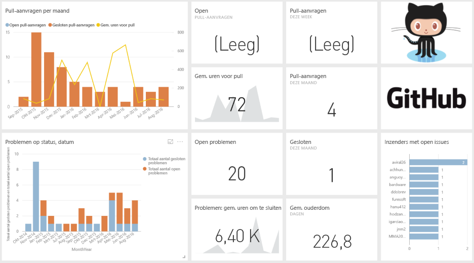
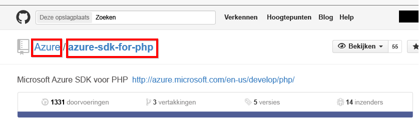

# Verbinding maken met GitHub via Power BI
Het GitHub-inhoudspakket voor Power BI maakt het mogelijk om inzicht te verkrijgen in een GitHub-opslagplaats (ook wel een repository of repo genoemd) met gegevens van bijdragen, problemen, pull-aanvragen en actieve gebruikers.

Maak verbinding met het [GitHub-inhoudspakket](https://app.powerbi.com/getdata/services/github) of lees meer over de [integratie van GitHub](https://powerbi.microsoft.com/integrations/github) met Power BI.

>[!NOTE]
>Het inhoudspakket werkt alleen als het GitHub-account toegang heeft tot de opslagplaats. Meer informatie over de vereisten volgt hieronder.

## Verbinding maken
1. Selecteer **Gegevens ophalen** onder in het linkernavigatievenster.
   
    
2. Selecteer in het vak **Services** de optie **Ophalen**.
   
    
3. Selecteer **GitHub** \> **Nu downloaden**.
   
   
4. Voer de naam in van de opslagplaats en de naam van de eigenaar van de opslagplaats. Zie details over [het vinden van deze parameters](#FindingParams) hieronder.
   
   
5. Geef uw referenties voor GitHub op (deze stap kan worden overgeslagen als u al bent aangemeld in uw browser). 
6. Selecteer voor de **verificatiemethode** **oAuth2**\> **Aanmelden**. 
7. Volg de verificatie-instructies van Github. Verleen het GitHub-inhoudspakket voor Power BI machtiging voor de GitHub-gegevens.
   
   
   
   Hierdoor wordt Power BI verbonden met GitHub en heeft Power BI toegang tot de gegevens.  De gegevens worden eenmaal per dag vernieuwd.
8. Nadat u verbinding met de opslagplaats hebt gemaakt, worden de gegevens geïmporteerd door Power BI. U ziet een nieuw [GitHub-dashboard](https://powerbi.microsoft.com/integrations/github), een nieuw rapport en een nieuwe gegevensset in het navigatievenster aan de linkerzijde. Nieuwe items zijn gemarkeerd met een geel sterretje \*.
   
   

**Wat nu?**

* [Stel vragen in het vak Q&A](power-bi-q-and-a.md) boven in het dashboard.
* [Wijzig de tegels](service-dashboard-edit-tile.md) in het dashboard.
* [Selecteer een tegel](service-dashboard-tiles.md) om het onderliggende rapport te openen.
* Als uw gegevensset is ingesteld op dagelijks vernieuwen, kunt u het vernieuwingsschema wijzigen of de gegevensset handmatig vernieuwen met **Nu vernieuwen**.

## Wat is inbegrepen?
De volgende gegevens van GitHub zijn beschikbaar in Power BI:     

| Tabelnaam | Beschrijving |
| --- | --- |
| Contributions |Deze tabel geeft het totale aantal toevoegingen, verwijderingen en wijzigingen dat een inzender per week heeft bijgedragen. De tabel bevat gegevens van de 100 actiefste medewerkers. |
| Issues |Een overzicht van alle problemen voor de geselecteerde opslagplaats en berekeningen zoals de totale en gemiddelde tijd voor het afhandelen van een probleem, het totale aantal openstaande problemen en het totale aantal afgesloten problemen. Deze tabel is leeg wanneer er geen problemen zijn gemeld voor de opslagplaats. |
| Pull requests |Deze tabel bevat alle pull-aanvragen voor de opslagplaats en wie de aanvraag heeft gedaan. De tabel bevat daarnaast berekeningen van het aantal openstaande en gesloten pull-aanvragen, het totale aantal pull-aanvragen, hoe lang het heeft geduurd om aanvragen te verwerken en hoe lang de gemiddelde pull-aanvraag heeft geduurd. Deze tabel is leeg wanneer er geen problemen zijn gemeld voor de opslagplaats. |
| Users |Deze tabel bevat een lijst van GitHub-gebruikers of -inzenders die bijdragen hebben geleverd, problemen hebben gemeld of pull-aanvragen hebben opgelost voor de geselecteerde opslagplaats. |
| Milestones |Deze tabel bevat alle mijlpalen voor de geselecteerde opslagplaats. |
| DateTable |Deze tabel bevat datums vanaf vandaag tot jaren in het verleden waarmee u gegevens van GitHub kunt analyseren op datum. |
| ContributionPunchCard |Deze tabel kan worden gebruikt als een controlemiddel voor bijdragen aan de geselecteerde opslagplaats. U ziet hier 'commits' per dag van de week en tijdstip van de dag. Deze tabel is niet verbonden met andere tabellen in het model. |
| RepoDetails |Deze tabel bevat details voor de geselecteerde opslagplaats. |

## Systeemvereisten
* Een GitHub-account met toegang tot de opslagplaats.  
* Machtiging verleend aan de app Power BI voor GitHub tijdens de eerste aanmelding. Zie de details hieronder om de toegang weer in te trekken.  
* Er zijn voldoende API-aanroepen beschikbaar om de gegevens op te halen en te vernieuwen.  

### Autorisatie van Power BI intrekken
Als u Power BI geen toegang meer wilt geven om verbinding te maken met uw GitHub-opslagplaats, kunt u de toegang intrekken in GitHub. Zie voor meer informatie dit [Help-onderwerp over GitHub](https://help.github.com/articles/keeping-your-ssh-keys-and-application-access-tokens-safe/#reviewing-your-authorized-applications-oauth).

## Parameters zoeken
U kunt de eigenaar en opslagplaats vaststellen door te kijken naar de opslagplaats in GitHub zelf:

Het eerste deel, 'Azure', is de eigenaar en het tweede deel, 'azure-sdk-for-php', is de opslagplaats zelf.  Deze twee items komen ook terug in de URL van de opslagplaats:

    <https://github.com/Azure/azure-sdk-for-php> .

## Probleemoplossing
Indien nodig kunt u uw GitHub-referenties controleren.  

1. Ga in een ander browservenster naar de website van GitHub en meld u aan bij GitHub. U kunt in de rechterbovenhoek van de GitHub-site zien of u bent aangemeld.    
2. Navigeer in GitHub naar de URL van de opslagplaats die u wilt raadplegen in Power BI, Bijvoorbeeld: https://github.com/dotnet/corefx.  
3. Ga terug naar Power BI en probeer verbinding te maken met GitHub. Gebruik in het dialoogvenster Configure GitHub de naam van de opslagplaats en de naam van de eigenaar van dezelfde opslagplaats.  

## Volgende stappen
* [Aan de slag met Power BI](service-get-started.md)
* [Gegevens ophalen](service-get-data.md)
