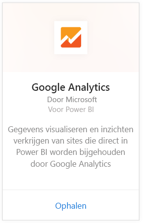
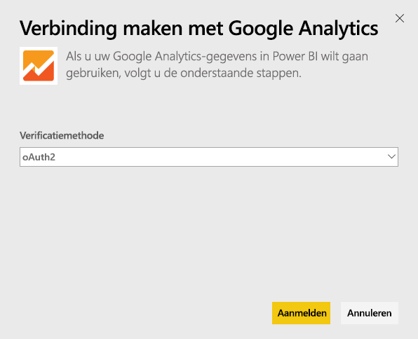
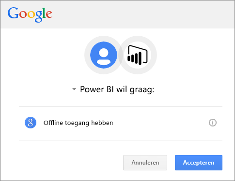
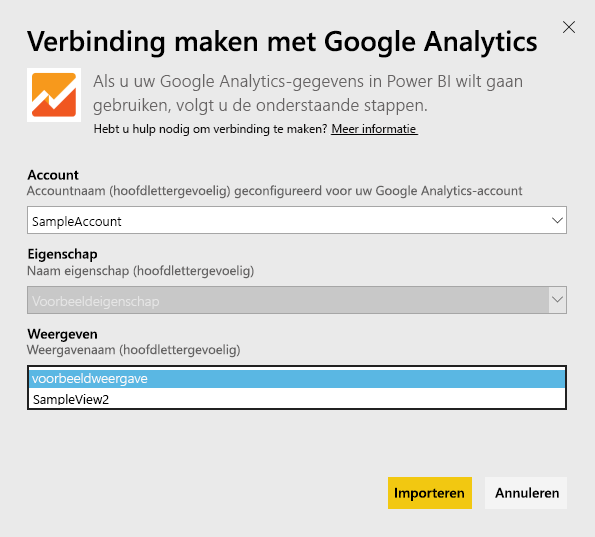
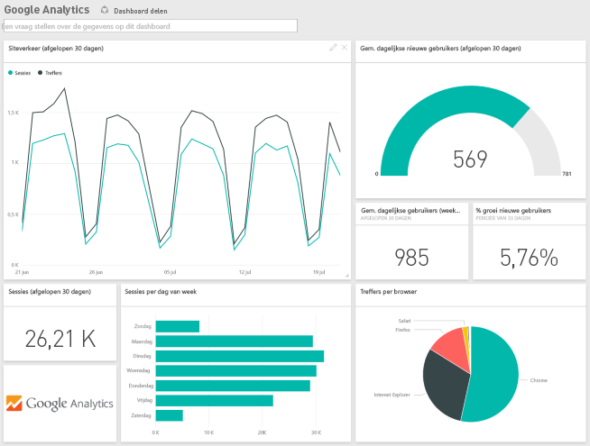
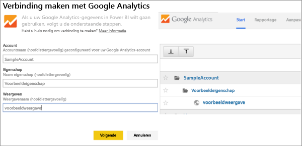

# Verbinding maken met Google Analytics via Power BI
U maakt verbinding met Google Analytics via Power BI door eerst verbinding te maken met uw Google Analytics-account. U ziet een Power BI-dashboard en een set Power BI-rapporten die inzicht geven in het verkeer van uw site en de gebruikersgegevens. U kunt met het dashboard en de rapporten werken, maar u kunt wijzigingen niet opslaan. De gegevens wordt eenmaal per dag automatisch vernieuwd.

Verbinding maken met [Google Analytics](https://app.powerbi.com/getdata/services/google-analytics) voor Power BI. Meer informatie over de [Google Analytics-integratie](https://powerbi.microsoft.com/integrations/google-analytics) met Power BI.

U kunt aangepaste dashboards en rapporten maken op basis van de [Google Analytics-connector](service-google-analytics-connector.md) in Power BI Desktop. Maak gewoon verbinding met uw Google Analytics-account en maak uw eigen rapporten, die u naar Power BI-service kunt publiceren.

## Verbinding maken
[!INCLUDE [powerbi-service-apps-get-more-apps](./includes/powerbi-service-apps-get-more-apps.md)]

1. Selecteer **Google Analytics** \> **Ophalen**.
   
   
2. Voer uw Google Analytics-referenties in als dit wordt gevraagd. Selecteer **oAuth 2** als verificatiemethode en klik op **Aanmelden**. Volg de Google-verificatiestroom. Deze kan uit een tweeledige verificatie bestaan als u deze hebt geconfigureerd.
   
   
3. Klik op **accepteren** om Power BI toegang te geven tot uw Google Analytics-gegevens.
   
   
4. Power BI maakt verbinding met een specifieke Google Analytics-weergave. Selecteer de accountnaam, de eigenschapsnaam en de weergavenaam waarmee u verbinding wilt maken. Deze informatie vindt u in uw Google Analytics-account, linksboven op het scherm of op het tabblad **Start**. Zie hieronder voor meer informatie. 
   
   
5. Klik op **Verbinding maken** om het importproces te starten. 

## Het Google Analytics-dashboard en de rapporten weergeven
[!INCLUDE [powerbi-service-apps-open-app](./includes/powerbi-service-apps-open-app.md)]

      

[!INCLUDE [powerbi-service-apps-open-app](./includes/powerbi-service-apps-what-now.md)]

## Systeemvereisten
Als u verbinding wilt maken vanuit Power BI, moet u beschikken over een [Google Analytics](https://www.google.com/analytics/)-account. Bij andere Google-accounts die nog niet zijn verbonden met het Google Analytics-account, ontvangt u een verificatiefout.

## Probleemoplossing
**Referenties** Als u meerdere Google-accounts hebt, moet u een incognito- of privé-browservenster tijdens de verbinding gebruiken om te zorgen dat het juiste account wordt gebruikt.

Als u een foutbericht ontvangt dat aangeeft dat uw referenties ongeldig zijn, maar u zich wel kunt aanmelden bij Google, controleert u of u een [Google Analytics](https://www.google.com/analytics/)-account hebt.

**Parameters** Unieke namen zijn momenteel vereist voor de parameters. Als een foutbericht verschijnt dat aangeeft dat de door u geselecteerde waarde twee keer voorkomt, selecteert u een andere waarde of wijzigt u de namen in Google Analytics zodat deze uniek zijn. Er wordt hard gewerkt om dit te verbeteren.

>[!NOTE]
>Parameters zijn hoofdlettergevoelig. Voer deze precies in zoals ze worden weergegeven in uw Google Analytics-account.

Hebt u nog steeds problemen? Open een ondersteuningsticket om contact op te nemen met het team van Power BI:

* Selecteer in de Power BI-app het vraagteken \> **Contact opnemen met ondersteuning.**
* Selecteer op de pagina Ondersteuning van Power BI (waar u dit artikel leest) **Contact opnemen met ondersteuning** aan de rechterkant van de pagina.

## Volgende stappen
* [Wat zijn apps in Power BI?](service-install-use-apps.md)
* [Gegevens ophalen in Power BI](service-get-data.md)
* Hebt u nog vragen? [Misschien dat de Power BI-community het antwoord weet](http://community.powerbi.com/)

