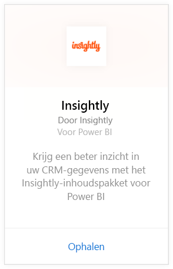
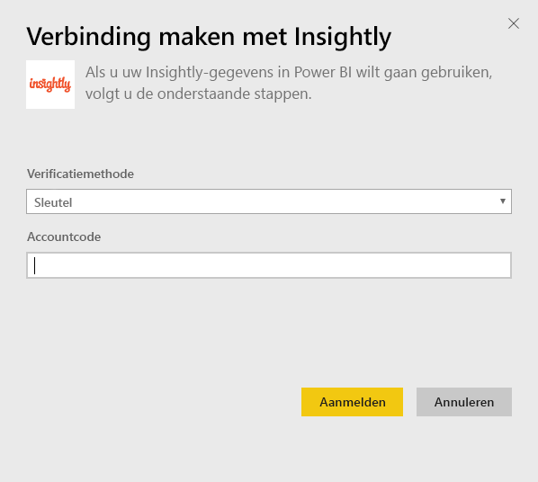
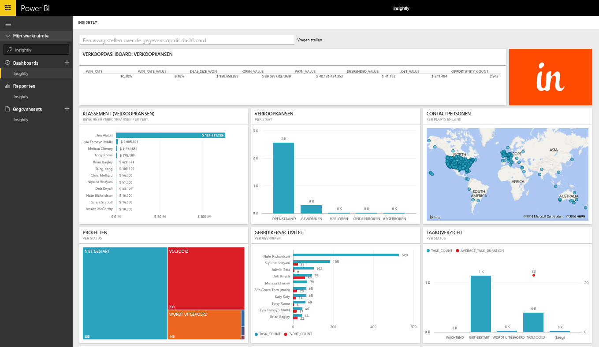
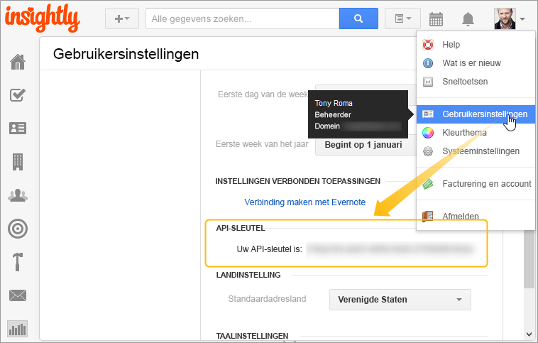

# Verbinding maken met Insightly met Power BI
Visualiseer en deel uw Insightly CRM-gegevens in Power BI met het Insightly-inhoudspakket. Maak verbinding met Power BI met uw Insightly API-sleutel weergeven en maak rapporten en dashboards op basis van uw CRM-gegevens. Met Power BI kunt u uw gegevens op nieuwe manieren analyseren, krachtige grafieken en diagrammen maken en contactpersonen, potentiële klanten en organisaties weergeven op een kaart.

Maak verbinding met het [Insightly-inhoudspakket](https://app.powerbi.com/getdata/services/insightly) voor Power BI.

## Verbinding maken
1. Selecteer **Gegevens ophalen** onder in het linker navigatievenster.
   
   
2. Selecteer in het vak **Services** de optie **Ophalen**.
   
   
3. Selecteer **Insightly** \>  **Ophalen**.
   
   
4. Selecteer **Sleutel** als verificatietype en geef uw Insight API-sleutel op. Selecteer vervolgens **Aanmelden**. Gedetailleerde informatie over het vinden van deze sleutel vindt u [hieronder](#FindingParams).
   
   
5. Na goedkeuring wordt het importproces automatisch gestart. Nadat het importeren is voltooid, bevat het navigatiedeelvenster een nieuw dashboard, rapport en model. Selecteer het dashboard om uw geïmporteerde gegevens weer te geven.
   
     

**Wat nu?**

* [Stel vragen in het vak Q&A](service-q-and-a.md) boven in het dashboard
* [Wijzig de tegels](service-dashboard-edit-tile.md) in het dashboard.
* [Selecteer een tegel](service-dashboard-tiles.md) om het onderliggende rapport te openen.
* Als uw gegevensset is ingesteld op dagelijks vernieuwen, kunt u het vernieuwingsschema wijzigen of de gegevensset handmatig vernieuwen met **Nu vernieuwen**

## Wat is inbegrepen?
Het inhoudspakket bevat de volgende tabellen met velden uit de bijbehorende records:

| Tabellen |  |  |  |
| --- | --- | --- | --- |
| Contactpersonen |Verkoopkansen |Pijplijnfasen |Voltooiingsdatum taak |
| Aangepaste velden |Sluitdatum verkoopkans |Voltooiingsdatum project |Taken |
| Gebeurtenissen |Datum verkoopkansprognose |Projecten |Teams/leden |
| Leads |Organisaties |Tags |Gebruikers |

Veel tabellen en rapporten bevatten ook unieke berekende velden, zoals:  

* Tabellen met ‘gegroepeerde’ voorspelde sluitingsdatums van verkoopkansen, werkelijke sluitingsdatums van verkoopkansen, voltooiingsdatums van projecten en taken voor analyse per maand, kwartaal of jaar.  
* Een veld met een gewogen waarde voor verkoopkansen (waarde verkoopkans * winstkans).  
* Gemiddelde en totale duurvelden voor taken, op basis van begin- en voltooiingsdatums.  
* Rapporten met berekende velden voor winstfrequentie van verkoopkansen (aantal gewonnen/totaal aantal verkoopkansen) en winstfrequentiewaarde (waarde gewonnen/waarde van totaal aantal verkoopkansen).  

## Systeemvereisten
Er is een Insightly account met toegang tot de Insightly API vereist. Zichtbaarheidsmachtigingen worden gebaseerd op de API-sleutel die wordt gebruikt om de verbinding met Power BI tot stand te brengen. Alle Insightly records die voor u zichtbaar zijn, zijn ook zichtbaar in de Power BI- rapporten en -dashboards die u met anderen deelt.

## Parameters zoeken
**API-sleutel**

Als u uw API-sleutel uit Insightly wilt kopiëren, selecteert u Gebruikersinstellingen in het profielmenu van Insightly en schuift u omlaag. Deze tekenreeks wordt gebruikt voor het verbinden van uw gegevens met Power BI.

## Probleemoplossing
Uw gegevens worden geïmporteerd via de Insightly API, met een dagelijkse limiet op basis van uw Insightly-abonnementsniveau. De limieten worden vermeld in de sectie Rate Limiting/Throttling Requests (snelheid beperken/bandbreedte aanvragen beperken) in onze API documentatie: https://api.insight.ly/v2.2/Help#!/Overview/Introduction#ratelimit

In de aangeboden rapporten worden standaardvelden van Insightly gebruikt, en ze bevatten mogelijk niet uw aanpassingen. Bewerk het rapport om alle beschikbare velden te bekijken.

## Volgende stappen
[Aan de slag in Power BI](service-get-started.md)

[Gegevens ophalen in Power BI](service-get-data.md)

