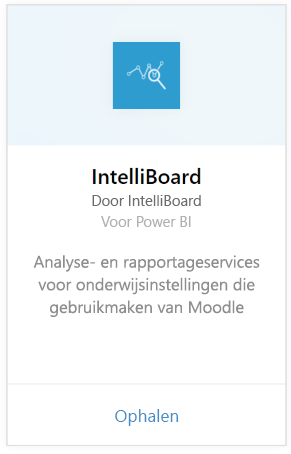
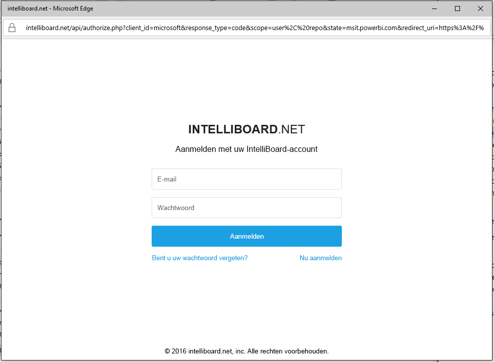
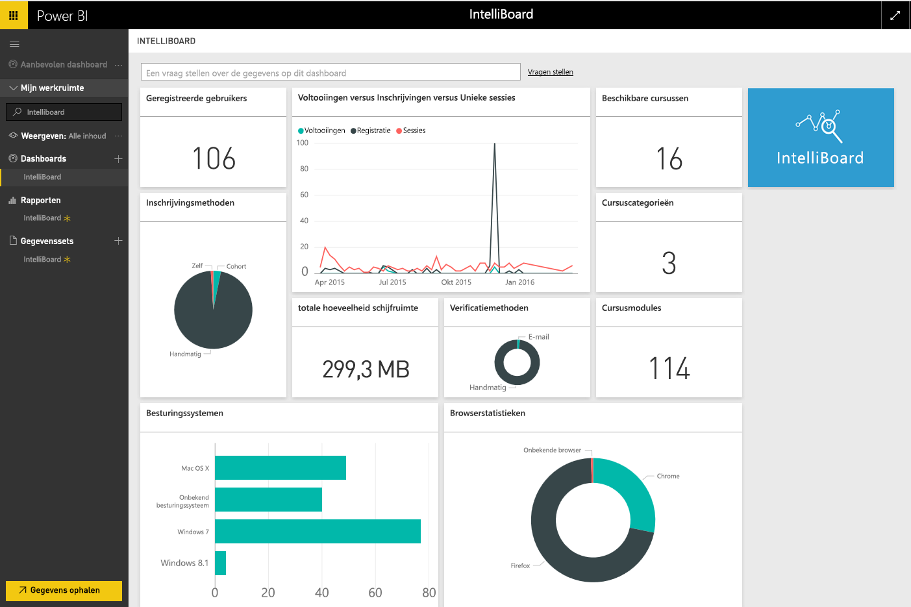

# Verbinding met IntelliBoard maken met Power BI
IntelliBoard biedt vereenvoudigde toegang tot uw Moodle LMS-gegevens (Learning Management System) via Reporting Services. Het IntelliBoard-inhoudspakket voor Power BI biedt aanvullende analyses, inclusief metrische gegevens over uw cursussen, geregistreerde gebruikers, prestaties in het algemeen en uw LMS-activiteit.

Maak verbinding met het [IntelliBoard-inhoudspakket](https://app.powerbi.com/getdata/services/intelliboard) voor Power BI.

## Verbinding maken
1. Selecteer **Gegevens ophalen** onder in het linkernavigatievenster.  
   
    
2. Selecteer in het vak **Services** de optie **Ophalen**.  
   
    
3. Selecteer **IntelliBoard** en selecteer vervolgens **Ophalen**.  
   
    
4. Selecteer **OAuth 2** en vervolgens **Aanmelden**. Geef desgevraagd uw IntelliBoard-referenties op.
   
    
   
    
5. Nadat verbinding is gemaakt, worden automatisch een dashboard, rapport en gegevensset geladen. Vervolgens worden de tegels bijgewerkt met gegevens uit uw IntelliBoard-account.
   
    

**Wat nu?**

* [Stel vragen in het vak Q&A](power-bi-q-and-a.md) boven in het dashboard.
* [Wijzig de tegels](service-dashboard-edit-tile.md) in het dashboard.
* [Selecteer een tegel](service-dashboard-tiles.md) om het onderliggende rapport te openen.
* Als uw gegevensset is ingesteld op dagelijks vernieuwen, kunt u het vernieuwingsschema wijzigen of de gegevensset handmatig vernieuwen met **Nu vernieuwen**.

## Wat is inbegrepen?
Het inhoudspakket bevat gegevens uit de volgende tabellen:  

    - Activiteit  
    - Agenten  
    - Verificatie  
    - Landen  
    - Cursusvoortgang  
    - Registratie
    - Taal  
    - Platform  
    - Totalen  
    - UsersProgress    

## Systeemvereisten
Een IntelliBoard-account met machtigingen voor de bovenstaande tabellen is vereist om dit inhoudspakket te starten.

## Volgende stappen
[Aan de slag met Power BI](service-get-started.md)

[Power BI - basisconcepten](service-basic-concepts.md)

