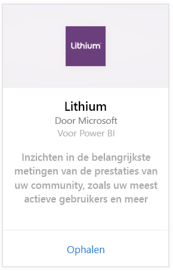
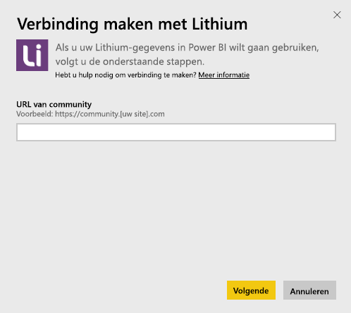
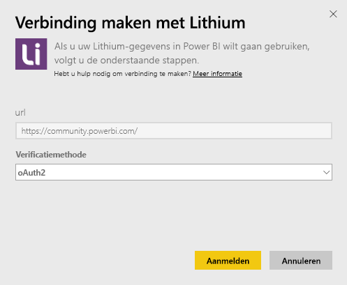
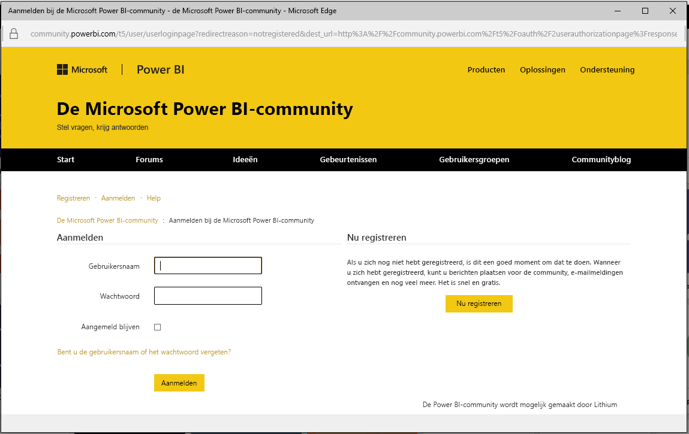
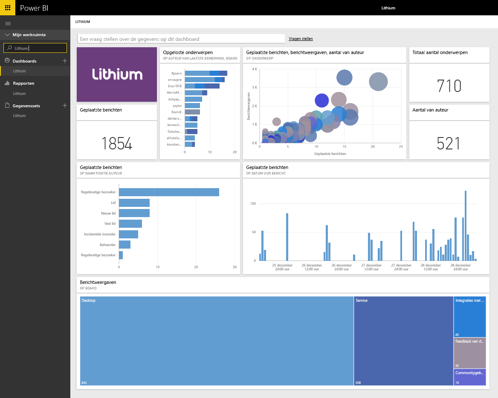

# Verbinding met Lithium maken via Power BI
Lithium bouwt vertrouwde relaties tussen de beste merken ter wereld en hun klanten en helpt mensen om antwoorden te vinden en hun ervaringen te delen. Door het Lithium-inhoudspakket te verbinden met Power BI, kunt u essentiële metrische gegevens over uw online community meten om zodoende de verkoop te stimuleren, de servicekosten te reduceren en de loyaliteit te verhogen. 

Maak verbinding met het [Lithium-inhoudspakket](https://app.powerbi.com/getdata/services/lithium) voor Power BI.

>[!NOTE]
>Het Power BI-inhoudspakket maakt gebruik van de Lithium-API. Wanneer de API overmatig vaak wordt aangeroepen, worden mogelijk extra kosten voor Lithium in rekening gebracht. U kunt dit navragen bij uw Lithium-beheerder.

## Verbinding maken
1. Selecteer **Gegevens ophalen** onder in het linkernavigatievenster.
   
    
2. Selecteer in het vak **Services** de optie **Ophalen**.
   
    
3. Selecteer **Lithium** \> **Ophalen**.
   
   
4. Geef de URL van de Lithium-community op. Deze heeft de notatie *https://community.yoursite.com*.
   
   
5. Geef desgevraagd uw Lithium-referenties op. Selecteer **oAuth 2** als verificatiemechanisme, klik op **Aanmelden** en volg de verificatiestroom van Lithium.
   
   
   
   
6. Als het aanmeldingsproces is voltooid, wordt het importproces gestart. Nadat het importeren is voltooid, bevat het navigatiedeelvenster een nieuw dashboard, rapport en model. Selecteer het dashboard om uw geïmporteerde gegevens weer te geven.
   
    

**Wat nu?**

* [Stel vragen in het vak Q&A](power-bi-q-and-a.md) boven in het dashboard.
* [Wijzig de tegels](service-dashboard-edit-tile.md) in het dashboard.
* [Selecteer een tegel](service-dashboard-tiles.md) om het onderliggende rapport te openen.
* Als uw gegevensset is ingesteld op dagelijks vernieuwen, kunt u het vernieuwingsschema wijzigen of de gegevensset handmatig vernieuwen met **Nu vernieuwen**.

## Systeemvereisten
Voor het Lithium-inhoudspakket is een Lithium Community v15.9 of hoger vereist. Neem contact op met uw Lithium-beheerder om dit te controleren.

## Volgende stappen
[Aan de slag met Power BI](service-get-started.md)

[Power BI - basisconcepten](service-basic-concepts.md)

