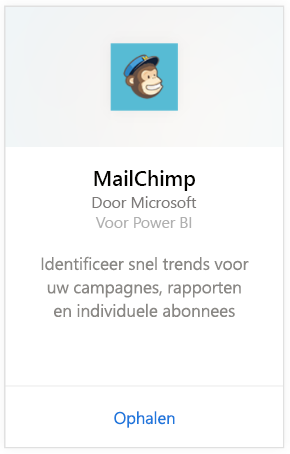
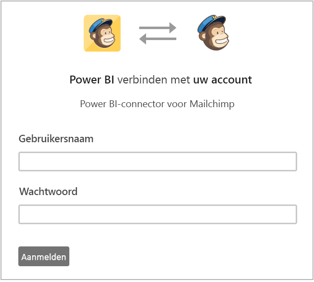
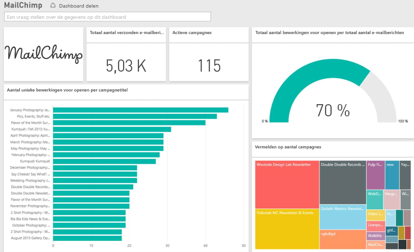

# Verbinding met MailChimp maken via Power BI
Met het Power BI-inhoudspakket worden gegevens opgehaald uit uw MailChimp-account en worden een dashboard, een set met rapporten en een gegevensset gegenereerd die u kunt gebruiken om uw gegevens te verkennen. Haal analyses op om [MailChimp-dashboards](https://powerbi.microsoft.com/integrations/mailchimp) te maken en snel trends voor uw campagnes, rapporten en individuele abonnees te identificeren. De gegevens worden dagelijks vernieuwd, zodat u zeker weet dat uw bewakingsgegevens up-to-date zijn.

Maak verbinding met het [MailChimp-inhoudspakket](https://app.powerbi.com/getdata/services/mailchimp) voor Power BI.

## Verbinding maken
1. Selecteer **Gegevens ophalen** onder in het linkernavigatievenster.
   
    
2. Selecteer in het vak **Services** de optie **Ophalen**.
   
   
3. Selecteer **MailChimp** \> **Ophalen**.
   
   
4. Selecteer voor de verificatiemethode **oAuth2** \> **Aanmelden**.
   
    Geef desgevraagd uw MailChimp-referenties op en voer het verificatieproces uit.
   
    De eerste keer dat u verbinding maakt, wordt u gevraagd om Power BI alleen-lezen toegang tot uw account te geven. Selecteer **Toestaan** om het importproces te starten. Dit kan overigens een paar minuten duren, afhankelijk van de hoeveelheid gegevens in uw account.
   
    
5. Nadat de gegevens in Power BI zijn geïmporteerd, ziet u een nieuw dashboard, een nieuw rapport en een nieuwe gegevensset in het navigatiedeelvenster aan de linkerzijde. Dit is het standaarddashboard dat door Power BI is gemaakt om uw gegevens weer te geven. U kunt dit dashboard wijzigen om uw gegevens weer te geven zoals u dat wilt.
   
   

**Wat nu?**

* [Stel vragen in het vak Q&A](power-bi-q-and-a.md) boven in het dashboard.
* [Wijzig de tegels](service-dashboard-edit-tile.md) in het dashboard.
* [Selecteer een tegel](service-dashboard-tiles.md) om het onderliggende rapport te openen.
* Als uw gegevensset is ingesteld op dagelijks vernieuwen, kunt u het vernieuwingsschema wijzigen of de gegevensset handmatig vernieuwen met **Nu vernieuwen**

## Volgende stappen
[Aan de slag met Power BI](service-get-started.md)

[Power BI - basisconcepten](service-basic-concepts.md)

