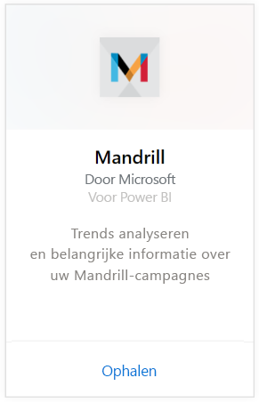
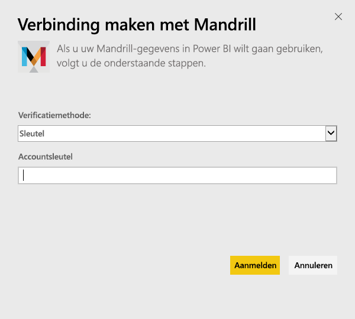
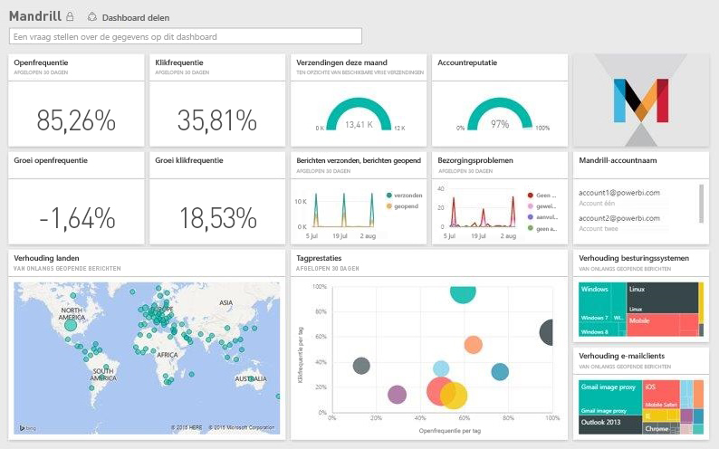

# Verbinding maken met Mandrill met Power BI
Met het Power BI-inhoudspakket worden gegevens opgehaald uit uw Mandrill-account en worden een dashboard, een set met rapporten en een gegevensset gegenereerd die u kunt gebruiken om uw gegevens te verkennen. Gebruik de analytische gegevens van Mandrill om snel inzicht te krijgen in uw nieuwsbrief of marketingcampagne. De gegevens worden dagelijks vernieuwd, zodat u zeker weet dat uw bewakingsgegevens up-to-date zijn.

Verbinding maken met het [Mandrill-inhoudspakket voor Power BI](http://app.powerbi.com/getdata/services/mandrill)

## Verbinding maken
1. Selecteer **Gegevens ophalen** onder in het linkernavigatievenster.
   
    
2. Selecteer in het vak **Services** de optie **Ophalen**.
   
    
3. Selecteer **Mandrill** > **Ophalen**.
   
    
4. Selecteer voor **Verificatiemethode** de optie **Sleutel** en voer uw API-sleutel in. U kunt de sleutel vinden op het tabblad **Instellingen** van het Mandrill-dashboard. Selecteer **Aanmelden** om het importproces te starten. Dit kan overigens een paar minuten duren, afhankelijk van de hoeveelheid gegevens in uw account.
   
    
5. Nadat de gegevens in Power BI zijn geïmporteerd, ziet u een nieuw dashboard, een nieuw rapport en een nieuwe gegevensset in het navigatiedeelvenster aan de linkerzijde. Dit is het standaarddashboard dat door Power BI is gemaakt om uw gegevens weer te geven.
   
    

**Wat nu?**

* [Stel vragen in het vak Q&A](power-bi-q-and-a.md) boven in het dashboard.
* [Wijzig de tegels](service-dashboard-edit-tile.md) in het dashboard.
* [Selecteer een tegel](service-dashboard-tiles.md) om het onderliggende rapport te openen.
* Als uw gegevensset is ingesteld op dagelijks vernieuwen, kunt u het vernieuwingsschema wijzigen of de gegevensset handmatig vernieuwen met **Nu vernieuwen**

## Volgende stappen
[Aan de slag met Power BI](service-get-started.md)

[Power BI - basisconcepten](service-basic-concepts.md)

