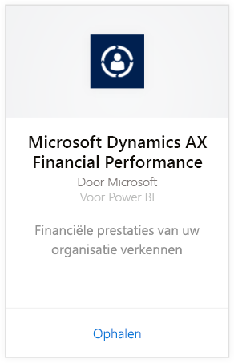
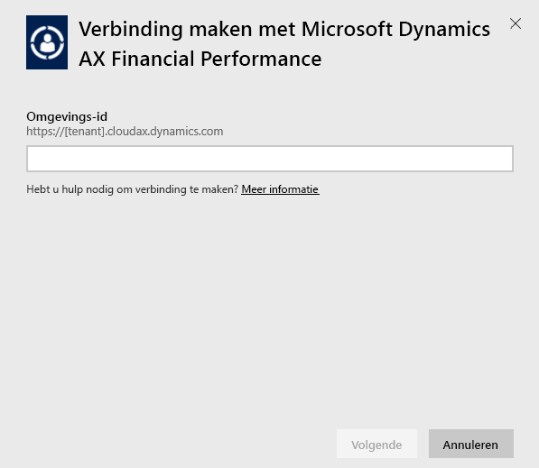
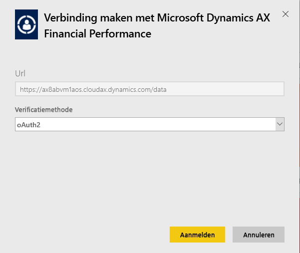
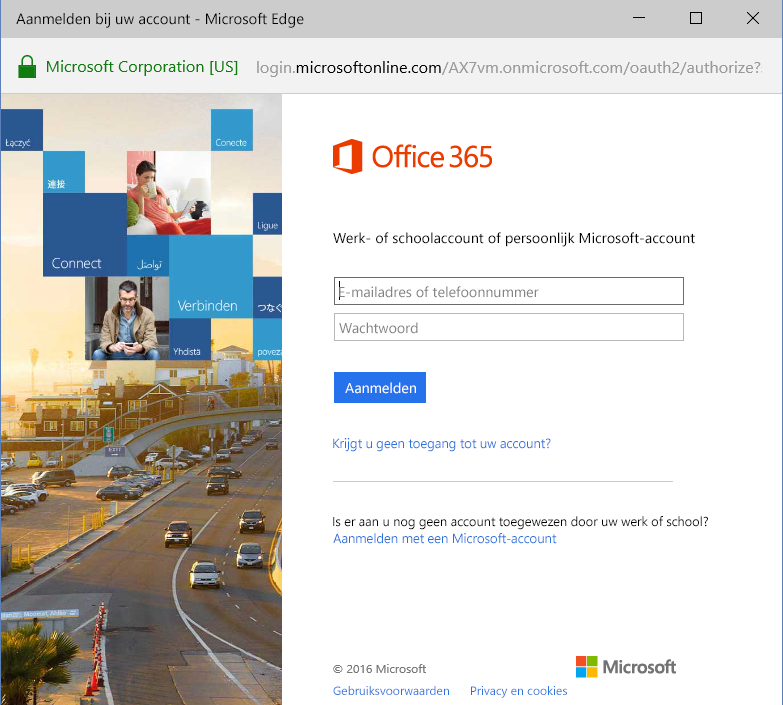
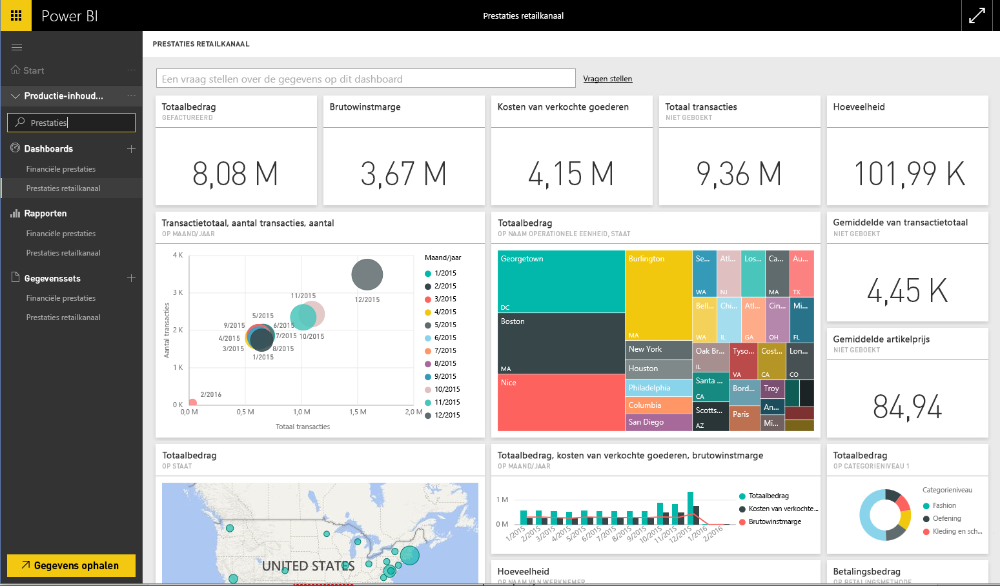

# Verbinding met het Microsoft Dynamics AX-inhoudspakket maken via Power BI
Microsoft Dynamics AX bevat drie Power BI-inhoudspakketten die zijn bedoeld voor verschillende zakelijke gebruikers. Het inhoudspakket Financiële prestaties is specifiek ontworpen voor CFO's en biedt inzicht in de financiële prestaties van uw organisatie. Het inhoudspakket Afzetkanaalprestaties is bedoeld voor kanaalmanagers en bevat informatie over de verkoopprestaties om trends te voorspellen en inzichten aan het licht te brengen door rechtstreeks gebruik te maken van de retailgegevens en commerciële gegevens. Het inhoudspakket Kostenbeheer is ontworpen voor COO's en CFO's en bevat gedetailleerde informatie over de operationele prestaties.

Maak verbinding met een van de volgden Microsoft Dynamics AX-inhoudspakketten voor Power BI: [Afzetkanaalprestaties](https://app.powerbi.com/getdata/services/dynamics-ax-retail-channel-performance), [Financiële prestaties](https://app.powerbi.com/getdata/services/dynamics-ax-financial-performance) of [Kostenbeheer](https://app.powerbi.com/getdata/services/dynamics-ax-cost-management).

## Verbinding maken
1. Selecteer **Gegevens ophalen** onder in het linkernavigatievenster.
   
   
2. Selecteer in het vak **Services** de optie **Ophalen**.
   
   
3. Selecteer een van de Dynamics AX-inhoudspakketten en kies **Ophalen**.
   
   
4. Geef de URL van uw Dynamics AX-7-omgeving op. Bekijk hieronder de details voor [het vinden van die parameters](#FindingParams).
   
   
5. Selecteer voor **Verificatiemethode** **oAuth2**\> **Aanmelden**. Geef desgevraagd uw Dynamics AX-referenties op.
   
    
   
    
6. Nadat uw aanmelding is goedgekeurd, wordt het importeren automatisch gestart. Nadat het importeren is voltooid, bevat het navigatiedeelvenster een nieuw dashboard, rapport en model. Selecteer het dashboard om uw geïmporteerde gegevens weer te geven.
   
     

**Wat nu?**

* [Stel vragen in het vak Q&A](power-bi-q-and-a.md) boven in het dashboard.
* [Wijzig de tegels](service-dashboard-edit-tile.md) in het dashboard.
* [Selecteer een tegel](service-dashboard-tiles.md) om het onderliggende rapport te openen.
* Als uw gegevensset is ingesteld op dagelijks vernieuwen, kunt u het vernieuwingsschema wijzigen of de gegevensset handmatig vernieuwen met **Nu vernieuwen**.

## Wat is inbegrepen?
Het inhoudspakket maakt gebruik van de OData-feed van Dynamics AX 7 om de gegevens te importeren met betrekking tot de afzetkanaalprestaties, de financiële prestaties of het kostenbeheer.

## Systeemvereisten
Voor dit inhoudspakket hebt u een URL van de Dynamics AX-7-omgeving nodig en moet de gebruiker toegang hebben tot de OData-feed.

## Parameters zoeken

De URL van de Dynamics AX 7-omgeving wordt weergegeven in de browser wanneer de gebruikers zich aanmeldt. Kopieer de URL van de rootomgeving van Dynamics AX naar het Power BI-dialoogvenster.

## Probleemoplossing
Het kan even duren voordat alle gegevens zijn geladen. Dit is afhankelijke van de grootte van uw instantie. Als er lege rapporten in Power BI worden weergegeven, controleert u of u toegang hebt tot de benodigde OData-tabellen voor de rapporten.

## Volgende stappen
[Aan de slag in Power BI](service-get-started.md)

[Gegevens ophalen in Power BI](service-get-data.md)

