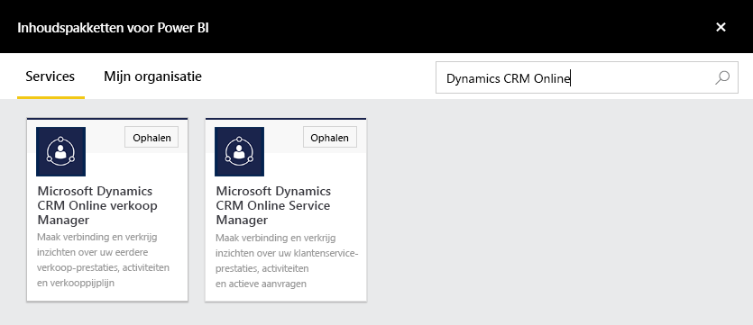
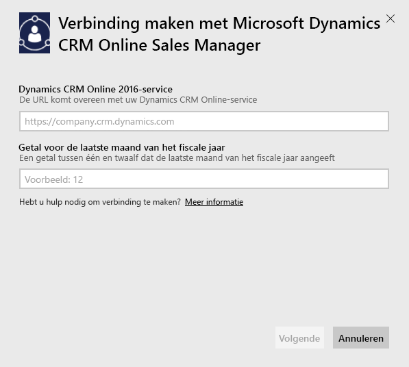
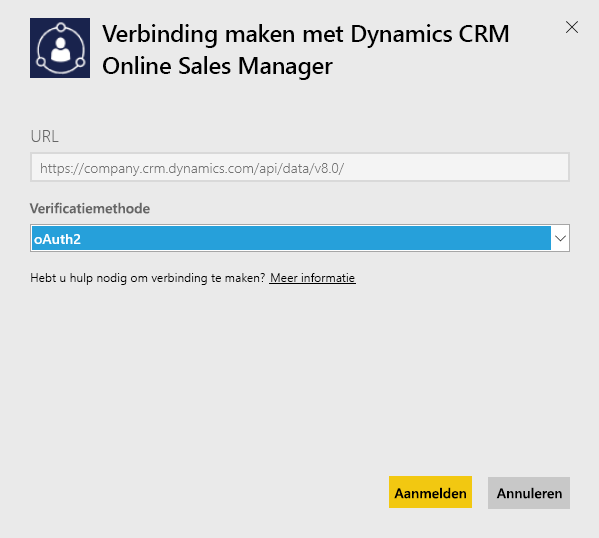
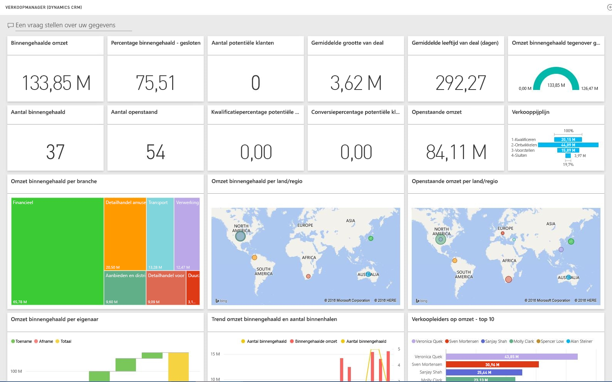

# Verbinding maken met Microsoft Dynamics CRM met Power BI
Met Microsoft Dynamics CRM Online voor Power BI kunt u eenvoudig toegang krijgen tot uw gegevens en deze analyseren. Power BI maakt gebruik van de OData-feed voor het maken van een beschrijvend model, met alle benodigde entiteiten en metrische gegevens zoals Accounts, Activities, Opportunities, Product, Leads, Users en meer. Nadat u de app hebt geïnstalleerd, kunt u het dashboard en de rapporten bekijken in de Power BI-service ([https://powerbi.com](https://powerbi.com)) en in de mobiele Power BI-apps. 

Maak verbinding met Dynamics CRM Online [Sales Manager](https://msit.powerbi.com/groups/me/getdata/services/dynamics-crm-sales-manager) of [Service Manager](https://msit.powerbi.com/groups/me/getdata/services/dynamics-crm-customer-service). Lees meer over [de integratie van Dynamics CRM Online](https://powerbi.microsoft.com/integrations/microsoft-dynamicscrm) met Power BI.

Deze verbinding vereist **Microsoft Dynamics CRM Online 2016 of hoger**. Meer informatie over de [vereisten](#Requirements) leest u hieronder.

## Verbinding maken
[!INCLUDE [powerbi-service-apps-get-more-apps](./includes/powerbi-service-apps-get-more-apps.md)]

1. Selecteer **Microsoft Dynamics CRM Sales Manager** of **Microsoft Dynamics CRM Service Manager** en klik op **Ophalen**.
   
   
2. Geef de service-URL op die is gekoppeld aan uw account.  De URL moet deze notatie hebben: `https://company.crm.dynamics.com`. Zie [hieronder](#FindingParams) voor meer details.
   
   
3. Geef uw referenties op als u daarom wordt gevraagd (deze stap kan worden overgeslagen als u al bent aangemeld in uw browser). Selecteer **oAuth2** voor de verificatiemethode en klik op **Aanmelden**:
   
   
4. Als de verbinding tot stand is gekomen, ziet u een dashboard dat is aangepast voor een verkoopmanager of servicemanager, gevuld met uw eigen gegevens:
   
   

## Dashboard en rapporten van Microsoft Dynamics CRM weergeven
[!INCLUDE [powerbi-service-apps-open-app](./includes/powerbi-service-apps-open-app.md)]

[!INCLUDE [powerbi-service-apps-open-app](./includes/powerbi-service-apps-what-now.md)]

## Wat is inbegrepen
De onderstaande secties bevatten informatie over welke gegevens worden opgenomen voor de rollen [Verkoopmanager](#Sales) en [Servicemanager](#Service).

Het is wel zo dat de beschikbare gegevens ook beperkt worden op basis van de beveiligingsrol die is toegewezen aan de gebruiker van Dynamics CRM Online.

Het dashboard en de rapporten zijn bedoeld om operationele rapportages te bieden voor kortetermijngegevens met de focus op een team of groep. Elke query wordt beperkt tot het ophalen van maximaal 100.000 records uit Dynamics CRM Online. Als deze limiet wordt overschreden vanwege de grote hoeveelheid gegevens in uw organisatie, mislukt het inrichten van het dashboard omdat het vernieuwen van gegevens van Dynamics CRM Online wordt beëindigd. Als uw account te groot is, kunt u verbinding maken via Power BI Desktop om een aangepaste oplossing te bouwen.

### Verkoopmanager
Het dashboard en de rapporten bevatten de belangrijkste metrische gegevens zoals:  

* Won Revenue   
* Win Rate   
* Open Revenue   
* Lost revenue   
* Expected Revenue  
* Average Deal Size en meer.  

Ze bevatten ook belangrijke diagrammen, zoals:  

* Won and Lost Revenue Trend, Won Revenue Vs Estimated Revenue Trend  
* Won Revenue voor verschillende dimensies zoals Industry, Region, Territory   
* Sales Leaders By Revenue, Activities,   
* Top Accounts, Top Won/Lost Deals,    
* New Leads Trend, Sales Pipeline en meer.   

Deze metrische gegevens en diagrammen helpen om inzicht te krijgen in de prestaties van uw verkooporganisatie en maken het mogelijk om de verkooppijplijn binnen het verkoopteam te analyseren.

De volgende tabel bevat de CRM-entiteiten die beschikbaar zijn voor deze service en geeft ook informatie over de filters die zijn toegepast op elk van de entiteitsrecords.

| CRM-entiteit | Toegepaste filters |
| --- | --- |
| Account |Alle accounts met gerelateerde verkoopkansen die mogelijk zijn gewijzigd in de afgelopen 365 dagen |
| Activity |Alle activiteiten die zijn gewijzigd in de afgelopen 90 dagen   [modifiedon] > today - 90 days |
| Business Unit |Alle business units die niet zijn uitgeschakeld   [isdisabled] = false |
| Lead |Alle leads die zijn gewijzigd in de afgelopen 180 dagen   [modifiedon] > today - 180 days |
| Opportunity |Alle verkoopkansen die zijn gewijzigd in de afgelopen 365 dagen   [modifiedon] > today - 365 days |
| Opportunity Product |Alle verkoopkansproducten die zijn gewijzigd in de afgelopen 365 dagen   [modifiedon] > today - 365 days |
| Product |Alle actieve producten   [statecode] <> 1 |
| Territory |Alle gebieden |
| User |Alle actieve gebruikers en niet-gedelegeerde beheerders    [isdisabled] = false and [accessmode] <> 4 |

### Servicemanager
Dit dashboard en deze rapporten bevatten belangrijke metrische gegevens zoals:  

* CSAT Percentage   
* SLA Met percentage   
* Escalated Cases Percentage   
* Average Handling Time   
* Total Resolved Cases  
* Total Active Cases  
* Number of Times KB Article Used in cases en meer.    

Ze bevatten ook belangrijke diagrammen, zoals:   

* Case Volume Trends voor Incoming Cases, Resolved Cases, Escalated Cases   
* Case Volume voor verschillende dimensies zoals Origin, Location, Priority, Type  
* Leaders by CSAT percentage, SLA met percentage, Activities, Resolved cases  
* Most Used en Most viewed KB Articles en meer.  
    Deze metrische gegevens en grafieken kunnen inzicht geven in de prestaties van uw ondersteuningsorganisatie en helpen bij het analyseren van actieve dossiers binnen het serviceteam en in de servicewachtrijen.

De volgende tabel bevat de CRM-entiteiten die beschikbaar zijn voor deze service en geeft ook informatie over de filters die zijn toegepast op elk van de entiteitsrecords.

| CRM-entiteit | Toegepaste filters |
| --- | --- |
| Account |Alle accounts met gerelateerde dossiers die mogelijk zijn gewijzigd in de afgelopen 90 dagen |
| Activity |Alle activiteiten die zijn gewijzigd in de afgelopen 90 dagen   [modifiedon] > today - 90 days |
| Case |Alle dossiers die zijn gewijzigd in de afgelopen 90 dagen   [modifiedon] > today - 90 days |
| Case Resolution Activity |Alle activiteiten voor dossieroplossing die zijn gewijzigd in de afgelopen 90 dagen   [modifiedon] > today - 90 days |
| Contact |Alle contactpersonen met gerelateerde dossiers die mogelijk zijn gewijzigd in de afgelopen 90 dagen |
| Knowledge Article |Alle nieuwste versies van Knowledge Base-artikelen    [islatestversion] = true |
| Knowledge Article Incident |Alle incidenten in Knowledge Base-artikelen die zijn gewijzigd in de afgelopen 90 dagen   [modifiedon] > today - 90 days |
| Queue |Alle actieve wachtrijen    [statecode] = 0 |
| Queue Item |Alle dossiergerelateerde wachtrij-items die zijn gemaakt in de afgelopen 365 dagen    [createdon] > today - 365 days and   [objecttypecode] = 112 |
| User |Alle actieve gebruikers    [isdisabled] = false |

## Systeemvereisten
* Een geldige versie van Dynamics CRM Online 2016 of hoger (Power BI werkt niet met een on-premises CRM-versie). Als u niet beschikt over 2016 of hoger:
* Een beheerder moet het OData-eindpunt in de site-instellingen inschakelen.
* Een account met minder dan 100.000 records in een van de tabellen. Als het account toegang heeft tot meer dan 100.000 records, mislukt het importeren.

## Parameters zoeken
Het adres van het exemplaar kunt u vinden in de URL-balk van uw browser. Het adres heeft meestal deze indeling: `https://[instance_name].crm.dynamics.com`.

Power BI ondersteunt alleen eindpunten van Dynamics CRM 2016. De verbinding werkt niet met eerdere versies van CRM Online. Gebruik Power BI Desktop om rechtstreeks verbinding te maken met uw account.

## Problemen oplossen
Controleer het volgende als er problemen zijn met de verbinding:  

* u gebruikt de juiste URL (neem contact op met de beheerder)  
* het exemplaar is CRM Online 2016  
* het OData-eindpunt is ingeschakeld  

Probeer ook rechtstreeks in Power BI Desktop verbinding te maken, met behulp van de URL voor OData: `https://[instance_name].crm.dynamics.com/api/data/v8.0/`.

Als u inderdaad Dynamics CRM Online 2016 hebt, maar het nog steeds niet lukt om verbinding te maken, neemt u contact op met uw CRM-beheerder om te controleren of alle beschikbare updates zijn geïnstalleerd.

Als u niet beschikt over CRM Online 2016 of hoger, gebruikt u Power BI Desktop om rechtstreeks verbinding te maken met uw account.

Als u een fout ziet met de melding dat het vernieuwen van gegevens is mislukt omdat de query de maximumlimiet van 100000 records heeft overschreden, kunt u overwegen om rechtstreeks vanuit Power BI Desktop verbinding te maken of om de oplossingssjabloon voor CRM te gebruiken.

## Volgende stappen
* [Wat zijn apps in Power BI?](service-install-use-apps.md)
* [Gegevens ophalen in Power BI](service-get-data.md)
* Hebt u nog vragen? [Misschien dat de Power BI-community het antwoord weet](http://community.powerbi.com/)

