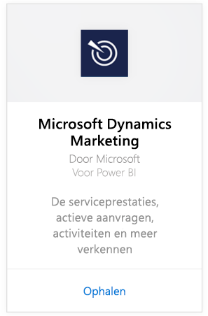
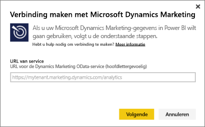
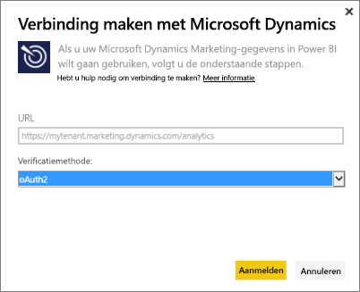
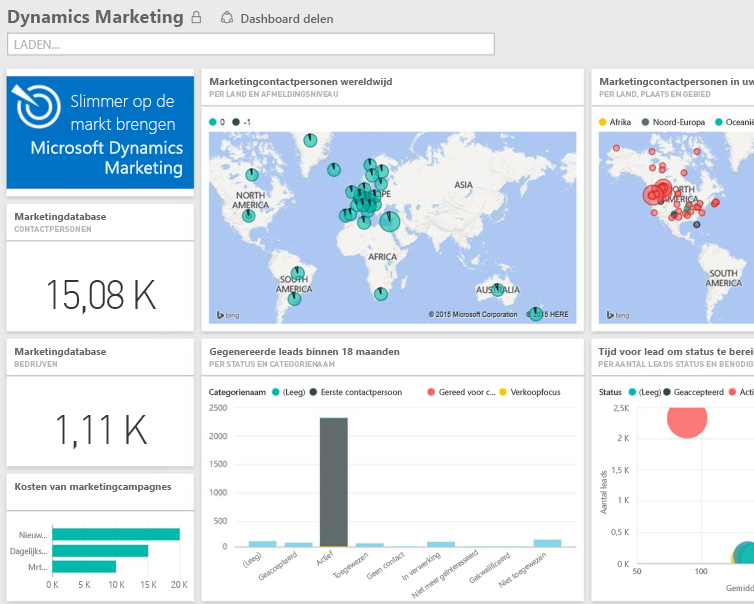

# Verbinding maken met Microsoft Dynamics Marketing in Power BI
Met het Microsoft Dynamics Marketing-inhoudspakket voor Power BI kunt u eenvoudig toegang krijgen tot uw gegevens en uw gegevens van Dynamics Marketing analyseren. Het inhoudspakket maakt gebruik van een beschrijvend model boven op de OData-feed, met alle benodigde entiteiten en meetwaarden zoals Programma's, Campagnes, Marketing-contactpersonen en bedrijven, Potentiële klanten, Leadscores, E-mailmarketingberichten en websites, gedragsonderzoek, budgetten, financiële transacties, prestatie-KPI's en nog veel meer. 

Verbinding maken met [Dynamics Marketing-inhoudspakket](https://app.powerbi.com/getdata/services/microsoft-dynamics-marketing) voor Power BI.

>[!NOTE]
>U moet een geldige OData-URL voor een Dynamics Marketing-exemplaar opgeven (het inhoudspakket werkt niet met een on-premises CRM-versie). Zie hieronder voor aanvullende vereisten.

## Verbinding maken
1. Selecteer Gegevens ophalen onder in het linkernavigatievenster.
   
    
2. Selecteer in het vak **Services** de optie **Ophalen**.
   
    
3. Selecteer **Microsoft Dynamics Marketing** \> **Ophalen**.
   
   
4. Geef de OData-URL op die is gekoppeld aan uw account.  Deze heeft de indeling "`https://[instance\_name].marketing.dynamics.com/analytics.`"
   
   
5. Geef indien gewenst uw referenties op (deze stap kan worden overgeslagen als u al bent aangemeld in uw browser). Voer voor de verificatiemethode **oAuth2** in en klik op **Aanmelden**:
   
   
6. Nadat u verbinding hebt gemaakt, ziet u een Dynamics Marketing-dashboard met uw eigen gegevens ingevuld. De gele sterretjes markeren de nieuwe items in het navigatiedeelvenster links.
   
   

**Wat nu?**

* [Stel vragen in het vak Q&A](consumer/end-user-q-and-a.md) boven in het dashboard.
* [Wijzig de tegels](service-dashboard-edit-tile.md) in het dashboard.
* [Selecteer een tegel](consumer/end-user-tiles.md) om het onderliggende rapport te openen.
* Als uw gegevensset is ingesteld op dagelijks vernieuwen, kunt u het vernieuwingsschema wijzigen of de gegevensset handmatig vernieuwen met **Nu vernieuwen**

## Systeemvereisten
* U moet een geldige OData-URL voor een Dynamics Marketing-exemplaar opgeven (het inhoudspakket werkt niet met een on-premises CRM-versie).  
* Een beheerder moet het OData-eindpunt in de site-instellingen inschakelen. U kunt het adres van de OData-eindpunt vinden door te navigeren naar **Start \> Instellingen \> Site-instellingen** in de sectie **Organisatiegegevensservice**.  De OData-URL heeft de indeling: https://[instance\_name].marketing.dynamics.com/analytics  
* Het gebruikersaccount/de identiteit die u gebruikt voor toegang tot Microsoft Dynamics Marketing moet hetzelfde zijn als het account waarmee u zich hebt aangemeld voor het gebruik van Power BI. Wanneer u zich aanmeldt bij Microsoft Dynamics Marketing, wordt u automatisch aangemeld met dezelfde identiteit die u voor Power BI gebruikt. Als u zich wilt aanmelden bij Microsoft Dynamics Marketing met een ander account, moet u zich met het andere account registreren als een Power BI-gebruiker. We streven ernaar om dit probleem op te lossen in een toekomstige release.   

## Probleemoplossing
Als u een bericht Aanmelden is mislukt ziet als u verbinding wilt maken met uw Dynamics CRM-account, moet u controleren of u voor het aanmelden bij Power BI hetzelfde account gebruikt als het account dat u gebruikt om toegang te krijgen tot de CRM Online OData-feed. Probeer ook aan te melden bij de feed in de browser, om het daar te testen.

Vraag uw beheerder om te bevestigen dat het de juiste OData-URL is en dat het OData-eindpunt is ingeschakeld.

Controleer de versie van Dynamics Marketing die u gebruikt. Er zijn aanvullende verbeteringen aangebracht in 18.0 en 18.1. Als u nog tegen problemen aanloopt en een oudere versie gebruikt, kunt wellicht upgraden.

Als er problemen blijven optreden, opent u een ondersteuningsticket om contact op te nemen met het team van Power BI:

* Selecteer in de Power BI-app het vraagteken \> **Contact opnemen met ondersteuning**.
* Selecteer op de pagina Ondersteuning van Power BI (waar u dit artikel leest) **Contact opnemen met ondersteuning** aan de rechterkant van de pagina.

## Volgende stappen
[Gegevens ophalen voor Power BI](service-get-data.md)

[Wat is Power BI?](power-bi-overview.md)

