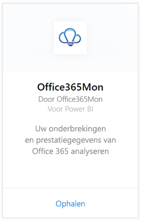
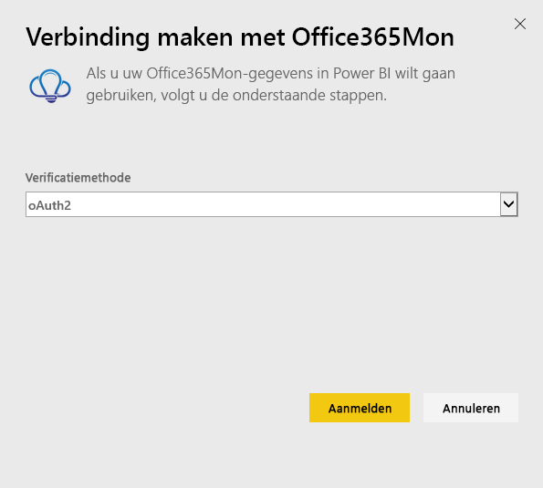
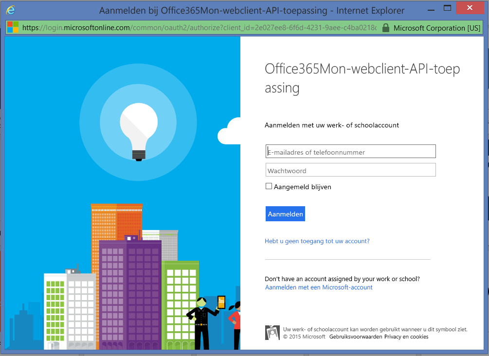
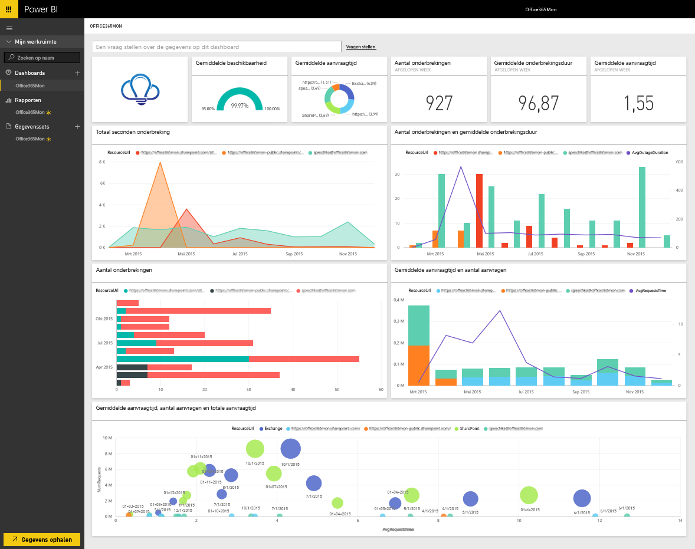

# Verbinding maken met Office365Mon met Power BI
U kunt eenvoudig de onderbrekingen van Office 365 en prestatiegegevens analyseren met Power BI en het Office365Mon-inhoudspakket. Uw gegevens, inclusief storingen en statuscontroles, worden opgehaald met Power BI en er worden een kant-en-klaar dashboard en rapporten gemaakt op basis van die gegevens.

Maak verbinding met het [Office365Mon-inhoudspakket](https://app.powerbi.com/groups/me/getdata/services/office365mon) voor Power BI.

>[!NOTE]
>Een Office365Mon-beheerdersaccount is vereist om het Power BI-inhoudspakket te verbinden en laden.

## Verbinding maken
1. Selecteer **Gegevens ophalen** onder in het linkernavigatievenster.
   
   
2. Selecteer in het vak **Services** de optie **Ophalen**.
   
    
3. Selecteer **Office365Mon** \> **Ophalen**.
   
   
4. Selecteer voor de verificatiemethode **oAuth2** \> **Aanmelden**.
   
   Geef desgevraagd uw Office365Mon-beheerdersreferenties op en voer het verificatieproces uit.
   
   
   
   
5. Nadat de gegevens in Power BI zijn geïmporteerd, ziet u een nieuw dashboard, een nieuw rapport en een nieuwe gegevensset in het navigatiedeelvenster aan de linkerzijde. Nieuwe items worden gemarkeerd met een geel sterretje \*; selecteer de vermelding Office365Mon.
   
   

**Wat nu?**

* [Stel vragen in het vak Q&A](service-q-and-a.md) boven in het dashboard
* [Wijzig de tegels](service-dashboard-edit-tile.md) in het dashboard.
* [Selecteer een tegel](service-dashboard-tiles.md) om het onderliggende rapport te openen.
* Als uw gegevensset is ingesteld op dagelijks vernieuwen, kunt u het vernieuwingsschema wijzigen of de gegevensset handmatig vernieuwen met **Nu vernieuwen**

## Probleemoplossing
Als u een fout **Aanmelden is mislukt** krijgt nadat u uw Office365Mon-abonnementsgegevens hebt gebruikt om in te loggen, dan heeft het account dat u gebruikt geen rechten om de Office365Mon-gegevens van uw account op te halen. Controleer of het een beheerdersaccount is en probeer het opnieuw.

## Volgende stappen
[Aan de slag met Power BI](service-get-started.md)

[Gegevens ophalen voor Power BI](service-get-data.md)

