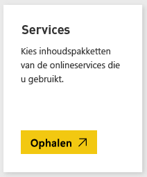
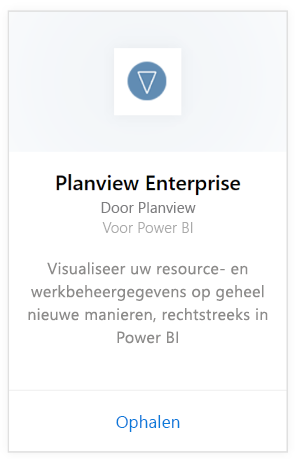
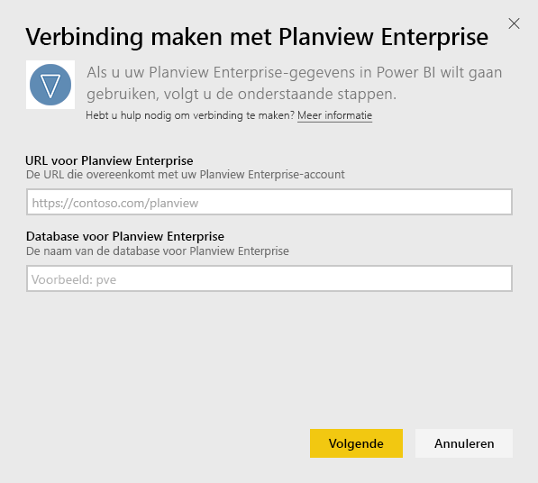
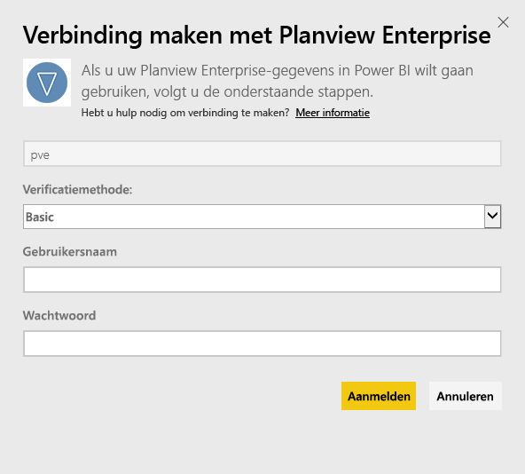
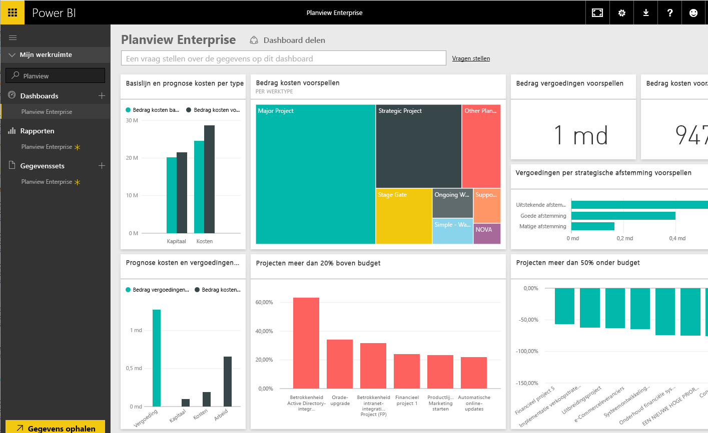

# Verbinding maken met Planview Enterprise met Power BI
Met het inhoudspakket van Planview Enterprise kunt u resource- en werkbeheergegevens op geheel nieuwe manieren visualiseren, rechtstreeks in Power BI. Gebruik uw Planview Enterprise-referenties voor een interactieve weergave van de investeringen in uw beleggingsportefeuille, om inzicht te krijgen in waar u boven en onder uw budget zit en om te zien hoe goed uw projecten zijn afgestemd op de strategische prioriteiten van uw bedrijf. U kunt het kant-en-klare dashboard en de rapporten ook uitbreiden om de inzichten te krijgen die voor u het belangrijkst zijn.

Verbinding maken met de [inhoudspakket van Planview Enterprise in Power BI](https://app.powerbi.com/getdata/services/planview-enterprise)

>[!NOTE]
>Als u uw Planview Enterprise-gegevens wilt importeren in Power BI, moet u een Planview Enterprise-gebruiker zijn en moet de functie voor het bekijken van de rapportageportal zijn ingeschakeld voor uw rol. Zie hieronder voor aanvullende vereisten.

## Verbinding maken
1. Selecteer **Gegevens ophalen** onder in het linkernavigatievenster.
   
    
2. Selecteer in het vak **Services** de optie **Ophalen**.
   
    
3. Selecteer op de pagina van Power BI **Planview Enterprise** en daarna **Ophalen**:  
    
4. Voer in het tekstvak URL voor Planview Enterprise de URL in voor de Planview Enterprise-server die u wilt gebruiken. Voer de naam van de Planview Enterprise-database in het tekstvak Planview Enterprise-database en klik op Volgende.  
    
5. Selecteer in de lijst Verificatiemethode **Basis** als dit nog niet is geselecteerd. Voer de **Gebruikersnaam** en het **Wachtwoord** voor uw account in en selecteer **Aanmelden**.  
   
6. Selecteer in het linkerdeelvenster Planview Enterprise in de lijst met dashboards.  
     De Planview Enterprise-gegevens worden geïmporteerd in het dashboard. Houd er rekening mee dat het laden van de gegevens even kan duren.  
    

**Wat nu?**

* [Stel vragen in het vak Q&A](consumer/end-user-q-and-a.md) boven in het dashboard.
* [Wijzig de tegels](service-dashboard-edit-tile.md) in het dashboard.
* [Selecteer een tegel](consumer/end-user-tiles.md) om het onderliggende rapport te openen.
* Als uw gegevensset is ingesteld op dagelijks vernieuwen, kunt u het vernieuwingsschema wijzigen of de gegevensset handmatig vernieuwen met **Nu vernieuwen**

## Systeemvereisten
Als u uw Planview Enterprise-gegevens wilt importeren in Power BI, moet u een Planview Enterprise-gebruiker zijn en moet de functie voor het bekijken van de rapportageportal zijn ingeschakeld voor uw rol. Zie hieronder voor aanvullende vereisten.

Deze procedure gaat ervan uit dat u zich al met een Power BI-account hebt aangemeld op de startpagina van Microsoft Power BI. Als u geen Power BI-account hebt, gaat u naar [powerbi.com](https://powerbi.microsoft.com/get-started/) en selecteert u onder **Power BI - Samenwerken en delen via de cloud** de optie **Gratis proberen**. Klik vervolgens op **Gegevens ophalen**.

## Volgende stappen:

[Wat is Power BI?](power-bi-overview.md)

[Gegevens ophalen voor Power BI](service-get-data.md)