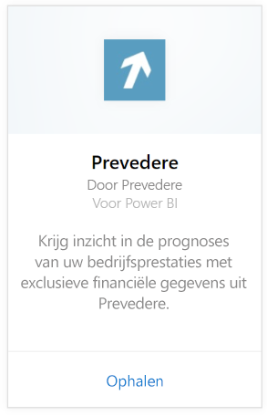
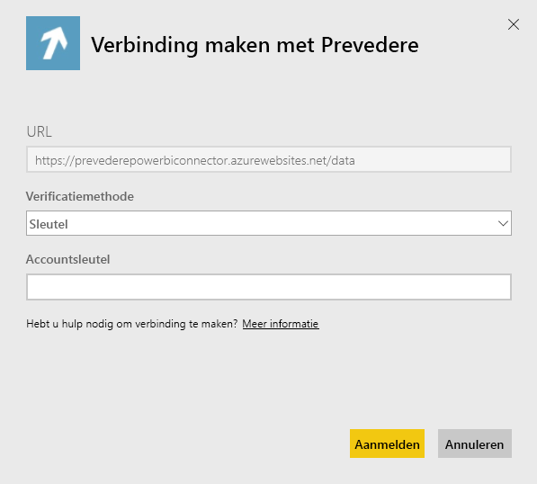

# Verbinding met Prevedere maken via Power BI
U hebt toegang tot exclusieve en kritieke financiële gegevens, zodat u uw bedrijf zorgeloos en proactief verder kunt uitbreiden.

Maak verbinding met het [Prevedere-inhoudspakket voor Power BI](https://app.powerbi.com/getdata/services/prevedere).

>[!NOTE]
>Als u Prevedere niet eerder hebt gebruikt, gebruik de [voorbeeldsleutel](https://prevederepowerbiconnector.azurewebsites.net/static/learnmore.html) om het pakket uit te proberen.

## Verbinding maken
1. Selecteer **Gegevens ophalen** onder in het linkernavigatievenster.
   
   
2. Selecteer in het vak **Services** de optie **Ophalen**.
   
   
3. Selecteer **Prevedere** en vervolgens **Ophalen**.
   
   
4. Selecteer voor **Verificatiemethode** de optie **Sleutel** en voer uw Prevedere API-sleutel in.
   
    
5. Selecteer **Aanmelden** om te beginnen met het importproces. Nadat het importeren is voltooid, bevat het navigatiedeelvenster een nieuw dashboard, rapport en model. Selecteer het dashboard om uw geïmporteerde gegevens weer te geven.
   
     

**Wat nu?**

* [Stel vragen in het vak Q&A](power-bi-q-and-a.md) boven in het dashboard.
* [Wijzig de tegels](service-dashboard-edit-tile.md) in het dashboard.
* [Selecteer een tegel](service-dashboard-tiles.md) om het onderliggende rapport te openen.
* Als uw gegevensset is ingesteld op dagelijks vernieuwen, kunt u het vernieuwingsschema wijzigen of de gegevensset handmatig vernieuwen met **Nu vernieuwen**.

## Wat is inbegrepen?
Het inhoudspakket biedt inzicht in uw retailprognoses, prognosemodellen, belangrijkste indicatoren en meer.

## Systeemvereisten
Dit inhoudspakket vereist toegang tot een Prevedere API-sleutel of de voorbeeldsleutel (zie hieronder).

## Parameters zoeken

Bestaande klanten hebben toegang tot hun gegevens via de API-sleutel. Als u nog geen klant bent, kunt u een voorbeeld van de gegevens en analyses bekijken door gebruik te maken van de [voorbeeldsleutel](https://prevederepowerbiconnector.azurewebsites.net/static/learnmore.html).

## Probleemoplossing
Het kan even duren voordat alle gegevens zijn geladen. Dit is afhankelijke van de grootte van uw instantie.

## Volgende stappen
[Aan de slag in Power BI](service-get-started.md)

[Gegevens ophalen in Power BI](service-get-data.md)

