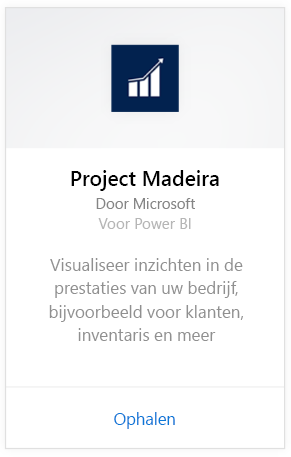
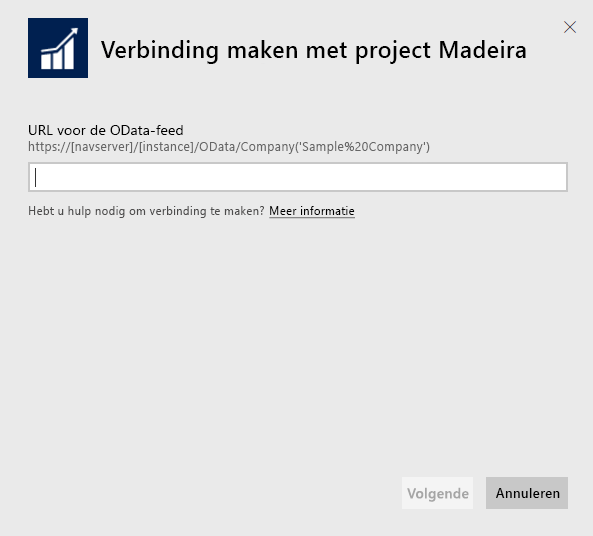
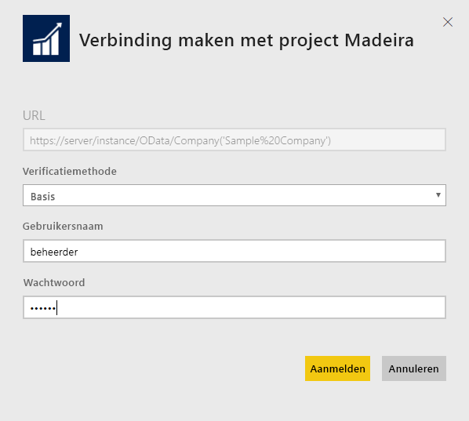
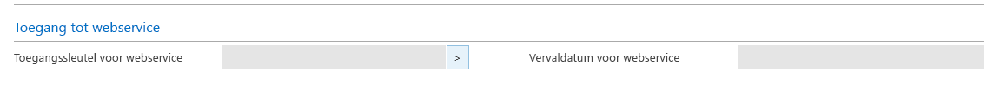
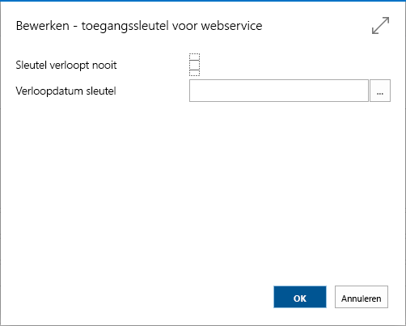

# Verbinding maken met Project "Madeira" met behulp van Power BI
U kunt eenvoudig inzicht krijgen in uw Project "Madeira"-gegevens met Power BI en het Project "Madeira"-inhoudspakket. Met Power BI kunt u uw gegevens ophalen, zowel verkoopgegevens als financiële gegevens, en vervolgens een out-of-box-dashboard en rapporten bouwen op basis van die gegevens.
Maak verbinding met Project "Madeira" voor Power BI of lees meer over de Project "Madeira"-integratie met Power BI.

>[!NOTE]
>Voor dit inhoudspakket hebt u machtigingen nodig voor de tabellen waaruit gegevens worden opgehaald, in dit geval verkoopgegevens en financiële gegevens. Meer informatie over de vereisten volgt [hieronder](#Requirements).

Maak verbinding met het [Project "Madeira" Analytics-inhoudspakket](https://app.powerbi.com/getdata/services/project-madeira) voor Power BI.

## Verbinding maken
1. Selecteer **Gegevens ophalen** onder in het linkernavigatievenster.  
    
2. Selecteer in het vak **Services** de optie **Ophalen**.  
    
3. Selecteer **Project "Madeira"** en selecteer vervolgens **Ophalen**.  
    
4. Wanneer u dat wordt gevraagd, voert u de URL van Project "Madeira" in. De URL moet het volgende patroon exact volgen en uw Project "Madeira"-bedrijfsnaam bevatten: https://mycronusus.projectmadeira.com:7048/NAV/OData/Company('CRONUS%20US'). Let er op dat er geen afsluitende schuine streep aan het einde staat en dat de verbinding https is. Gedetailleerde informatie over het vinden van deze URL vindt u [hieronder](#FindingParams).  
   
    
5. Wanneer u dat wordt gevraagd, selecteert u Basic als verificatiemethode, voert u uw e-mailadres voor Project "Madeira" in als de gebruikersnaam, en voert u de webservicetoegangssleutel voor uw Project "Madeira"-account in als het wachtwoord. Als u al bent aangemeld bij Project "Madeira" in uw browser, ontvangt u mogelijk geen prompt om referenties in te voeren. Gedetailleerde informatie over het genereren van de toegangssleutel vindt u [hieronder](#FindingParams).  
   
    >[!NOTE]
    >U moet een supergebruiker zijn in Project "Madeira".
   
   
6. Zodra u bent verbonden, wordt er automatisch een dashboard, rapport en gegevensset geladen. Wanneer dit is voltooid, worden de tegels bijgewerkt met gegevens uit uw account.  
   
    

**Wat nu?**

* [Stel vragen in het vak Q&A](power-bi-q-and-a.md) boven in het dashboard.
* [Wijzig de tegels](service-dashboard-edit-tile.md) in het dashboard.
* [Selecteer een tegel](service-dashboard-tiles.md) om het onderliggende rapport te openen.
* Als uw gegevensset is ingesteld op dagelijks vernieuwen, kunt u het vernieuwingsschema wijzigen of de gegevensset handmatig vernieuwen met **Nu vernieuwen**.

## Systeemvereisten
Als u uw Project "Madeira"-gegevens wilt importeren in Power BI, moet u machtigingen hebben voor de tabellen met verkoopgegevens en financiële gegevens waaruit gegevens worden opgehaald. Vereiste tabellen (hoofdlettergevoelig) voor het inhoudspakket zijn:  
 
    ´´´ 
    - ItemSalesAndProfit  
    - ItemSalesByCustomer  
    - powerbifinance  
    - SalesDashboard  
    - SalesOpportunities  
    - SalesOrdersBySalesPerson  
    - TopCustomerOverview  
    ´´´ 

## Parameters zoeken
**De juiste URL ophalen** U kunt deze URL eenvoudig ophalen in Project "Madeira" door naar Web Services te gaan en daar te zoeken naar de powerbifinance-webservice. Kopieer de Odata-URL (klik met de rechtermuisknop en selecteer Snelkoppeling kopiëren), maar verwijder daarbij het deel '/powerbifinance...' uit de URL.

**Webservicetoegangssleutels** U moet u een webservicetoegangssleutel voor uw gebruikersaccount maken om gegevens van Project "Madeira" te gebruiken. Zoek in Project "Madeira" naar de pagina Gebruikers en open vervolgens de kaart voor uw gebruikersaccount. Hier kunt u een nieuwe webservicetoegangssleutel genereren en deze kopiëren naar het wachtwoordveld op de verbindingspagina voor Power BI.

Wanneer u webservicetoegangssleutels gaat gebruiken, moet u deze in de toekomst blijven gebruiken, dus klik op OK in het bericht dat wordt weergegeven.
U kunt bij het maken van de sleutel selecteren of deze op een specifieke datum moet verlopen.

Als u OK kiest, wordt er een sleutel gemaakt, zodat u deze kunt kopiëren naar het wachtwoordveld op de verbindingspagina voor Power BI.

## Problemen oplossen
Het Power BI-dashboard is afhankelijk van de gepubliceerde webservices die hierboven worden vermeld, en geeft gegevens weer van het voorbeeldbedrijf of uw eigen bedrijf als u gegevens uit uw huidige financiële oplossing importeert. Als er toch iets mis gaat, vindt u in dit gedeelte tijdelijke oplossingen voor de meest voorkomende problemen.

**Kan de parameter niet valideren. Controleer of alle parameters geldig zijn**

Als deze fout wordt weergegeven nadat u uw Project 'Madeira'-URL hebt ingevoerd, controleert u of er aan de volgende vereisten wordt voldaan:  

   - De URL volgt exact dit patroon: https://*mycronusus*.projectmadeira.com:7048/NAV/OData/Company('*CRONUS%20US*')  
   - Verwijder tekst tussen haakjes na de bedrijfsnaam  
   - Zorg dat er geen afsluitende slash aan het einde van de URL staat.  
   - Zorg ervoor dat de URL een beveiligde verbinding gebruikt en dus met https begint.  

**'Aanmelden mislukt'** Als er een fout wordt weergegeven dat het aanmelden is mislukt wanneer u zich probeert aan te melden voor het dashboard met uw Project "Madeira"-gegevens, kan dit een van de volgende oorzaken hebben:  

   - Het account dat u gebruikt, heeft geen rechten om de Project "Madeira"-gegevens van uw account te lezen. Controleer uw gebruikersaccount in Project "Madeira" en bekijk of u de juiste webservicetoegangssleutel hebt gebruikt als wachtwoord. Probeer het vervolgens opnieuw.  
   - Het Project "Madeira"-exemplaar waarmee u probeert verbinding te maken, heeft geen geldig SSL-certificaat. In dit geval ziet u een gedetailleerde foutmelding (kan geen vertrouwde SSL-relatie tot stand brengen). Houd er rekening mee dat zelfondertekende certificaten niet worden ondersteund.  

**'Oeps'** Als er een dialoogvenster met de foutmelding 'Oeps' wordt weergegeven nadat u het dialoogvenster voor verificatie hebt doorgegeven, wordt dit meestal veroorzaakt door een probleem bij het verbinden met de gegevens voor het inhoudspakket. Controleer of de URL het patroon heeft dat eerder is aangegeven:  
    https://*mycronusus*.projectmadeira.com:7048/NAV/OData/Company('*CRONUS%20US*')

Een veelvoorkomende fout is het opgeven van de volledige URL voor een specifieke webservice:  
    https://*mycronusus*.projectmadeira.com:7048/NAV/OData/Company('*CRONUS%20US*')/powerbifinance

Of u bent mogelijk vergeten om de bedrijfsnaam op te geven:   
    https://*mycronusus*.projectmadeira.com:7048/NAV/OData/

## Volgende stappen
[Aan de slag met Power BI](service-get-started.md)

[Power BI - basisconcepten](service-basic-concepts.md)

