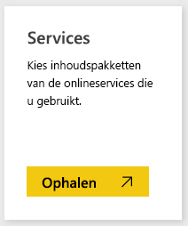
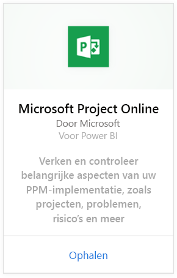
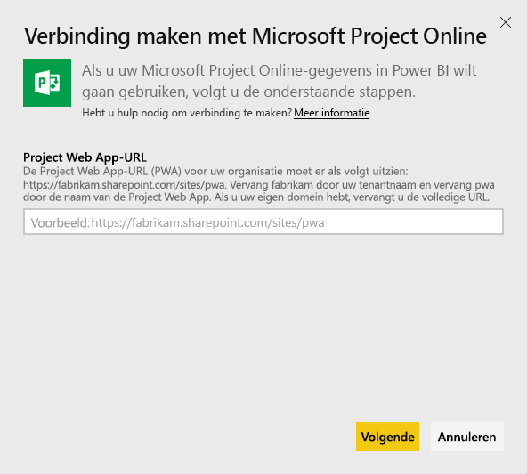
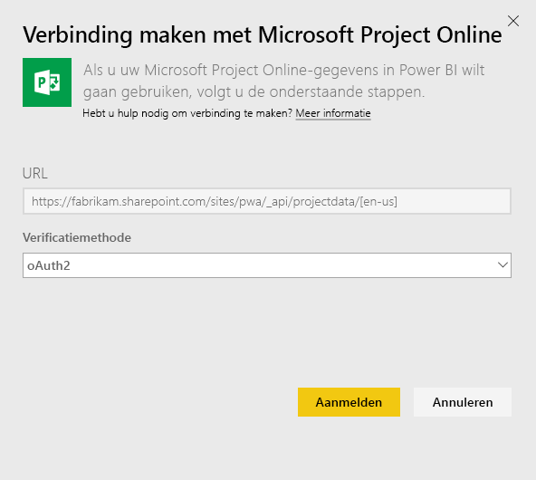
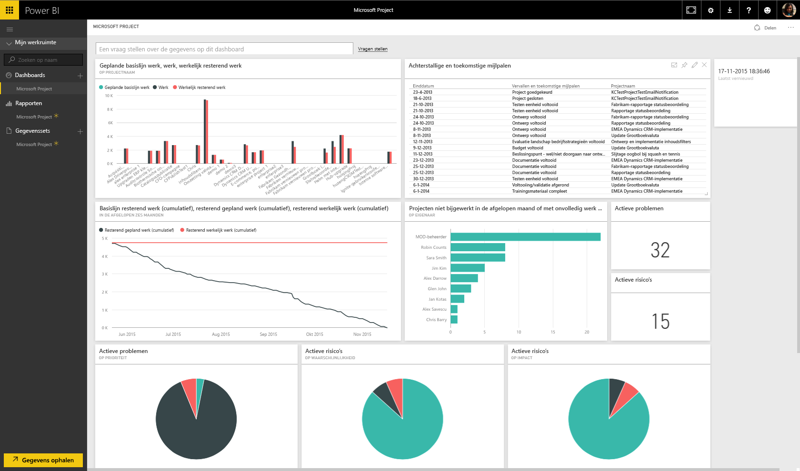
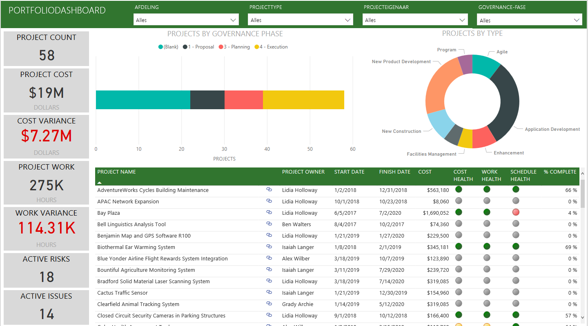
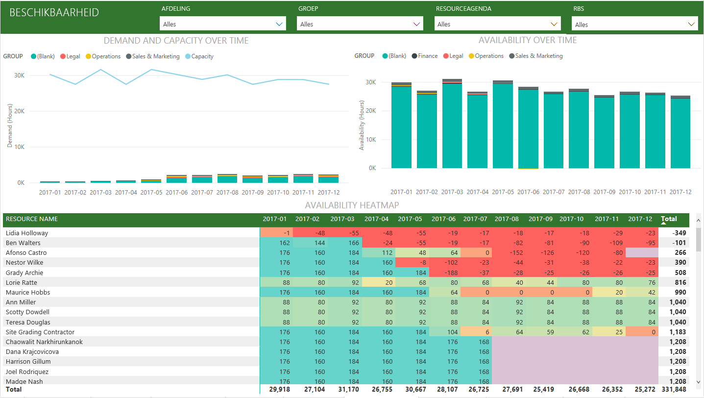
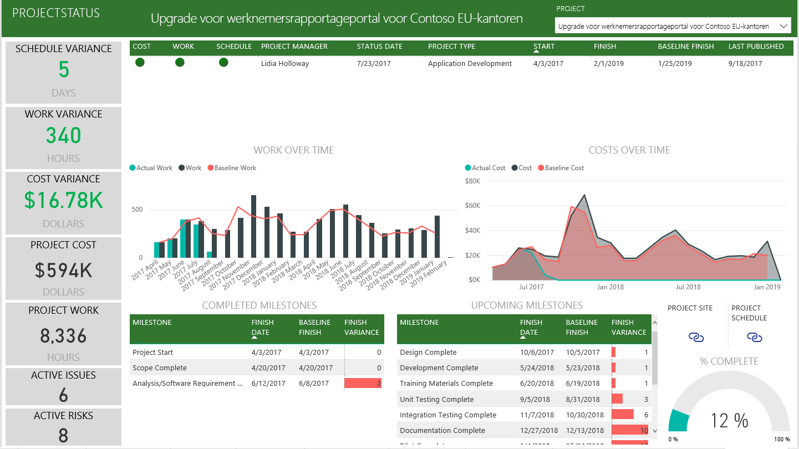

# Verbinding maken met Project Online via Power BI
Microsoft Project Online is een flexibele onlineoplossing voor beheer van projectportfolio's (Project Portfolio Management; PPM) en dagelijkse werkzaamheden. Met Project Online kunnen organisaties meteen aan de slag, projectportfolio-investeringen prioriteren en de beoogde bedrijfswaarde leveren. Met het Project Online-inhoudspakket voor Power BI kunt u inzicht van Power Online ontgrendelen voor het beheer van projecten, portfolio's en resources.

Maak verbinding met het [Project Online-inhoudspakket](https://app.powerbi.com/getdata/services/project-online) voor Power BI.

## Verbinding maken
1. Selecteer **Gegevens ophalen** onder in het linkernavigatievenster.
   
    
2. Selecteer in het vak **Services** de optie **Ophalen**.
   
   
3. Selecteer **Microsoft Project Online** \> **Ophalen**.
   
   
4. Voer in het tekstvak **Project Web App-URL** de URL in voor de Project Web Add (PWA) toe waarmee u wilt verbinden en kies **Volgende**. Houd er rekening mee dat deze instructie kan afwijken van het voorbeeld als u een aangepast domein hebt. Typ in het tekstvak **Taal PWA-site** het getal dat overeenkomt met de taal van uw PWA-site. Typ het cijfer '1' voor Engels, '2' voor Frans, '3' voor Duits, '4' voor Portugees (Brazilië), '5' voor Portugees (Portugal) en '6' voor Spaans. 
   
    
5. Selecteer voor de verificatiemethode **oAuth2** \> **Aanmelden**. Geef uw Project Online-referenties op als u hierom wordt gevraagd en voer het verificatieproces uit.
   
    
    
Houd er rekening mee dat u machtigingen als Portfolioviewer, Portfoliomanager of beheerder moet hebben voor de Project Web App waarmee u verbinding maakt.

6. U ziet een melding dat uw gegevens geladen worden. Dit kan enige tijd duren, afhankelijk van de grootte van uw account. Nadat de gegevens in Power BI zijn geïmporteerd, ziet u een nieuw dashboard, 13 rapporten en een nieuwe gegevensset in het navigatiedeelvenster aan de linkerzijde. Dit is het standaarddashboard dat door Power BI is gemaakt om uw gegevens weer te geven. U kunt dit dashboard wijzigen om uw gegevens weer te geven zoals u dat wilt.

   

7. Wanneer uw dashboard en rapporten klaar zijn, kunt u uw Project Online-gegevens verkennen. Het inhoudspakket wordt geleverd met 13 uitgebreide en gedetailleerde rapporten voor het Portfolio-overzicht (6 rapportpagina's), het Resource-overzicht (5 rapportpagina's) en de Project-status (2 rapportpagina's). 

   
   
   
   
   

**Wat nu?**

* [Stel vragen in het vak Q&A](power-bi-q-and-a.md) boven in het dashboard.
* [Wijzig de tegels](service-dashboard-edit-tile.md) in het dashboard.
* [Selecteer een tegel](service-dashboard-tiles.md) om het onderliggende rapport te openen.
* Als uw gegevensset is ingesteld op dagelijks vernieuwen, kunt u het vernieuwingsschema wijzigen of de gegevensset handmatig vernieuwen met **Nu vernieuwen**.

**Het inhoudspakket uitvouwen**

Download het [GitHub PBIT-bestand](https://github.com/OfficeDev/Project-Power-BI-Content-Packs) om het inhoudspakket verder aan te passen en bij te werken

## Volgende stappen
[Aan de slag in Power BI](service-get-started.md)

[Gegevens ophalen in Power BI](service-get-data.md)

