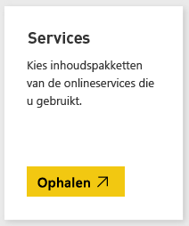
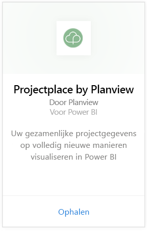
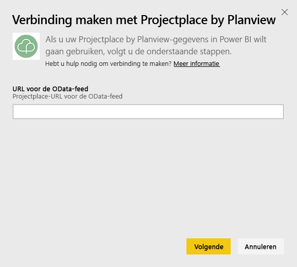
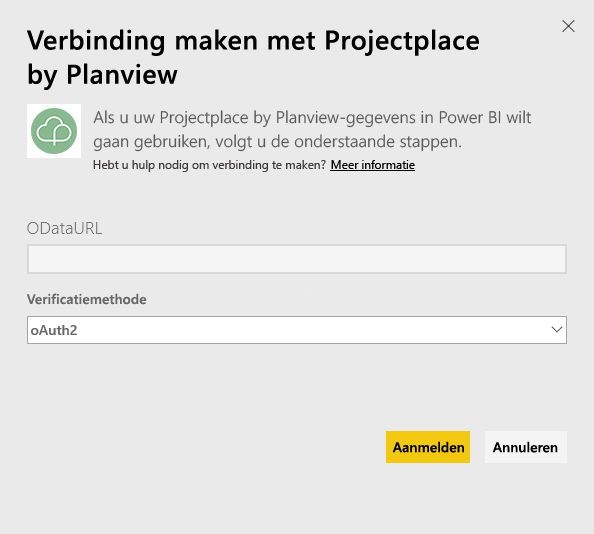
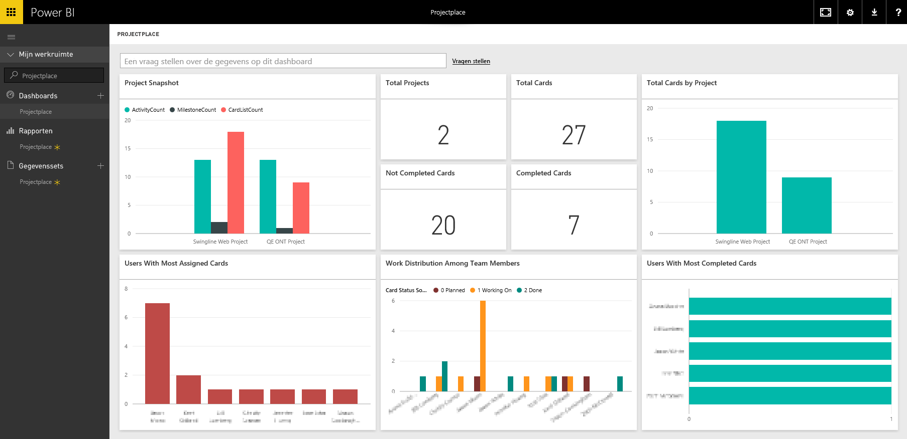

# Verbinding maken met Projectplace by Planview met Power BI
Met het inhoudspakket van Projectplace by Planview kunt u uw gezamenlijke projectgegevens op geheel nieuwe manieren rechtstreeks in Power BI visualiseren. Gebruik uw aanmeldingsgegevens van Projectplace om de belangrijkste projectstatistieken interactief te bekijken, te ontdekken wie uw meest actieve en productieve teamleden zijn en de risicokaarten en activiteiten in verschillende projecten in uw Projectplace-account te identificeren. U kunt het kant-en-klare dashboard en de rapporten ook uitbreiden om de inzichten te krijgen die voor u het belangrijkst zijn.

[Verbinding maken met het Projectplace-inhoudspakket in Power BI](https://app.powerbi.com/getdata/services/projectplace)

>[!NOTE]
>Als u uw Projectplace-gegevens wilt importeren in Power BI, moet u een Projectplace-gebruiker zijn. Zie hieronder voor aanvullende vereisten.

## Verbinding maken
1. Selecteer **Gegevens ophalen** onder in het linkernavigatievenster.
   
    
2. Selecteer in het vak **Services** de optie **Ophalen**.
   
    
3. Selecteer op de pagina van Power BI **Projectplace by Planview** en daarna **Ophalen**:  
   
    
4. Typ in het tekstvak URL voor OData-feed de URL voor de Projectplace OData-feed die u wilt gebruiken, zoals weergegeven in de volgende afbeelding:
   
    
5. Selecteer in de lijst Verificatiemethode **OAuth** als dit nog niet is geselecteerd. Klik op **Aanmelden** en volg de aanmeldprocedure.  
   
   
6. Selecteer in het linkerdeelvenster **Projectplace** in de lijst met dashboards. De Projectplace-gegevens worden door Power BI geïmporteerd in het dashboard. Houd er rekening mee dat het laden van de gegevens even kan duren.  
   
    Het dashboard bevat tegels die gegevens uit uw Projectplace-database weergeven. De volgende afbeelding toont een voorbeeld van het standaard Projectplace-dashboard in Power BI.
   
    

**Wat nu?**

* [Stel vragen in het vak Q&A](service-q-and-a.md) bovenin het dashboard
* [Wijzig de tegels ](service-dashboard-edit-tile.md) in het dashboard.
* [Selecteer een tegel](service-dashboard-tiles.md) om het onderliggende rapport te openen.
* Als uw gegevensset is ingesteld op dagelijks vernieuwen, kunt u het vernieuwingsschema wijzigen of de gegevensset handmatig vernieuwen met **Nu vernieuwen**

## Systeemvereisten
Als u uw Projectplace-gegevens wilt importeren in Power BI, moet u een Projectplace-gebruiker zijn. Deze procedure gaat ervan uit dat u zich al met een Power BI-account hebt aangemeld op de startpagina van Microsoft Power BI. Als u geen Power BI-account hebt, kunt u gratis een nieuw Power BI-account maken op de startpagina van Power BI. Klik vervolgens op Gegevens ophalen.

## Volgende stappen
[Aan de slag met Power BI](service-get-started.md)

[Power BI - basisconcepten](service-basic-concepts.md)

