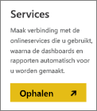
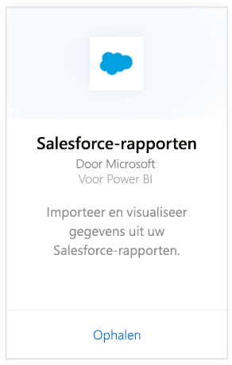
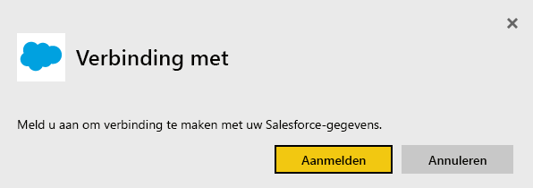
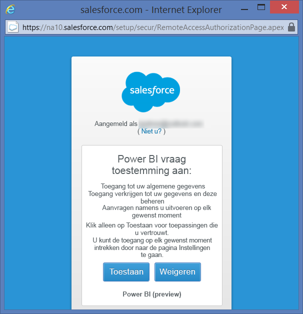
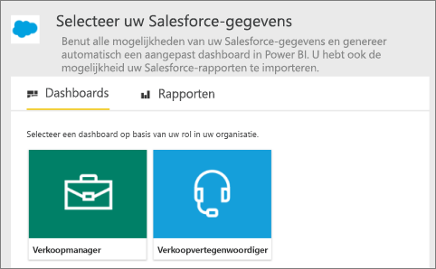
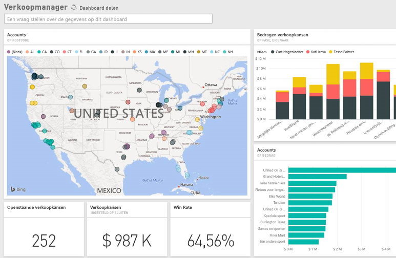

# Verbinding met Salesforce maken via Power BI
Met Power BI kunt u eenvoudig verbinding maken met uw Salesforce.com-account. Door deze verbinding te maken worden uw gegevens opgehaald en wordt er automatische een dashboard met de bijbehorende rapporten op basis van uw gegevens gemaakt.

Maak verbinding met het [Salesforce-inhoudspakket](https://app.powerbi.com/getdata/services/salesforce) voor Power BI of lees meer over de [integratie van Salesforce](https://powerbi.microsoft.com/integrations/salesforce) met Power BI.

## Verbinding maken
1. Selecteer **Gegevens ophalen** onder in het linkernavigatievenster.
   
    
2. Selecteer in het vak **Services** de optie **Ophalen**.
   
    
3. Klik op **Salesforce** en selecteer **Ophalen**.  
   
   
4. Selecteer **Aanmelden** om de aanmeldingsprocedure te starten.
   
    
5. Geef desgevraagd uw Salesforce-referenties op. Klik op **Toestaan** zodat Power BI toegang heeft tot uw basisinformatie en -gegevens van Salesforce.
   
   
6. Gebruik de vervolgkeuzelijst om te configureren wat u wilt importeren in Power BI:
   
   * **Dashboard**
     
     Selecteer een vooraf gedefinieerde dashboard op basis van een persoon (zoals **salesmanager**). Met deze dashboards importeert u een specifieke set standaardgegevens van Salesforce. Deze dashboards bevatten geen aangepaste velden.
     
     
   * **Rapporten**
     
     Selecteer een of meer aangepaste rapporten in uw Salesforce-account. Deze rapporten komen overeen met de weergaven in Salesforce en kunnen gegevens uit aangepaste velden of objecten bevatten.
     
     
     
     Als er geen rapporten worden weergegeven, voegt u ze toe aan of maakt u ze in uw Salesforce-account en maakt u opnieuw verbinding.
7. Klik op **Verbinding maken** om het importproces te starten. Tijdens het importeren wordt er een melding weergegeven dat er een importbewerking wordt uitgevoerd. Zodra het importeren is voltooid, ziet u een dashboard, rapport en gegevensset voor uw Salesforce-gegevens in het navigatiedeelvenster aan de linkerkant.
   
   

U kunt dit dashboard wijzigen om uw gegevens weer te geven zoals u dat wilt. U kunt vragen stellen met Q & A of op een tegel klikken om [het onderliggende rapport te openen](service-dashboard-tiles.md) en [de tegels wijzigen](service-dashboard-edit-tile.md) in het dashboard.

**Wat nu?**

* [Stel vragen in het vak Q&A](power-bi-q-and-a.md) boven in het dashboard
* [Wijzig de tegels](service-dashboard-edit-tile.md) in het dashboard.
* [Selecteer een tegel](service-dashboard-tiles.md) om het onderliggende rapport te openen.
* Als uw gegevensset is ingesteld op dagelijks vernieuwen, kunt u het vernieuwingsschema wijzigen of de gegevensset handmatig vernieuwen met **Nu vernieuwen**.

## Systeemvereisten en overwegingen
- Verbinding met een productieaccount van Salesforce waarvoor API-toegang is ingeschakeld.
- Er moet tijdens het aanmelden een machtiging aan de BI-app worden verleend.
- Het account beschikt over voldoende beschikbare API-aanroepen om de gegevens op te halen en te vernieuwen.
- Er is een geldig verificatietoken nodig om de gegevens te kunnen vernieuwen. Zorg ervoor dat u maximaal Salesforce-gegevenssets importeert, aangezien er een limiet van vijf verificatietokens per toepassing geldt voor Salesforce.
- De API voor Salesforce-rapporten heeft een beperking: er worden maximaal 2000 rijen gegevens ondersteund.

## Problemen oplossen
Als er fouten optreden, raadpleegt u de bovenstaande vereisten. Houd er ook rekening mee dat aanmelden bij een aangepast of sandbox-domein momenteel niet wordt ondersteund.

### Het bericht Kan geen verbinding maken met de externe server

Als het bericht Er kan geen verbinding worden gemaakt met de externe server wordt weergegeven wanneer u probeert verbinding te maken met uw Salesforce-account, raadpleegt u deze oplossing op het Outsystems-forum: [Bericht over fout in Salesforce Connector-logboek: Er kan geen verbinding worden gemaakt met de externe server](https://www.outsystems.com/forums/Forum_TopicView.aspx?TopicId=17674&TopicName=log-in-error-message-unable-to-connect-to-the-remote-server&)

## Volgende stappen
[Wat is Power BI?](power-bi-overview.md)

[Gegevens ophalen](service-get-data.md)

