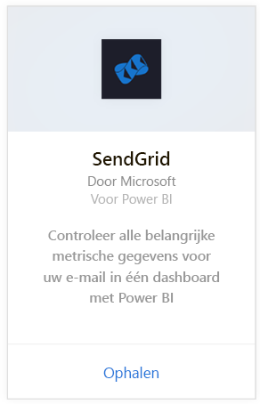
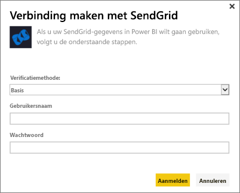
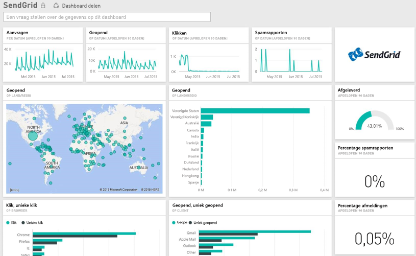

# Verbinding met SendGrid maken via Power BI
Met het Power BI-inhoudspakket voor SendGrid kunt u inzichten en statistieken verkrijgen uit uw SendGrid-account. Met behulp van het SendGrid-inhoudspakket kunt u uw statistieken van SendGrid visualiseren in een dashboard.

Maak verbinding met het [SendGrid-inhoudspakket](https://app.powerbi.com/getdata/services/sendgrid) voor Power BI.

## Verbinding maken
1. Selecteer **Gegevens ophalen** onder in het linkernavigatievenster.
   
    
2. Selecteer in het vak **Services** de optie **Ophalen**.
   
    
3. Selecteer het **SendGrid**-inhoudspakket en klik op **Ophalen**.
   
    
4. Geef desgevraagd uw SendGrid-gebruikersnaam en -wachtwoord op. Selecteer **Aanmelden**.
   
   
5. Nadat de gegevens in Power BI zijn geïmporteerd, ziet u een nieuw dashboard, een nieuw rapport en een nieuwe gegevensset in het navigatiedeelvenster aan de linkerzijde. Deze bevatten de e-mailstatistieken voor de afgelopen 90 dagen. Nieuwe items zijn gemarkeerd met een geel sterretje \*.
   
   

**Wat nu?**

* [Stel vragen in het vak Q&A](consumer/end-user-q-and-a.md) boven in het dashboard.
* [Wijzig de tegels](service-dashboard-edit-tile.md) in het dashboard.
* [Selecteer een tegel](consumer/end-user-tiles.md) om het onderliggende rapport te openen.
* Als uw gegevensset is ingesteld op dagelijks vernieuwen, kunt u het vernieuwingsschema wijzigen of de gegevensset handmatig vernieuwen met **Nu vernieuwen**

## Wat is inbegrepen
De volgende metrische gegevens zijn beschikbaar in het SendGrid-dashboard:

* Algemene e-mailstatistieken: aanvragen, bezorgd, niet bezorgbaar, geblokkeerde spam, spamrapport, enzovoort.
* E-mailstatistieken per categorie
* E-mailstatistieken per geografie
* E-mailstatistieken per serviceprovider
* E-mailbericht statistiek per apparaat, client, browser

## Volgende stappen
[Wat is Power BI?](power-bi-overview.md)

[Gegevens ophalen](service-get-data.md)

