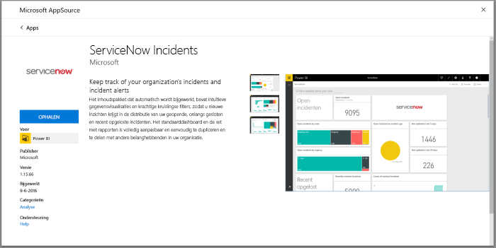
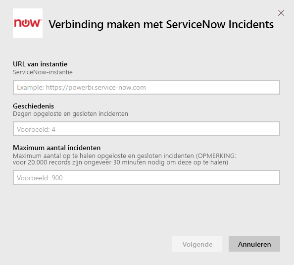
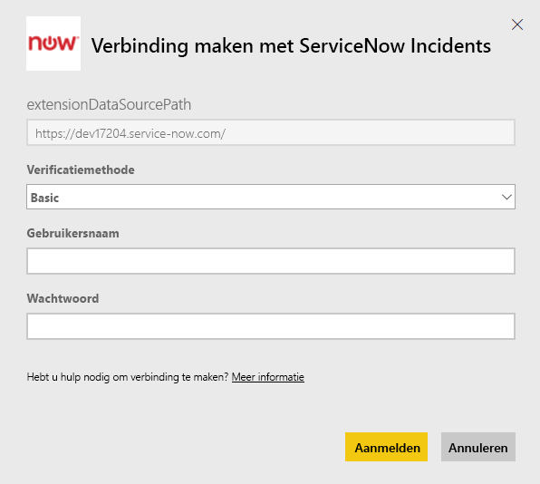
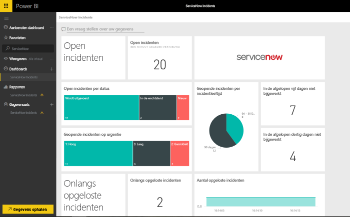

# Verbinding maken met ServiceNow met Power BI voor incidentrapportage
ServiceNow biedt verschillende producten en oplossingen, waaronder beheer van business, operaties en IT om de bedrijfsvoering te verbeteren. Dit inhoudspakket bestaat uit meerdere rapporten en inzichten in openstaande, recent opgeloste en onlangs afgesloten incidenten.  

Maak verbinding met het Power BI-inhoudspakket voor [ServiceNow Incidents](https://app.powerbi.com/getdata/services/servicenow).

## Verbinding maken
1. Selecteer **Gegevens ophalen** onder in het linkernavigatievenster.
   
    
2. Selecteer **Ophalen** in het vak **Services**.
   
    
3. Selecteer **ServiceNow Incidents** \> **Nu downloaden**.
   
   
4. Geef de URL op van uw ServiceNow-exemplaar en het bereik van dagen/records dat u wilt ophalen. Zodra er een limiet is bereikt, wordt het importeren gestopt.
   
   
5. Geef desgevraagd uw ServiceNow-referenties voor de verificatiemethode **Basic** op. Eenmalige aanmelding wordt op dit moment niet ondersteund. Zie verderop voor meer informatie over de systeemvereisten.
   
   
6. Als het aanmeldingsproces is voltooid, wordt het importproces gestart. Nadat het importeren is voltooid, bevat het navigatiedeelvenster een nieuw dashboard, rapport en model. Selecteer het dashboard om uw geïmporteerde gegevens weer te geven.
   
    

**Wat nu?**

* [Stel vragen in het vak Q&A](power-bi-q-and-a.md) boven in het dashboard.
* [Wijzig de tegels](service-dashboard-edit-tile.md) in het dashboard.
* [Selecteer een tegel](service-dashboard-tiles.md) om het onderliggende rapport te openen.
* Als uw gegevensset is ingesteld op dagelijks vernieuwen, kunt u het vernieuwingsschema wijzigen of de gegevensset handmatig vernieuwen met **Nu vernieuwen**.

## Systeemvereisten
U hebt het volgende nodig om verbinding te maken:  

* Een account dat toegang heeft uworganisatie.service-now.com met basisverificatie (eenmalige aanmelding wordt niet ondersteund in deze versie)  
* Het account moet de rol rest_service hebben en leestoegang tot de incidententabel  

## Problemen oplossen
Als er tijdens het laden een fout wordt weergegeven met betrekking tot de referenties, raadpleegt u de bovenstaande toegangsvereisten. Als u de juiste machtigingen hebt en er nog steeds problemen zijn, neemt u contact op met uw ServiceNow-beheerder om ervoor te zorgen dat u de beschikking krijgt over eventuele aanvullende machtigingen die nodig zijn voor uw aangepaste exemplaar.

Als het laden van de gegevens erg lang duurt, controleert u het aantal incidenten en het aantal dagen dat u hebt opgegeven tijdens het opzetten van de verbinding. Misschien is het verstandig om de waarden naar beneden bij te stellen.

## Volgende stappen
[Aan de slag met Power BI](service-get-started.md)

[Power BI - basisconcepten](service-basic-concepts.md)

