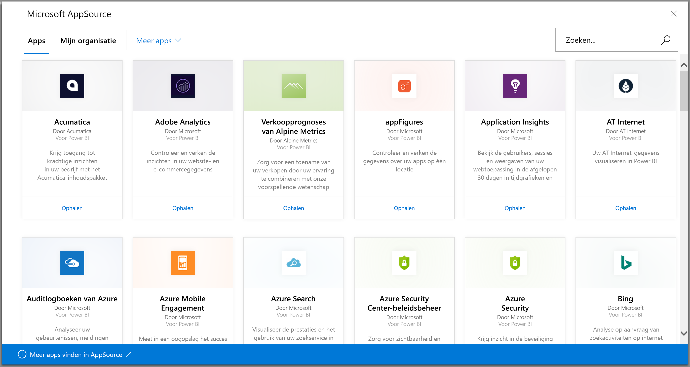
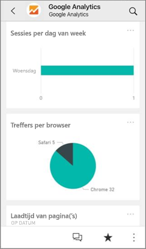
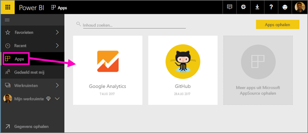
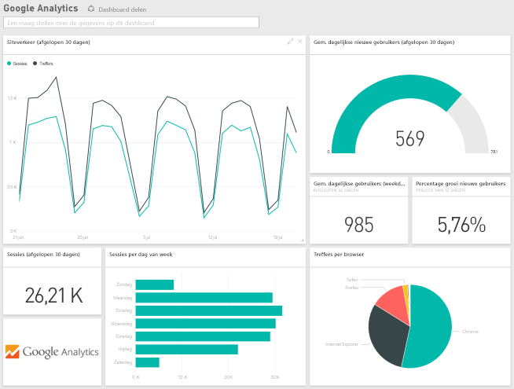
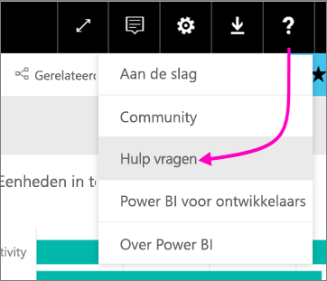

# Verbinding maken met de services die u gebruikt met Power BI
U kunt verbinding maken met een aantal services die u gebruikt om uw bedrijf te runnen, zoals Salesforce, Microsoft Dynamics en Google Analytics. In Power BI worden eerst uw referenties gebruikt om verbinding te maken met de service. Vervolgens wordt een Power BI-app met een dashboard en een reeks Power BI-rapporten gemaakt, waarop automatisch uw gegevens worden getoond en die een visueel overzicht geven van uw bedrijf.

Meld u aan bij Power BI om alle [services waarmee u verbinding kunt maken](https://app.powerbi.com/getdata/services) (Engelstalig) weer te geven. 

Nadat u de app hebt geïnstalleerd, kunt u het dashboard en de rapporten bekijken in de Power BI-service ([https://powerbi.com](https://powerbi.com)) en in de mobiele Power BI-apps. 

## Aan de slag
[!INCLUDE [powerbi-service-apps-get-more-apps](./includes/powerbi-service-apps-get-more-apps.md)]

## Dashboard en rapporten weergeven
Zodra het importeren is voltooid, wordt de nieuwe app weergegeven op de pagina Apps.

1. Selecteer in het linkernavigatievenster de optie **Apps** en selecteer vervolgens de app.
   
     
2. U kunt een vraag stellen door te typen in een Q&A-veld of op een tegel klikken om het onderliggende rapport te openen. 
   
    
   
    U kunt de gegevens in het rapport filteren en markeren, maar u kunt uw wijzigingen niet opslaan.

## Wat is erbij inbegrepen?
Nadat u verbinding met een service hebt gemaakt, ziet u een nieuwe app met een dashboard, rapporten en een gegevensset. De gegevens van de service zijn gericht op een specifiek scenario en bevatten mogelijk niet alle gegevens van de service. De gegevens worden eenmaal per dag automatisch vernieuwd. U kunt het schema aanpassen door de gegevensset te selecteren.

U kunt ook [Power BI Desktop](desktop-get-the-desktop.md) gebruiken om met bepaalde services verbinding te maken, zoals Google Analytics, en uw eigen aangepaste dashboards en rapporten te maken.  

Zie de desbetreffende Help-pagina's voor meer informatie over het verbinding maken met bepaalde services.

## Problemen oplossen
**Lege tegels**  
Als Power BI de eerste keer verbinding maakt met de service, ziet u mogelijk een lege verzameling tegels op het dashboard. Als u na twee uur nog steeds een leeg dashboard ziet, dan is de verbinding mogelijk niet tot stand gebracht. Als u geen foutbericht hebt gekregen met informatie over het oplossen van het probleem, kunt u een ondersteuningsticket indienen.

* Selecteer in de rechterbovenhoek het vraagtekenpictogram (**?**) en vervolgens **Hulp vragen**.
  
    

**Ontbrekende informatie**  
Het dashboard en de rapporten bevatten inhoud van de service die is gericht op een specifiek scenario. Ze bevatten niet alle informatie van de service. Als u een bepaalde meetwaarde niet in het inhoudspakket ziet, kunt u een idee plaatsen op de pagina [Power BI Support](https://support.powerbi.com/forums/265200-power-bi) (Ondersteuning van Power BI).

## Services voorstellen
Gebruikt u een service die u graag als Power BI-app zou willen hebben? Ga naar de pagina [Power BI Support](https://support.powerbi.com/forums/265200-power-bi) (Ondersteuning van Power BI) en laat het ons weten.

Hebt u een service waarvoor een app zou willen bouwen? [Dien uw nominatie in](https://azure.microsoft.com/marketplace/programs/certified/apply/) en selecteer Power BI-inhoudspakket publiceren om aan de slag te gaan.

## Volgende stappen
* [Wat zijn apps in Power BI?](service-install-use-apps.md)
* [Gegevens ophalen in Power BI](service-get-data.md)
* Hebt u nog vragen? [Misschien dat de Power BI-community het antwoord weet](http://community.powerbi.com/)

