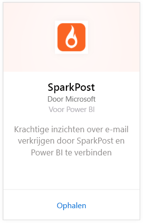
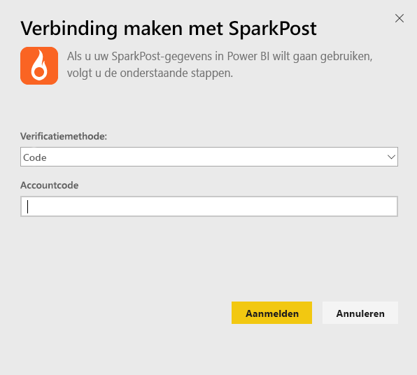
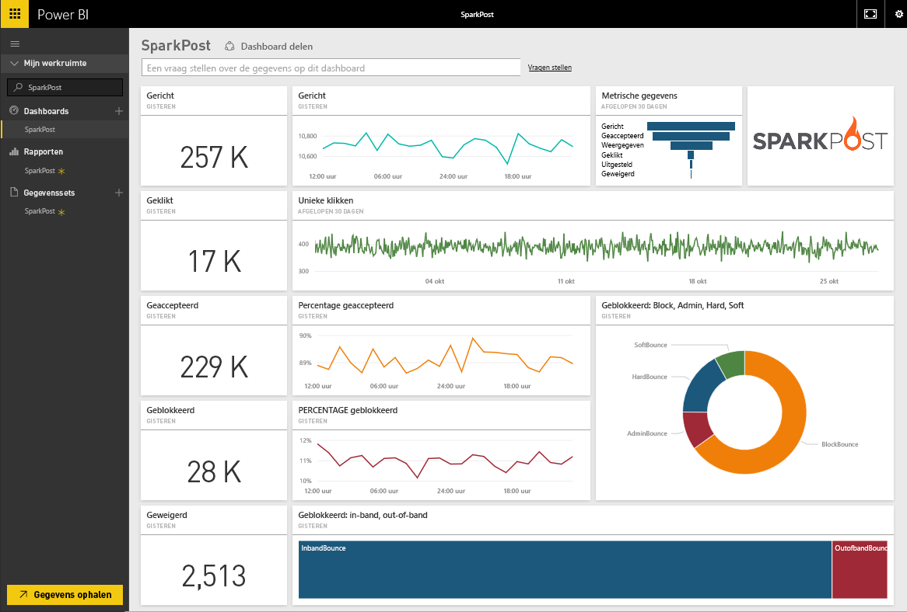
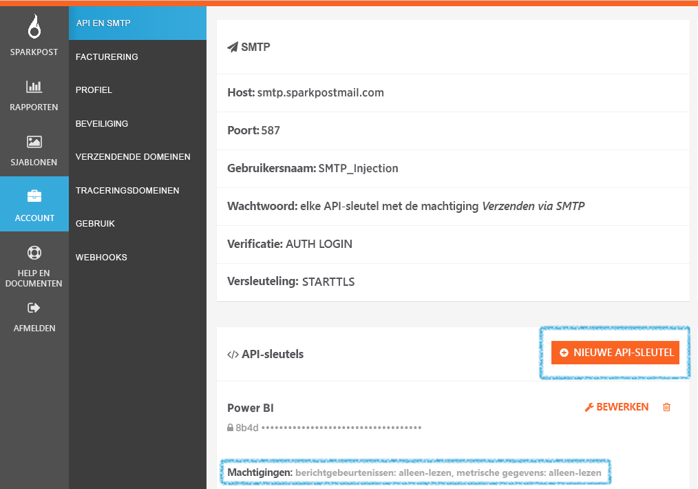

# Verbinding met SparkPost maken via Power BI
Met het Power BI-inhoudspakket voor SparkPost kunt u waardevolle gegevenssets extraheren uit uw SparkPost-account en in een inzichtelijk dashboard weergeven. Met behulp van het SparkPost-inhoudspakket kunt u uw algemene e-mailstatistieken visualiseren, inclusief domeinen, campagnes en betrokkenheid per serviceprovider.

Maak verbinding met het [SparkPost-inhoudspakket voor Power BI](https://app.powerbi.com/getdata/services/spark-post).

## Verbinding maken
1. Selecteer **Gegevens ophalen** onder in het linkernavigatievenster.
   
   
2. Selecteer in het vak **Services** de optie **Ophalen**.
   
   
3. Selecteer het **SparkPost**-inhoudspakket en klik op **Ophalen**. 
   
   
4. Geef desgevraagd uw SparkPost API-sleutel op en selecteer Aanmelden. Meer informatie over het [zoeken van deze parameters](#FindingParams) vindt u hieronder.
   
   
5. Uw gegevens worden geladen. Afhankelijk van de grootte van uw account kan dit enige tijd duren. Nadat de gegevens in Power BI zijn geïmporteerd, wordt het standaarddashboard, -rapport en de standaardgegevensset weergegeven in het linkernavigatievenster, met daarin de e-mailstatistieken voor de afgelopen 90 dagen. Nieuwe items zijn gemarkeerd met een geel sterretje \*.
   
   

**Wat nu?**

* [Stel vragen in het vak Q&A](power-bi-q-and-a.md) boven in het dashboard.
* [Wijzig de tegels](service-dashboard-edit-tile.md) in het dashboard.
* [Selecteer een tegel](service-dashboard-tiles.md) om het onderliggende rapport te openen.
* Als uw gegevensset is ingesteld op dagelijks vernieuwen, kunt u het vernieuwingsschema wijzigen of de gegevensset handmatig vernieuwen met **Nu vernieuwen**.

## Wat is inbegrepen?
De inhoudspakket voor Power BI bevat informatie zoals unieke klikken, acceptatiepercentages, bouncepercentages, vertragingspercentage, afwijzingspercentages en meer.

## Parameters zoeken
Er wordt een API-sleutel gebruikt om uw SparkPost-account te verbinden met Power BI. U vindt uw API-sleutel in uw account onder Account \> API en SMTP (meer informatie vindt u [hier](https://support.sparkpost.com/customer/portal/articles/1933377-create-api-keys)). U kunt het beste een API-sleutel met machtigingen voor `Message Events: Read-only ` en `Metrics: Read-only` gebruiken.

