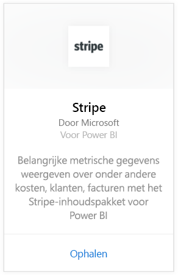
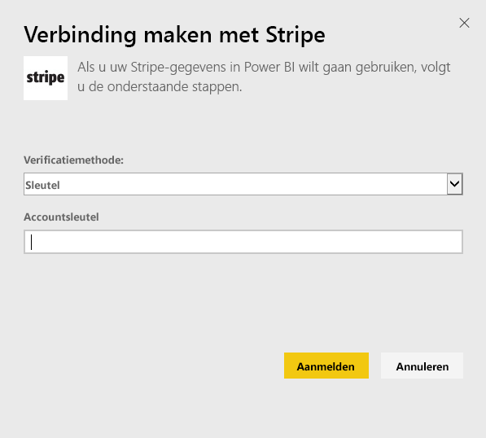
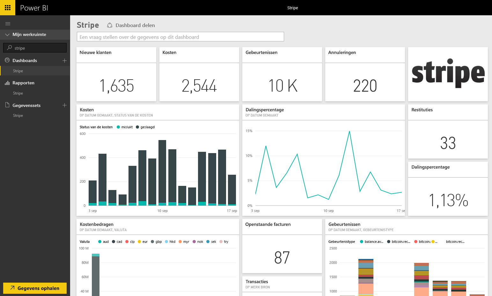

# Via Power BI verbinding maken met Stripe
Visualiseer en verken uw Stripe-gegevens in Power BI met het Power BI-inhoudspakket. Met het Power BI Stripe-inhoudspakket haalt u gegevens op over uw klanten, kosten, gebeurtenissen en facturen. De gegevens bevatten de meest recente 10.000 gebeurtenissen en 5000 kostengegevens gedurende de afgelopen 30 dagen. De inhoud wordt automatisch een keer per dag vernieuwd volgens een schema dat u bepaalt. 

Maak verbinding met het [Stripe-inhoudspakket voor Power BI](https://app.powerbi.com/getdata/services/stripe).

## Verbinding maken
1. Selecteer Gegevens ophalen onder in het linkernavigatievenster.  
   
    
2. Selecteer in het vak **Services** de optie **Ophalen**.  
   
      
3. Selecteer **Stripe** &gt; **Ophalen**.  
   
      
4. Geef de [API-sleutel](https://dashboard.stripe.com/account/apikeys) van Stripe op om verbinding te maken.  
   
    
5. Het importproces wordt automatisch gestart. Als het proces is voltooid, worden een nieuw dashboard, rapport en model in het navigatiedeelvenster weergegeven. Deze zijn gemarkeerd met een sterretje. Selecteer het dashboard om uw geïmporteerde gegevens weer te geven.
   
    

**Wat nu?**

* [Stel vragen in het vak Q&A](power-bi-q-and-a.md) boven in het dashboard.
* [Wijzig de tegels](service-dashboard-edit-tile.md) in het dashboard.
* [Selecteer een tegel](service-dashboard-tiles.md) om het onderliggende rapport te openen.
* Als uw gegevensset is ingesteld op dagelijks vernieuwen, kunt u het vernieuwingsschema wijzigen of de gegevensset handmatig vernieuwen met **Nu vernieuwen**

## Volgende stappen
[Aan de slag met Power BI](service-get-started.md)

[Gegevens ophalen voor Power BI](service-get-data.md)

