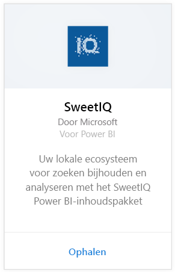
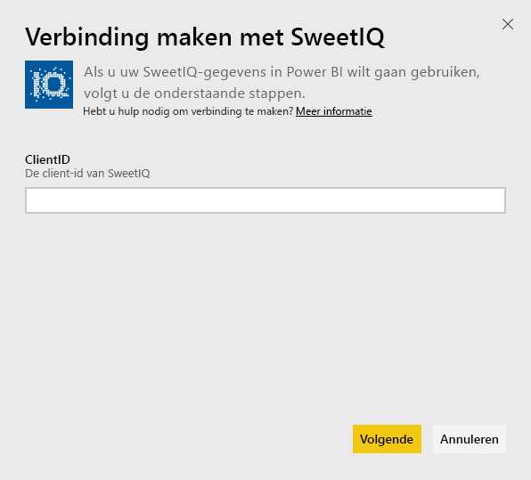
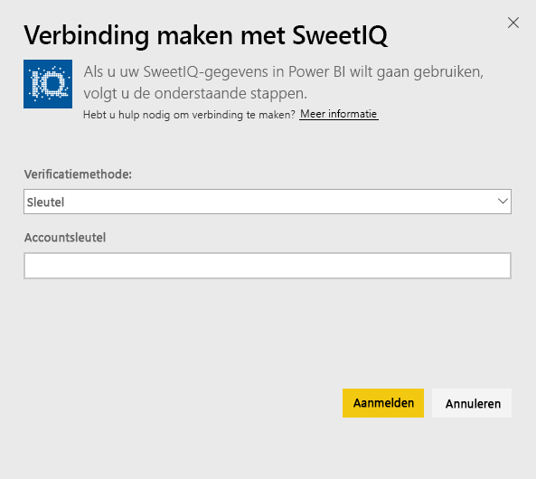
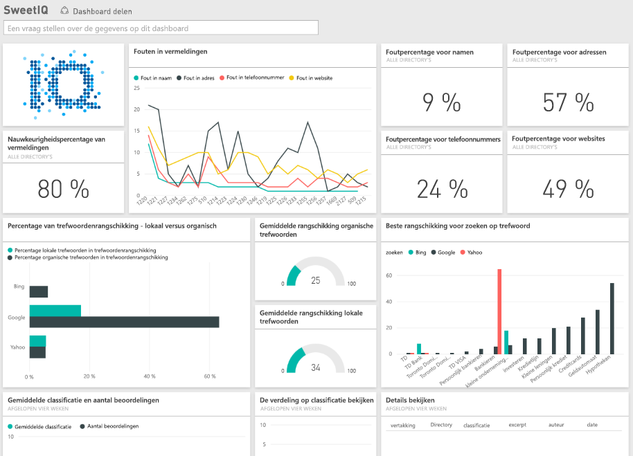

# Verbinding met SweetIQ maken via Power BI
Met het Power BI-inhoudspakket worden gegevens opgehaald uit uw SweetIQ-account en wordt er een kant-en-klare gegevensset gegeneerd zodat u eenvoudig uw gegevens kunt verkennen. Gebruik het SweetIQ-inhoudspakket om gegevens te analyseren over uw locaties, vermeldingen, beoordelingen en recensies. De gegevens worden dagelijks vernieuwd, zodat u zeker weet dat uw bewakingsgegevens up-to-date zijn.

Maak verbinding met het [SweetIQ-inhoudspakket voor Power BI](https://app.powerbi.com/groups/me/getdata/services/sweetiq).

## Verbinding maken
1. Klik in het navigatiedeelvenster op aan de linkerkant op **Gegevens ophalen**.
   
    
2. Selecteer **SweetIQ** en klik op **Ophalen**.
   
    
3. Geef uw client-id voor SweetIQ op. Dit is meestal een alfanumerieke waarde. Meer informatie over het zoeken van deze waarde vindt u hieronder.
   
    
4. Selecteer het verificatietype **Sleutel** en geef uw Sweet IQ API-sleutel op. Dit is meestal een alfanumerieke waarde. Meer informatie over het zoeken van deze waarde vindt u hieronder.
   
    
5. Vervolgens worden de gegevens door Power BI geladen. Dit kan enige tijd duren, kan afhankelijk van de hoeveelheid gegevens in uw account. Zodra de gegevens zijn geladen, ziet u een nieuw dashboard, een nieuw rapport en een nieuwe gegevensset in het navigatiedeelvenster aan de linkerzijde.
   
    

**Wat nu?**

* [Stel vragen in het vak Q&A](power-bi-q-and-a.md) boven in het dashboard.
* [Wijzig de tegels](service-dashboard-edit-tile.md) in het dashboard.
* [Selecteer een tegel](service-dashboard-tiles.md) om het onderliggende rapport te openen.
* Als uw gegevensset is ingesteld op dagelijks vernieuwen, kunt u het vernieuwingsschema wijzigen of de gegevensset handmatig vernieuwen met **Nu vernieuwen**

## Parameters zoeken
De client-id en API-sleutel voor dit inhoudspakket zijn niet gelijk aan uw SweetIQ-gebruikersnaam en -wachtwoord.

Selecteer een client-id voor een van de clients waartoe u toegang hebt met uw account. De lijst met clients bevindt zich in uw SweetIQ-account onder Clientbeheer.

Neem contact met de beheerder op over uw API-sleutel voor toegang tot de gegevens voor de specifieke client.

## Volgende stappen
[Aan de slag met Power BI](service-get-started.md)

[Gegevens ophalen voor Power BI](service-get-data.md)

