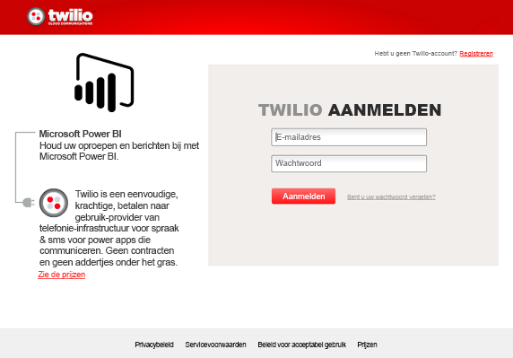
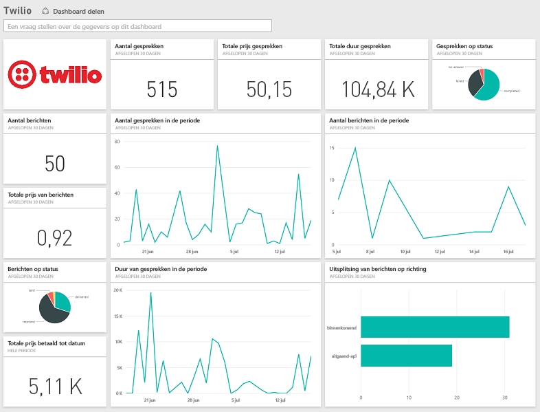

# Verbinding maken met Twilio via Power BI
Met het Microsoft Twilio-inhoudspakket voor Power BI kunt u uw gegevens in Power BI laden en maakt u een kant-en-klaar [Twilio-dashboard](https://powerbi.microsoft.com/integrations/twilio) en -rapport die inzicht geven in uw gegevens. U kunt ook uw aangepaste rapporten en dashboard maken op basis van de gegevensset die Power BI maakt. De gegevens worden eenmaal per dag vernieuwd zodat u altijd over de meest recente gegevens beschikt.

Verbinding maken met het [Twilio-inhoudspakket voor Power BI](https://app.powerbi.com/getdata/services/twilio).

## Verbinding maken
1. Selecteer **Gegevens ophalen** onder in het linkernavigatievenster.
   
    
2. Selecteer in het vak **Services** de optie **Ophalen**.
   
    
3. Selecteer **Twilio** \> **Ophalen**.
   
   
4. Selecteer voor de **verificatiemethode** **oAuth2**\> Aanmelden. Geef uw Twilio-gegevens op en machtig de Power BI-toepassing om toegang te krijgen tot uw gegevens.
   
   
5. Hiermee wordt begonnen met het importeren van gegevens uit uw Twilio-account en uw dashboard wordt gevuld met uw oproepen- en berichtengebruik van de afgelopen 30 dagen. 
   
   

**Wat nu?**

* [Stel vragen in het vak Q&A](power-bi-q-and-a.md) boven in het dashboard.
* [Wijzig de tegels](service-dashboard-edit-tile.md) in het dashboard.
* [Selecteer een tegel](service-dashboard-tiles.md) om het onderliggende rapport te openen.
* Als uw gegevensset is ingesteld op dagelijks vernieuwen, kunt u het vernieuwingsschema wijzigen of de gegevensset handmatig vernieuwen met **Nu vernieuwen**.

## Wat is inbegrepen
De details voor alle oproepen- en berichtentransacties voor de afgelopen 30 dagen. Op deze gegevens kunt u allerlei analyses en aggregaties uitvoeren.

Een set van reeds samengevoegde statistieken die u in de gaten wilt houden. Deze set omvat:

        All Time Calls Count  
        All Time Calls Duration  
        All Time Calls Price  
        All Time Messages Price  
        All Time Messages Count  
        All Time Count of Phone Numbers  
        All Time Price of Phone Numbers  
        All Time Twilio Client Calls Price  
        All Time Twilio Client Calls Duration  
        All Time Twilio Client Calls Count  
        All Time Total Price  
        All Time Inbound Calls Price  
        All Time Inbound Calls Duration  
        All Time Inbound Calls Count  
        All Time Outbound Calls Price  
        All Time Outbound Calls Duration  
        All Time Outbound Calls Count  
        This Month Calls Price  
        This Month Calls Duration  
        This Month Calls Count  
        This Month Messages Count  
        This Month Messages Price  
        This Month Count of Phone Numbers  
        This Month Price of Phone Numbers  
        This Month Twilio Client Calls Price  
        This Month Twilio Client Calls Duration  
        This Month Twilio Client Calls Count  
        This Month Total Price  
        This Month Inbound Calls Price  
        This Month Inbound Calls Duration  
        This Month Inbound Calls Count  
        This Month Outbound Calls Price  
        This Month Outbound Calls Duration  
        This Month Outbound Calls Count  
        This Month Inbound Messages Price  
        This Month Inbound Messages Count  
        This Month Outbound Messages Price  
        This Month Outbound Messages Count

## Probleemoplossing
Als u in de afgelopen 30 dagen een zeer grote hoeveelheid gegevens hebt (honderdduizenden transacties), kan het ophalen van gegevens mislukken. We zijn ons bewust van het probleem en werken eraan om het op te lossen. Als u ondertussen op dit probleem stuit, kunt u de koppeling voor ondersteuning bovenaan uw Power BI-pagina gebruiken om het ons te laten weten en wij zullen contact met u opnemen voor verder onderzoek.

## Volgende stappen
[Aan de slag in Power BI](service-get-started.md)

[Gegevens ophalen in Power BI](service-get-data.md)

