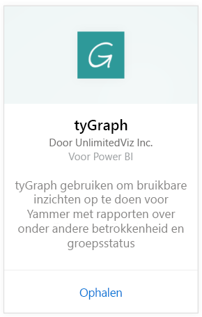
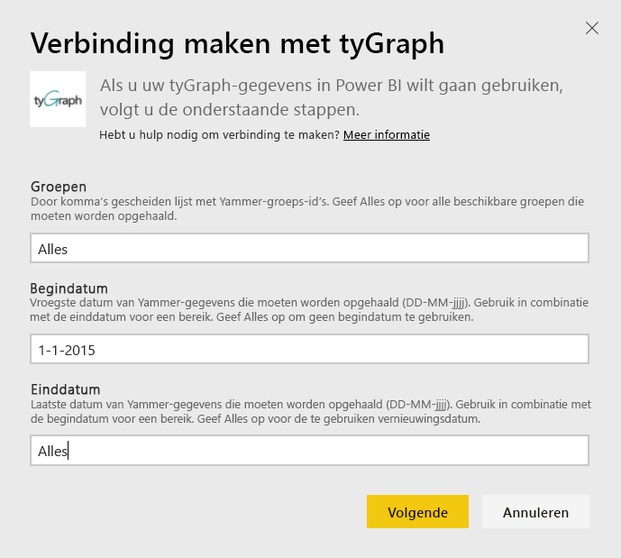
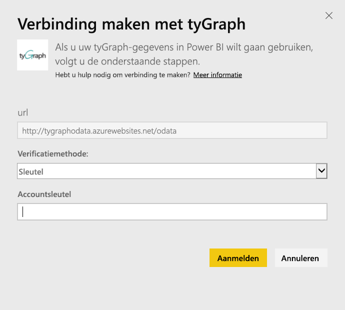
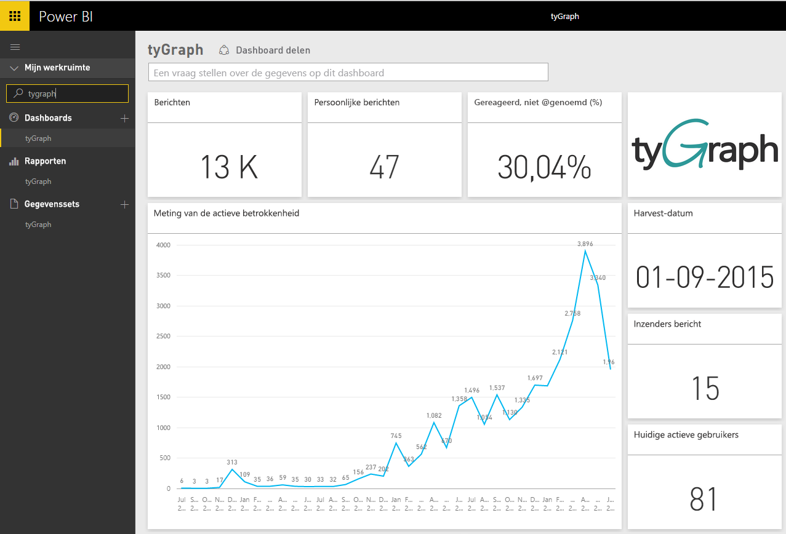
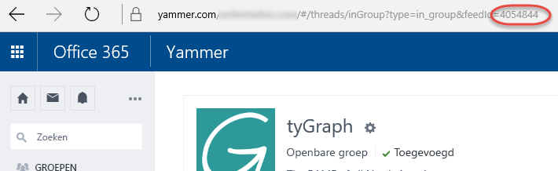

# Verbinding met tyGraph maken via Power BI
Visualiseer en verken uw tyGraph-gegevens in Power BI met het Power BI-inhoudspakket. Maak om te beginnen verbinding met uw tyGraph-account en laadt het dashboard, de rapporten en de gegevensset. De kant-en-klare inhoud biedt onder andere inzicht in de MAE-score (Measure of Active Engagement) en actiefste leden. U kunt de inhoud verder aanpassen om de informatie onder de aandacht te brengen die voor u het belangrijkst is.  De gegevens worden automatisch vernieuwd volgens een schema dat u instelt.

Maak verbinding met [tyGraph voor Power BI](https://app.powerbi.com/getdata/services/tygraph).

## Verbinding maken
1. Selecteer **Gegevens ophalen** onder in het linkernavigatievenster.
   
   
2. Selecteer in het vak **Services** de optie **Ophalen**.
   
   
3. Selecteer **tyGraph** \> **Ophalen**.
   
   
4. Geef de groepen en tijdsbereik op waarmee u verbinding wilt maken. Geef Alle op als u alle gegevens wilt ophalen. De verwachte datumnotatie is JJJJ/MM/DD. Hieronder vindt u meer informatie over [hoe u de parameters kunt vinden](#FindingParams).
   
   
5. Geef uw tyGraph-sleutel op om verbinding te maken. Meer informatie over het zoeken van deze waarde vindt u hieronder.
   
    **Als u een geverifieerde Yammer-beheerder bent**  
    Zodra uw tyGraph-account is gemaakt, ontvangt u een e-mail met uw API-sleutel. Als u de sleutel niet meer kunt vinden, kunt u een nieuwe sleutel aanvragen door een e-mail naar support@unlimitedviz.com te verzenden. Als u nog geen tyGraph-account hebt, kunt u via [http://www.tygraph.com/](http://www.tygraph.com/) een proefversie starten. 
   
    **Als u geen geverifieerde Yammer-beheerder bent**
   
    Voor het tyGraph-inhoudspakket hebt u een tyGraph-account nodig die is gemaakt door een geverifieerde Yammer-beheerder. Zodra het account is gemaakt, kunnen er aanvullende sleutels worden uitgegeven aan gebruikers binnen dezelfde organisatie. Als uw geverifieerde beheerder nog geen tyGraph-account heeft gemaakt is, neemt u contact met de beheerder op met het verzoek om dit alsnog te doen. Als er wel al een account is gemaakt, kunt u een sleutel aanvragen door een e-mail te verzenden naar <support@unlimitedviz.com>.
   
    
6. Zodra de verificatie is geslaagd, wordt het importproces automatisch gestart. Nadat het importeren is voltooid, bevat het navigatiedeelvenster een nieuw dashboard, rapport en model. Selecteer het dashboard om uw geïmporteerde gegevens weer te geven.
   
    

**Wat nu?**

* [Stel vragen in het vak Q&A](power-bi-q-and-a.md) boven in het dashboard.
* [Wijzig de tegels](service-dashboard-edit-tile.md) in het dashboard.
* [Selecteer een tegel](service-dashboard-tiles.md) om het onderliggende rapport te openen.
* Als uw gegevensset is ingesteld op dagelijks vernieuwen, kunt u het vernieuwingsschema wijzigen of de gegevensset handmatig vernieuwen met **Nu vernieuwen**

## Parameters zoeken
U kunt alle gegevens ophalen voor alle groepen die voor u toegankelijk zijn, maar u kunt ook een subset opgeven. U kunt ook een subset gegevens maken op basis van de datum. U kunt meerdere tyGraph-dashboards maken om specifieke sets groepen en/of datums te controleren. Meer informatie over deze parameters vindt u hieronder.

**Groepen**

Met de tyGraph API kunt u gegevens filteren op basis van specifieke groeps-id's. Deze worden als een door komma's gescheiden lijst toegevoegd aan het inhoudspakket. 

    Example: 2427647,946595,1154464

U kunt de groeps-id voor een bepaalde groep in Yammer identificeren door naar de feed voor de groep te gaan en de URL te bekijken.

In het bovenstaande voorbeeld is de Yammer-groeps-id 4054844

**Begindatum**

Met de optie voor de begindatum kunt u de vroegste waarde beperken voor de geretourneerde gegevens. Alleen de gegevens die zijn gemaakt op of na deze datum, worden in het inhoudspakket geladen. De indeling van de begindatum is JJJJ/MM/DD. 

    Example: 2013/10/29

In het bovenstaande voorbeeld worden alle gegevens op of na 29 oktober 2013 geladen in het inhoudspakket. 

**Einddatum** Met de optie voor de einddatum kunt u de laatste waarde voor geretourneerde gegevens beperken. Deze optie kan worden gebruikt in combinatie met de optie voor de begindatum om gegevens uit een datumbereik te laden. Alleen de gegevens die zijn gemaakt op of vóór deze datum, worden in het inhoudspakket geladen. De indeling van de einddatum is JJJJ/MM/DD. 

    Example: 2014/10/20

In het bovenstaande voorbeeld worden alle gegevens op of vóór 20 oktober 2014 geladen in het inhoudspakket. 

## Volgende stappen
[Aan de slag in Power BI](service-get-started.md)

[Gegevens ophalen in Power BI](service-get-data.md)

