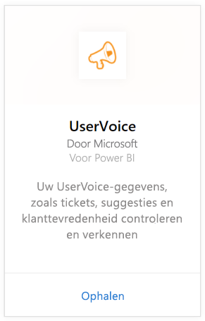
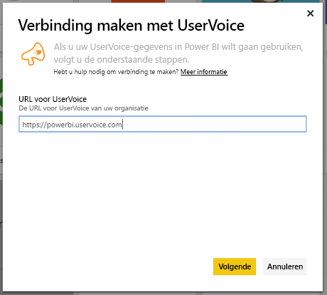
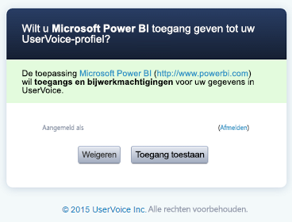
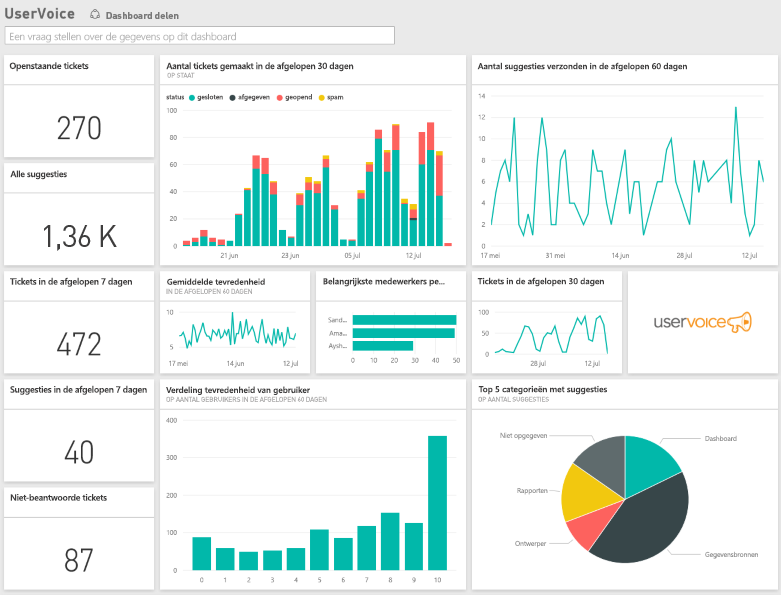

# Verbinding maken met UserVoice via Power BI
Met Power BI en het inhoudspakket van UserVoice kunt u eenvoudig uw UserVoice-gegevens bijhouden en verkennen. Uw gegevens, inclusief tickets, suggesties en tevredenheidsbeoordelingen, worden opgehaald met Power BI en er worden een kant-en-klaar dashboard en rapporten gemaakt op basis van die gegevens.

Maak verbinding met het [UserVoice-inhoudspakket](https://app.powerbi.com/getdata/services/uservoice) voor Power BI.

>[!NOTE]
>Een beheerdersaccount is vereist om verbinding te maken met het Power BI-inhoudspakket. Het inhoudspakket maakt ook gebruik van de UserVoice-API en telt mee voor het gebruik voor de limieten van UserVoice. Zie hieronder voor meer informatie.

## Verbinding maken
1. Selecteer **Gegevens ophalen** onder in het linkernavigatievenster.
   
   
2. Selecteer in het vak **Services** de optie **Ophalen**.
   
    
3. Selecteer **UserVoice** en vervolgens **Ophalen**.
   
   
4. Voer uw UserVoice-URL in wanneer u hierom wordt gevraagd. De URL moet exact het volgende patroon volgen `https://fabrikam.uservoice.com`, waarbij fabrikam moet worden vervangen door de naam van uw product of service.
   
   >[!NOTE]
   >Let er op dat er geen afsluitende slash aan het einde staat en dat de verbinding http**s** is.
   
   
5. Geef uw UserVoice-beheerdersreferenties op wanneer hierom wordt gevraagd en voer het UserVoice-verificatieproces uit. Als u al bent aangemeld bij UserVoice in uw browser, ontvangt u mogelijk geen prompt om referenties in te voeren. Geef de toepassing Power BI toegang tot uw gegevens door op Toegang toestaan te klikken.
   
   >[!NOTE]
   >U moet over beheerdersreferenties beschikken voor uw UserVoice-account.
   
   
6. In Power BI worden uw UserVoice-gegevens opgehaald en worden een kant-en-klaar dashboard en rapport voor u gemaakt. De volgende gegevens worden opgehaald door Power BI: al uw suggesties, alle openstaande tickets, alle tickets gemaakt in de afgelopen 30 dagen, inclusief de gesloten tickets en de classificaties voor de tevredenheid van de gebruiker.
   
   

**Wat nu?**

* [Stel vragen in het vak Q&A](consumer/end-user-q-and-a.md) boven in het dashboard.
* [Wijzig de tegels](service-dashboard-edit-tile.md) in het dashboard.
* [Selecteer een tegel](consumer/end-user-tiles.md) om het onderliggende rapport te openen.
* Als uw gegevensset is ingesteld op dagelijks vernieuwen, kunt u het vernieuwingsschema wijzigen of de gegevensset handmatig vernieuwen met **Nu vernieuwen**

## Problemen oplossen
**Kan de parameter niet valideren. Controleer of alle parameters geldig zijn**

Als u deze fout ziet nadat u uw UserVoice-URL hebt ingevoerd. Zorg dat aan de volgende vereisten is voldaan:

* De URL volgt exact het patroon `https://fabrikam.uservoice.com`, waarbij fabrikam moet worden vervangen door het juiste UserVoice URL-voorvoegsel.
* Controleer of alle elementen in kleine letters zijn getypt.
* Zorg dat de URL begint met http**s**.
* Zorg dat er geen afsluitende slash aan het einde van de URL staat.

**Aanmelden is mislukt**

Als de fout Aanmelden is mislukt verschijnt nadat u uw UserVoice-abonnementsgegevens hebt gebruikt om u aan te melden, heeft het account dat u gebruikt geen rechten om de UserVoice-gegevens van uw account op te halen. Controleer of het account een beheerdersaccount is en probeer het opnieuw.

"**Er is iets fout gegaan**"

Als u dit foutbericht ontvangt bij het laden van de gegevens, moet u controleren of uw UserVoice-account de maandelijkse gebruikerslimiet van API's nog niet heeft overschreden. Als alles er goed uitziet, probeert u opnieuw verbinding te maken. Als het probleem zich blijft voordoen, kunt u contact opnemen met de ondersteuning van Power BI op [https://community.powerbi.com](https://community.powerbi.com/).

**Overige**  

Het UserVoice-inhoudspakket voor Power BI maakt gebruik van UserVoice-API's voor het ophalen van uw gegevens. Zorg ervoor dat u het gebruik van uw API controleert, zodat u uw limiet niet overschrijdt. Als u een grote hoeveelheid gegevens in uw UserVoice-account hebt, is een suggestie om de impact op het gebruik van uw API te minimaliseren om de vernieuwingsfrequentie te wijzigen van de huidige standaardwaarde (eenmaal per dag) naar alleen op weekdagen vernieuwen of een andere dag afhankelijk van uw behoeften. Een andere suggestie is om een beheerder een inhoudspakket te laten maken en dit te delen met de rest van het team in plaats van dat elke beheerder in uw organisatie er afzonderlijk één maakt, wat onnodige belasting voor de API's betekent

## Volgende stappen
[Aan de slag in Power BI](service-get-started.md)

[Gegevens ophalen in Power BI](service-get-data.md)

