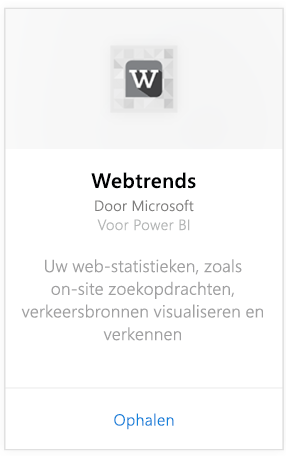
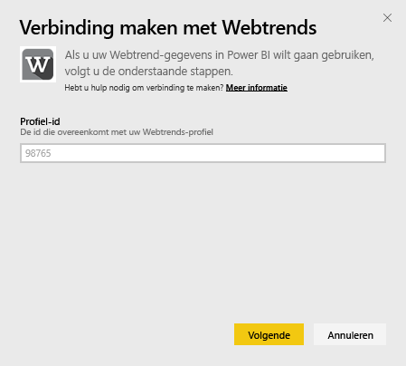
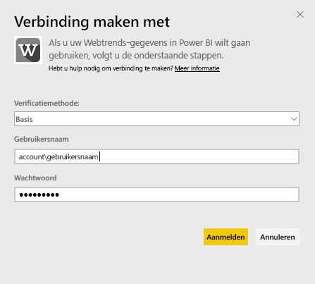
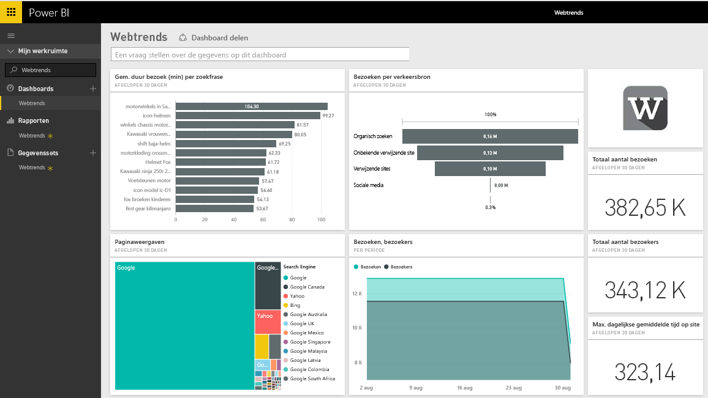
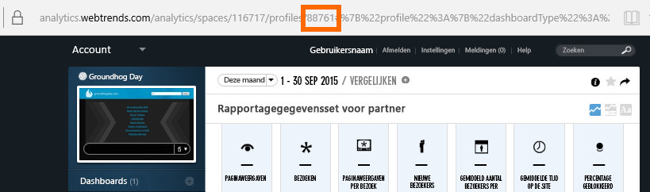
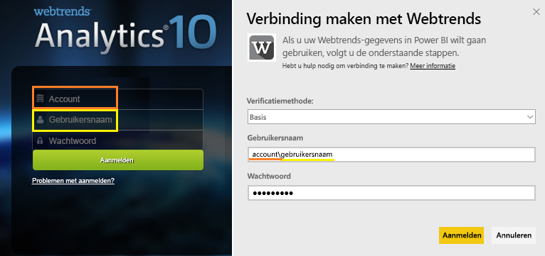

# Verbinding maken met Webtrends met Power BI
Het Webtrends-inhoudspakket voor Power BI bevat standaard tal van metrische gegevens zoals totaal aantal paginaweergaven en bezoeken per verkeersbron. Het visualiseren van uw Webtrends-gegevens in Power BI begint door verbinding te maken met uw Webtrends-account. U kunt het dashboard en de rapporten zó gebruiken, of ze aanpassen om de informatie die u het belangrijkst vindt eruit te laten springen.  De gegevens wordt eenmaal per dag automatisch vernieuwd.

Maak verbinding met het [Webtrends-inhoudspakket](https://app.powerbi.com/getdata/services/webtrends) voor Power BI.

## Verbinding maken
1. Selecteer **Gegevens ophalen** onder in het linkernavigatievenster.
   
   
2. Selecteer in het vak **Services** de optie **Ophalen**.
   
   
3. Selecteer **Webtrends** \> **Ophalen**.
   
   
4. Het inhoudspakket maakt verbinding met een specifiek Webtrends-profiel-id. Meer informatie over het [zoeken van deze parameter](#FindingParams) vindt u hieronder.
   
   
5. Geef uw Webtrends-referenties op om verbinding te maken. Merk op dat het veld Gebruikersnaam uw account en gebruikersnaam verwacht. Zie hieronder voor [meer informatie](#FindingParams).
   
   
6. Na goedkeuring wordt het importproces automatisch gestart. Nadat het importeren is voltooid, bevat het navigatiedeelvenster een nieuw dashboard, rapport en model. Selecteer het dashboard om uw geïmporteerde gegevens weer te geven.
   
   

**Wat nu?**

* [Stel vragen in het vak Q&A](consumer/end-user-q-and-a.md) boven in het dashboard.
* [Wijzig de tegels](service-dashboard-edit-tile.md) in het dashboard.
* [Selecteer een tegel](consumer/end-user-tiles.md) om het onderliggende rapport te openen.
* Als uw gegevensset is ingesteld op dagelijks vernieuwen, kunt u het vernieuwingsschema wijzigen of de gegevensset handmatig vernieuwen met **Nu vernieuwen**

## Wat is inbegrepen

Het inhoudspakket Webtrends haalt gegevens op uit de volgende rapporten:  

| Rapportnaam | Rapport-id |
| --- | --- |
| Belangrijkste metrische gegevens | |
| Zoekopdrachten binnen de site |34awBVEP0P6 |
| Uitgangspagina’s |7FshY8eP0P6 |
| Volgende pagina's |CTd5rpeP0P6 |
| Vorige pagina's |aSdOeaUgnP6 |
| Sitepagina’s |oOEWQj3sUo6 |
| Doorklikken naar advertenties op de site |41df19b6d9f |
| Plaatsen |aUuHskcP0P6 |
| Landen |JHWXJNcP0P6 |
| Bezoekers |xPcmTDDP0P6 |
| Duur van bezoek |U5KAyqdP0P6 |
| Zoekfrasen |IKYEDxIP0P6 |
| Bronnen van verkeer |JmttAoIP0P6 |
| Zoekmachines |yGz3gAGP0P6 |
| Ingangpagina’s |i6LrkNVRUo6 |

>[!NOTE]
>Voor SharePoint-profielen kunnen de namen van de metrische gegevens enigszins afwijken van wat er wordt weergegeven in de gebruikersinterface van Webtrends. De volgende toewijzing wordt uitgevoerd om consistentie tussen SharePoint- en Web-profielen te behouden:   

    - Sessies = bezoeken  
    - Nieuwe gebruikers = nieuwe bezoekers  
    - Weergaven per sessie = paginaweergaven per bezoek  
    - Gem. dagelijkse duur gebruiker = Gem. tijd op de site per bezoeker  

## Systeemvereisten
Het inhoudspakket vereist toegang tot een Webtrends-profiel met de [juiste set rapporten](#Included) ingeschakeld.

## Parameters zoeken
Uw Webtrends profiel-id vindt u in de URL nadat u een profiel hebt geselecteerd:

Uw referenties zijn dezelfde die u invoert wanneer u zich aanmeldt bij Webtrends, maar we verwachten uw account en gebruikersnaam op dezelfde regel, gescheiden door een backslash:

## Probleemoplossing
U kunt een probleem tegenkomen terwijl het inhoudspakket wordt geladen, nadat u uw referenties hebt opgegeven. Als u het bericht ‘Oeps’ ziet tijdens het laden, bekijkt u de onderstaande suggesties voor probleemoplossing. Als u nog steeds problemen hebt, kunt u een ondersteuningsticket indienen op https://support.powerbi.com

1. Controleer of de juiste profiel-id wordt gebruikt. Zie [Parameters vinden](#FindingParams) voor meer details.
2. Controleer of de gebruiker toegang heeft tot de rapporten die worden vermeld in de sectie [Wat is inbegrepen](#Included)

## Volgende stappen
[Wat is Power BI?](power-bi-overview.md)

[Power BI - basisconcepten](consumer/end-user-basic-concepts.md)

