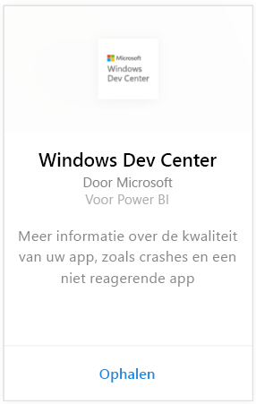
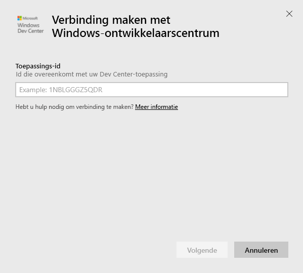
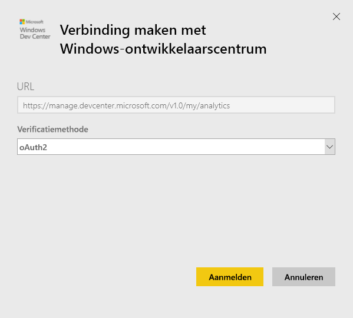
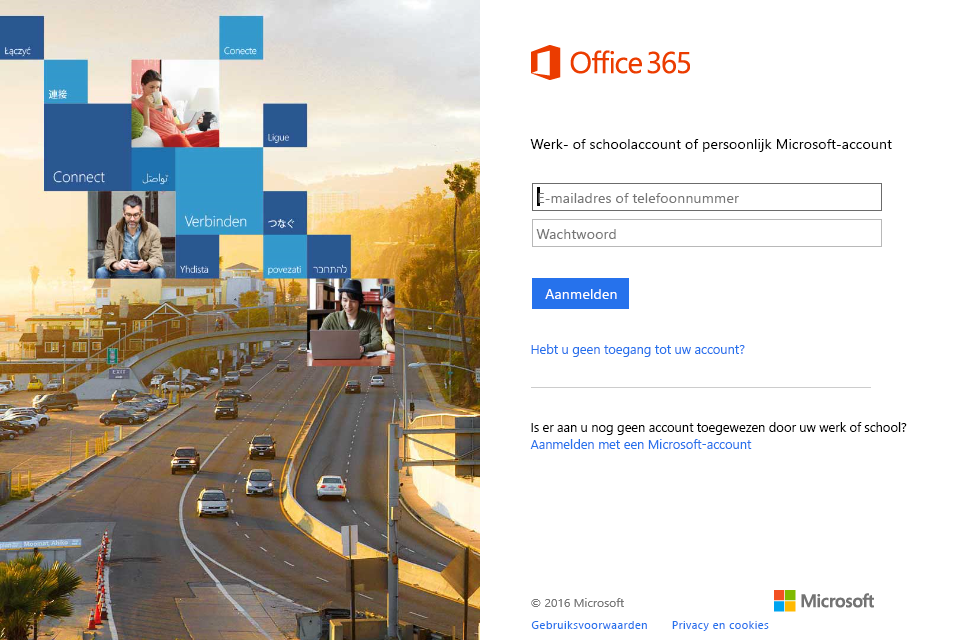
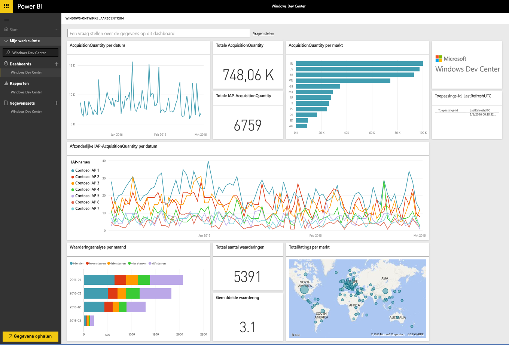
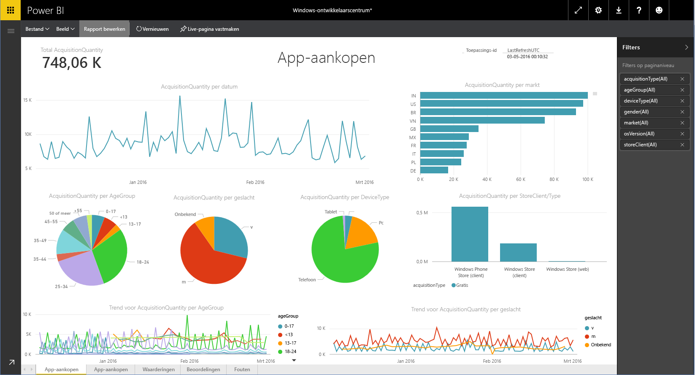

# Verbinding met Windows-ontwikkelaarscentrum maken via Power BI
Verken en bewaak de analytische gegevens van uw Windows-ontwikkelaarscentrum-app in Power BI met het Power BI-inhoudspakket. De gegevens wordt een keer per dag automatisch vernieuwd.

Maak verbinding met het [inhoudspakket van Windows-ontwikkelaarscentrum](https://app.powerbi.com/getdata/services/devcenter) voor Power BI.

## Verbinding maken
1. Selecteer **Gegevens ophalen** onder in het linkernavigatievenster.
   
   
2. Selecteer in het vak **Services** de optie **Ophalen**.
   
   
3. Selecteer **Windows-ontwikkelaarscentrum** \> **Ophalen**.
   
   
4. Voer de toepassings-id in van een app waarvan u de eigenaar bent en klik op Volgende. Hieronder vindt u meer informatie over [hoe u deze parameters kunt vinden](#FindingParams).
   
   
5. Selecteer voor de **verificatiemethode** **oAuth2**\> **Aanmelden**. Voer desgevraagd uw Azure Active Directory-referenties in die zijn gekoppeld aan uw account van Windows-ontwikkelaarscentrum (zie [Systeemvereisten](#Requirements) voor meer informatie).
   
    
   
    
6. Nadat uw aanmelding is goedgekeurd, wordt het importeren automatisch gestart. Nadat het importeren is voltooid, bevat het navigatiedeelvenster een nieuw dashboard, rapport en model. Selecteer het dashboard om de geïmporteerde gegevens te bekijken en kies een tegel om naar de onderliggende rapporten te navigeren.
   
    
   
    

**Wat nu?**

* [Stel vragen in het vak Q&A](power-bi-q-and-a.md) boven in het dashboard.
* [Wijzig de tegels](service-dashboard-edit-tile.md) in het dashboard.
* [Selecteer een tegel](service-dashboard-tiles.md) om het onderliggende rapport te openen.
* Als uw gegevensset is ingesteld op dagelijks vernieuwen, kunt u het vernieuwingsschema wijzigen of de gegevensset handmatig vernieuwen met **Nu vernieuwen**.

## Wat is inbegrepen?
Het Power BI-inhoudspakket voor het ontwikkelaarscentrum bevat analytische gegevens voor uw app- en IAP-acquisities, beoordelingen, recensies en status van de app. De gegevens zijn beperkt tot de afgelopen drie maanden. Bovendien is dit een zwevend venster, zodat de opgenomen datums worden bijgewerkt zodra de gegevensset wordt vernieuwd.

## Systeemvereisten
Voor dit inhoudspakket moet er minimaal één app naar de Microsoft Store zijn gepubliceerd en is een Windows-ontwikkelaarscentrum-account vereist (u vindt [hier](https://msdn.microsoft.com/windows/uwp/publish/manage-account-users) meer informatie).

## Parameters zoeken
De toepassings-id voor een app vindt u op de pagina App-id onder App-beheer.

De toepassings-id wordt weergegeven aan het eind van uw URL voor de Windows 10 Store, https://www.microsoft.com/store/apps/ **{applicationId}**

## Volgende stappen
[Aan de slag in Power BI](service-get-started.md)

[Gegevens ophalen in Power BI](service-get-data.md)

