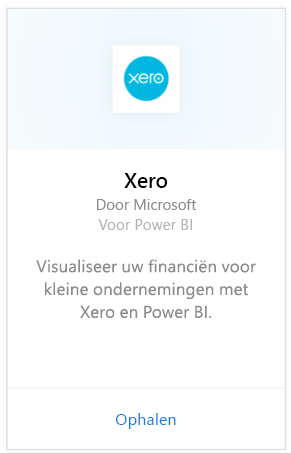
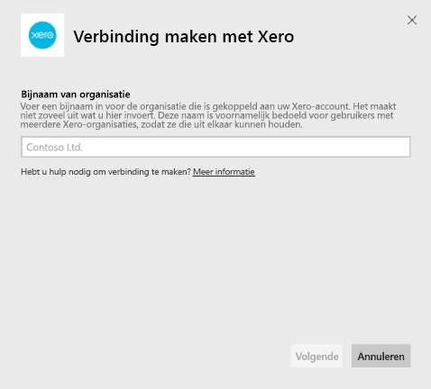
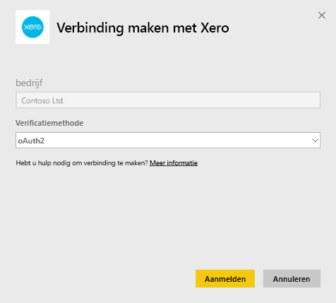
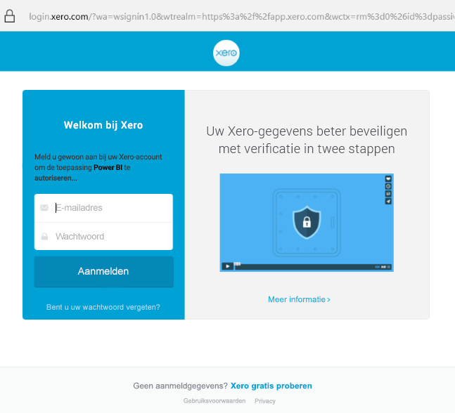
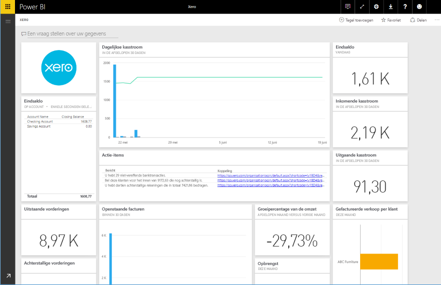

# Verbinding maken met Xero via Power BI
Xero is eenvoudig te gebruiken onlineboekhoudsoftware die speciaal ontworpen is voor kleine bedrijven. Met behulp van dit Power BI-inhoudspakket kunt u indrukwekkende visualisaties maken op basis van uw financiële gegevens in Xero. Uw standaarddashboard bevat allerlei metrische gegevens voor kleine bedrijven zoals kaspositie, omzet versus uitgaven, winst-en-verlies-trend, vervallen facturen en ROI.

Maak verbinding maken met het [Xero-inhoudspakket](https://app.powerbi.com/getdata/services/xero) voor Power BI of lees meer over de integratie tussen [Xero en Power BI](https://help.xero.com/Power-BI).

## Verbinding maken
1. Selecteer **Gegevens ophalen** onder in het linkernavigatievenster.
   
   
2. Selecteer in het vak **Services** de optie **Ophalen**.
   
   
3. Selecteer **Xero** \>  **Nu downloaden**.
   
   
4. Voer een bijnaam in voor de organisatie die is gekoppeld aan uw Xero-account. Het maakt niet zo veel uit wat u hier invoert. Deze naam is voornamelijk bedoeld voor gebruikers met meerdere Xero-organisaties, zodat ze die uit elkaar kunnen houden. Zie [hieronder](#FindingParams) voor meer informatie.
   
   
5. Selecteer **OAuth** in de lijst **Authentication method** als u wordt gevraagd u aan te melden bij uw Xero-account en selecteer de organisatie waarmee u verbinding wilt maken. Selecteer **Sign in** om u aan te melden.
   
    
   
    
6. Nadat uw aanmelding is goedgekeurd, wordt het importeren automatisch gestart. Nadat het importeren is voltooid, bevat het navigatiedeelvenster een nieuw dashboard, rapport en model. Selecteer het dashboard om uw geïmporteerde gegevens weer te geven.
   
     

**Wat nu?**

* [Stel vragen in het vak Q&A](consumer/end-user-q-and-a.md) boven in het dashboard.
* [Wijzig de tegels](service-dashboard-edit-tile.md) in het dashboard.
* [Selecteer een tegel](consumer/end-user-tiles.md) om het onderliggende rapport te openen.
* Als uw gegevensset is ingesteld op dagelijks vernieuwen, kunt u het vernieuwingsschema wijzigen of de gegevensset handmatig vernieuwen met **Nu vernieuwen**

## Wat is inbegrepen
Het inhoudspakket voor het dashboard bevat tegels en metrische gegevens voor verschillende gebieden, inclusief de bijbehorende rapporten:  

| Gebied | Dashboardtegels | Rapport |
| --- | --- | --- |
| Contanten |Daily cash flow  Cash in  Cash out  Closing balance by account  Closing balance today |Bank Accounts |
| Klant |Invoiced sales  Invoiced sales by customer  Invoiced sales growth trend  Invoices due  Outstanding receivables  Overdue receivables |Customer  Inventory |
| Leverancier |Billed purchases  Billed purchases by supplier  Billed purchases growth trend   Bills due  Outstanding payables  Overdue payables |Suppliers  Inventory |
| Voorraad |Monthly sales amount by product |Inventory |
| Winst en verlies |Monthly profit and loss  Net profit this fiscal year  Net profit this month  Top expense accounts |Profit and Loss |
| Balans |Total assets  Total liabilities  Equity |Balance Sheet |
| Status |Current ratio  Gross profit percentage   Return on total assets  Total liabilities to equity ratio |Health  Glossary and Technical Notes |

De gegevensset bevat ook de volgende tabellen om uw rapporten en dashboards aan te passen:  

* Addresses  
* Alerts  
* Bank Statement Daily Balance  
* Bank Statements  
* Contacts  
* Expense Claims  
* Invoice Line Items  
* Invoices  
* Items  
* Month End  
* Organisation  
* Trial Balance  
* Xero Accounts

## Systeemvereisten
De volgende rollen zijn vereist voor toegang tot het inhoudspakket van Xero: 'Standaard + Rapporten' of 'Adviseur'.

## Parameters zoeken
Geef een naam op voor uw organisatie die kan worden bijgehouden in Power BI. Dit maakt het mogelijk om met meerdere organisaties verbinding te maken. Het is niet mogelijk om meerdere keren met dezelfde organisatie verbinding te maken, aangezien dit invloed heeft op de geplande vernieuwing.   

## Probleemoplossing
* Xero-gebruikers moeten beschikken over de volgende rollen om toegang te krijgen tot het inhoudspakket van Xero: 'Standaard + Rapporten' of 'Adviseur'. Het inhoudspakket is afhankelijk van de machtigingen op gebruikersbasis om toegang te krijgen tot rapportgegevens via Power BI.  
* Als u pas na bepaalde tijd een foutmelding krijgt, controleer dan hoe lang het heeft geduurd voordat de fout zich voordeed. Het toegangstoken dat door Xero wordt verstrekt, is namelijk maar 30 minuten geldig, wat betekent dat er een fout optreedt wanneer het laden van gegevens langer duurt voor een account. Er wordt hard gewerkt om dit probleem op te lossen.
* Tijdens het laden hebben de tegels op het dashboard een algemene laadstatus. Dit verandert pas nadat alle gegevens zijn geladen. Als u een melding ontvangt dat het laden is voltooid, maar de tegels nog steeds worden geladen, probeer de dashboardtegels dan te vernieuwen met behulp van de... in de rechterbovenhoek van het dashboard.
* Als het inhoudspakket niet kan worden vernieuwd, controleert u of u per ongeluk niet meer dan één keer verbinding hebt gemaakt met dezelfde organisatie in Power BI. Xero staat slechts één actieve verbinding met een organisatie toe en mogelijk ziet u een foutbericht dat aangeeft dat uw referenties ongeldig zijn als u meer dan één keer verbinding probeert te maken met dezelfde organisatie.  
* Als er problemen zijn bij het verbinding maken met het Xero-inhoudspakket voor Power BI, zoals foutberichten of een erg trage respons, wist u eerst de cache en cookies, start u de browser opnieuw en maakt u vervolgens opnieuw verbinding met Power BI.  

Voor andere problemen kunt u een ondersteuningsticket maken op http://support.powerbi.com als het probleem zich blijft voordoen.

## Volgende stappen
[Aan de slag in Power BI](service-get-started.md)

[Gegevens ophalen in Power BI](service-get-data.md)

