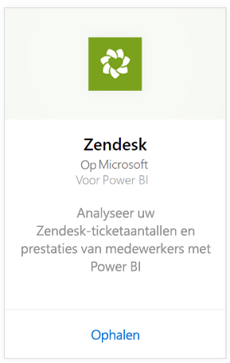
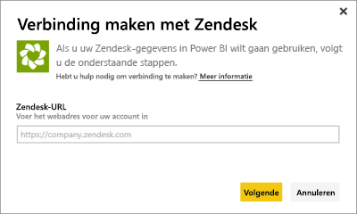
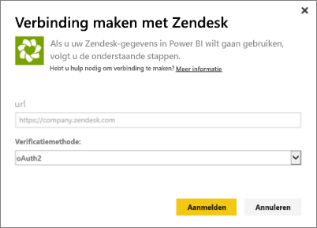
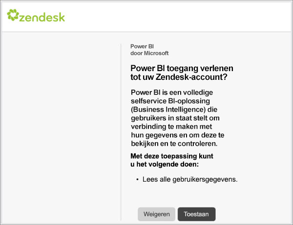
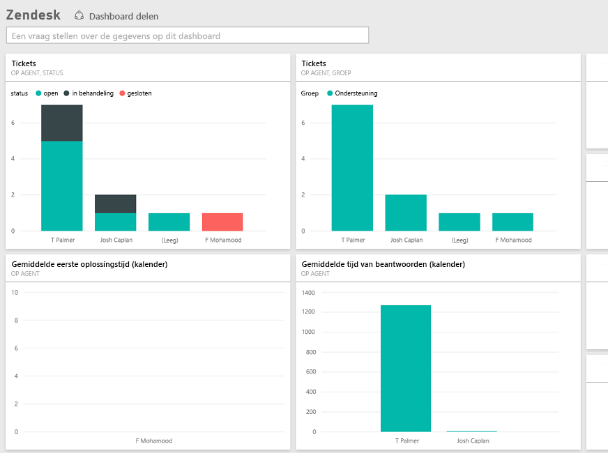

# Verbinding maken met Zendesk met Power BI
Het Zendesk-inhoudspakket biedt een Power BI-dashboard en een set Power BI-rapporten die inzicht geven in uw ticketaantallen en agentprestaties. U kunt het dashboard en de rapporten zó gebruiken, of ze aanpassen om de informatie die u het belangrijkst vindt eruit te laten springen.  De gegevens worden eenmaal per dag automatisch vernieuwd. 

Maak verbinding met het [Zendesk-inhoudspakket](https://app.powerbi.com/getdata/services/zendesk) of lees meer over de [Zendesk-integratie](https://powerbi.microsoft.com/integrations/zendesk) met Power BI.

>[!NOTE]
>Er is een Zendesk-beheerdersaccount vereist om verbinding te maken. Meer informatie over de [vereisten](#Requirements) volgt hieronder.

## Verbinding maken
1. Selecteer **Gegevens ophalen** onder in het linkernavigatievenster.
   
   
2. Selecteer in het vak **Services** de optie **Ophalen**.
   
    
3. Selecteer **Zendesk** \> **Ophalen.**
   
   
4. Geef de URL die is gekoppeld aan uw account. Deze staat in het formulier **https://company.zendesk.com**, zie details over [vinden van deze parameters](#FindingParams) hieronder.
   
   
5. Geef desgevraagd uw Zendesk-referenties op.  Selecteer **oAuth 2** als verificatiemethode en klik op **Aanmelden**. Volg de Zendesk-verificatieprocedure. (Als u al bent aangemeld bij Zendesk in uw browser, ontvangt u mogelijk geen prompt om referenties in te voeren.)
   
   > [!NOTE]
   > Dit inhoudspakket vereist dat u verbinding maakt met een Zendesk-beheerdersaccount. 
   > 
   > 
   
   
6. Klik op **Toestaan** om Power BI toegang te geven tot uw Zendesk-gegevens.
   
   
7. Klik op **Verbinding maken** om het importproces te starten. Nadat de gegevens in Power BI zijn geïmporteerd, ziet u een nieuw dashboard, een nieuw rapport en een nieuwe gegevensset in het navigatiedeelvenster aan de linkerzijde. Nieuwe items zijn gemarkeerd met een geel sterretje \*.
   
   

**Wat nu?**

* [Stel vragen in het vak Q&A](power-bi-q-and-a.md) boven in het dashboard.
* [Wijzig de tegels](service-dashboard-edit-tile.md) in het dashboard.
* [Selecteer een tegel](service-dashboard-tiles.md) om het onderliggende rapport te openen.
* Als uw gegevensset is ingesteld op dagelijks vernieuwen, kunt u het vernieuwingsschema wijzigen of de gegevensset handmatig vernieuwen met **Nu vernieuwen**.

## Wat is inbegrepen?
Het Power BI-inhoudspakket bevat gegevens over het volgende:  

* Gebruikers (eindgebruikers en agents)  
* Organisaties  
* Groepen  
* Tickets  

Er is ook een set metingen die zijn berekend, zoals gemiddelde wachttijd en opgeloste tickets in de afgelopen 7 dagen. Een volledige lijst is opgenomen in het inhoudspakket.

## Systeemvereisten
Een Zendesk-beheerdersaccount is vereist voor toegang tot het Zendesk-inhoudspakket. Als u een agent of een gebruiker bent en u wilt uw Zendesk-gegevens weergeven, voeg een suggestie toe en controleer de Zendesk-connector in de [Power BI Desktop](desktop-connect-to-data.md).

## Parameters zoeken
De URL van uw Zendesk is hetzelfde als de URL die u gebruikt bij het aanmelden bij uw Zendesk-account. Als u niet zeker weet wat uw Zendesk-URL is, kunt u de [hulp bij aanmelden](https://www.zendesk.com/login/) van Zendesk gebruiken.

## Probleemoplossing
Als u problemen ondervindt bij het maken van verbinding, controleer dan uw Zendesk-URL en bevestig dat u een Zendesk-beheerdersaccount gebruikt.

## Volgende stappen
* [Aan de slag met Power BI](service-get-started.md)
* [Gegevens ophalen](service-get-data.md)

