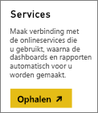
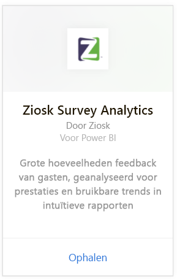
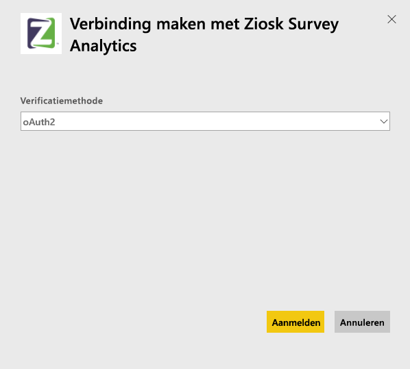
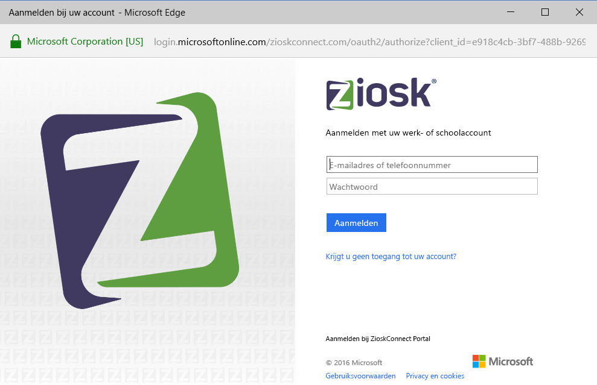
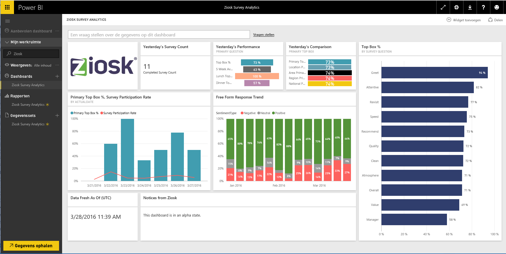

# Verbinding maken met Ziosk Survey Analytics via Power BI
Het Ziosk Survey Analytics-inhoudspakket biedt restaurants met Ziosk-tablets ongeëvenaarde toegang tot inzichten geleverd door Ziosk-onderzoeksgegevens, inclusief segmentering per dag, locatie, werknemer en meer.

Maak verbinding met het [Ziosk Survey Analytics-inhoudspakket](https://app.powerbi.com/getdata/services/ziosk-survey-analytics) voor Power BI.

## Verbinding maken
1. Selecteer **Gegevens ophalen** linksonder in het navigatievenster.  
   
    
2. Selecteer in het vak **Services** de optie **Ophalen**.  
   
    
3. Selecteer **Ziosk Survey Analytics**, selecteer daarna **Ophalen**.  
   
    
4. Selecteer **OAuth 2** en vervolgens **Aanmelden**. Geef desgevraagd uw Ziosk-referenties op.
   
    
   
    
5. Nadat verbinding is gemaakt, worden automatisch een dashboard, rapport en gegevensset geladen. Wanneer dit is voltooid, worden de tegels bijgewerkt met gegevens uit uw Ziosk-account.
   
    

**Wat nu?**

* [Stel vragen in het vak Q&A](service-q-and-a.md) boven in het dashboard
* [Wijzig de tegels](service-dashboard-edit-tile.md) in het dashboard.
* [Selecteer een tegel](service-dashboard-tiles.md) om het onderliggende rapport te openen.
* Als uw gegevensset is ingesteld op dagelijks vernieuwen, kunt u het vernieuwingsschema wijzigen of de gegevensset handmatig vernieuwen met **Nu vernieuwen**

## Wat is inbegrepen?
Het inhoudspakket bevat gegevens uit de volgende tabellen:  

    - Alcohol Category  
    - Appetizer Category  
    - CommentKeywords  
    - Date  
    - Daypart  
    - Dessert Category  
    - FreeForm  
    - Kids Category  
    - Messages  
    - Premium Content Category  
    - Question  
    - Store  
    - Surveys  
    - Weekday  

## Systeemvereisten
Een Ziosk-account met machtigingen voor de bovenstaande tabellen is vereist om dit inhoudspakket te starten.

## Volgende stappen
[Aan de slag met Power BI](service-get-started.md)

[Power BI - basisconcepten](service-basic-concepts.md)

