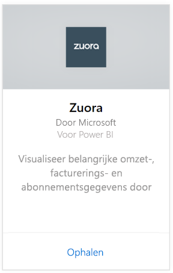
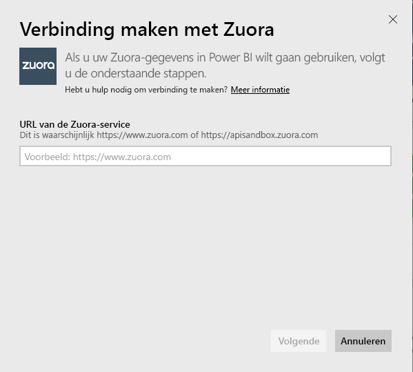
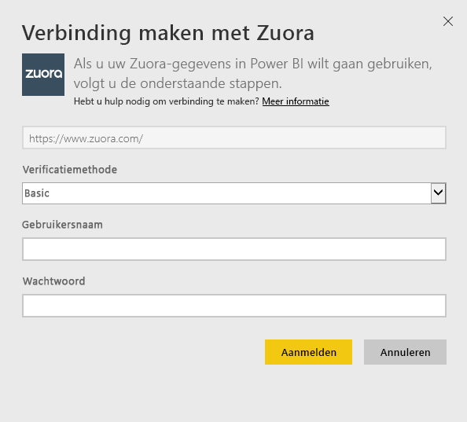
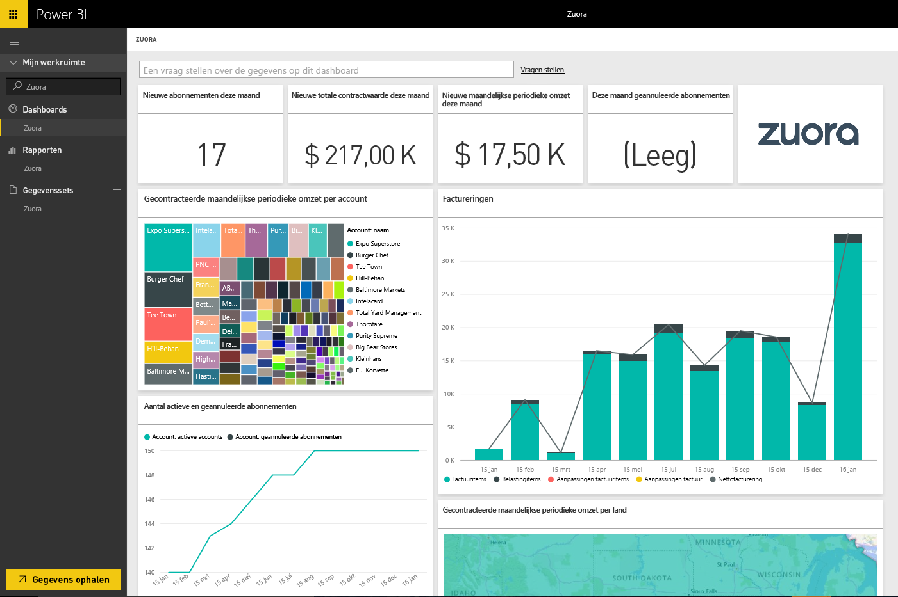

# Verbinding maken met Zuora via Power BI
Met Zuora voor Power BI kunt u belangrijke omzet-, facturerings- en abonnementsgegevens visualiseren. Gebruik het standaarddashboard en de rapporten om gebruikstrends, facturen en betalingen te analyseren en terugkerende inkomsten te controleren, of pas ze aan om te voldoen aan uw eigen unieke dashboard- en rapportagebehoeften.

Verbinding maken met [Zuora](https://app.powerbi.com/getdata/services/Zuora) voor Power BI.

## Verbinding maken
1. Selecteer **Gegevens ophalen** onder in het linkernavigatievenster.

   
2. Selecteer in het vak **Services** de optie **Ophalen**.

   
3. Selecteer **Zuora** \> **Ophalen**.

   
4. Geef uw Zuora-URL op. Dit is doorgaans https://www.zuora.com. Bekijk hieronder de details voor het [zoeken naar die parameters](#FindingParams).

   
5. Selecteer voor **Verificatiemethode** de optie **Standaard** en geef uw gebruikersnaam en wachtwoord (hoofdlettergevoelig) op. Selecteer vervolgens **Aanmelden**.

    
6. Nadat uw aanmelding is goedgekeurd, wordt het importeren automatisch gestart. Nadat het importeren is voltooid, bevat het navigatiedeelvenster een nieuw dashboard, rapport en model. Selecteer het dashboard om uw geïmporteerde gegevens weer te geven.

     

**Wat nu?**

* [Stel vragen in het vak Q&A](power-bi-q-and-a.md) boven in het dashboard.
* [Wijzig de tegels](service-dashboard-edit-tile.md) in het dashboard.
* [Selecteer een tegel](service-dashboard-tiles.md) om het onderliggende rapport te openen.
* Als uw gegevensset is ingesteld op dagelijks vernieuwen, kunt u het vernieuwingsschema wijzigen of de gegevensset handmatig vernieuwen met **Nu vernieuwen**.

## Wat is inbegrepen
Het inhoudspakket gebruikt de Zuora AQUA-API voor ophalen in de volgende tabellen:

| Tabellen |  |  |
| --- | --- | --- |
| Account |InvoiceItemAdjustment |Restitutie |
| AccountingCode |Betaling |RevenueSchedule |
| AccountingPeriod |PaymentMethod |RevenueScheduleItem |
| BillTo |Product |Abonnement |
| DateDim |ProductRatePlan |TaxationItem |
| Factuur |ProductRatePlanCharge |Gebruik |
| InvoiceAdjustment |RatePlan | |
| InvoiceItem |RatePlanCharge | |

Het omvat ook deze berekende maateenheden:

| Maateenheid | Beschrijving | Pseudo-berekening |
| --- | --- | --- |
| Account: betalingen |Totale betalingsbedragen in een periode gebaseerd op de ingangsdatum van de betaling. |SUM (Payment.Amount)  WHERE Payment.EffectiveDate = < TimePeriod.EndDate AND    Payment.EffectiveDate >= TimePeriod.StartDate |
| Account: restituties |Totaal aantal restitutiebedragen in een periode op basis van restitutiedatum. Bedrag wordt gerapporteerd als een negatief getal. |-1*SUM(Refund.Amount) WHERE Refund.RefundDate = < TimePeriod.EndDate AND    Refund.RefundDate >= TimePeriod.StartDate |
| Account: netto betalingen |Betalingen plus restituties van een account in een bepaalde periode. |Account.Payments + Account.Refunds |
| Account: actieve accounts |Het aantal accounts die in een bepaalde periode actief waren. Abonnementen moeten zijn gestart voor (of op) begindatum van periode. |COUNT (Account.AccountNumber) WHERE     Subscription.Status != "Verlopen" AND    Subscription.Status != "Concept" AND    Subscription.SubscriptionStartDate <= TimePeriod.StartDate AND    (Subscription.SubscriptionEndDate > TimePeriod.StartDate OR Subscription.SubscriptionEndDate = null) –evergreen abonnement |
| Account: gemiddelde terugkerende omzet |Brutomarge MRR per actieve account in een bepaalde periode. |Bruto MRR / Account.ActiveAccounts |
| Account: geannuleerde abonnementen |Het aantal accounts waarvoor een abonnement in een bepaalde periode is geannuleerd. |COUNT (Account.AccountNumber) WHERE Subscription.Status = "Geannuleerd" AND    Subscription.SubscriptionStartDate <= TimePeriod.StartDate AND    Subscription.CancelledDate >= TimePeriod.StartDate |
| Account: betalingsfouten |Totale waarde van betalingsfouten. |SUM (Payment.Amount) WHERE Payment.Status = "Fout" |
| Opbrengsten schema-item: opgenomen opbrengsten |Totaal opgenomen opbrengsten in een verslagperiode. |SUM (RevenueScheduleItem.Amount) WHERE AccountingPeriod.StartDate TimePeriod.StartDate = |
| Abonnement: nieuwe abonnementen |Het aantal nieuwe abonnementen in een bepaalde periode. |COUNT (Subscription.ID) WHERE Subscription.Version = "1" AND    Subscription.CreatedDate <= TimePeriod.EndDate AND    Subscription.CreatedDate >= TimePeriod.StartDate |
| Factuur: factuuritems |Totaalkosten factuuritems in een bepaalde periode. |SUM (InvoiceItem.ChargeAmount) WHERE     Invoice.Status = 'Geboekt' EN Invoice.InvoiceDate < = TimePeriod.EndDate AND    Invoice.InvoiceDate >= TimePeriod.StartDate |
| Factuur: belastingitems |Totaalbedrag belastingitems in een bepaalde periode. |SUM (TaxationItem.TaxAmount) WHERE Invoice.Status = 'Geboekt' EN Invoice.InvoiceDate < = TimePeriod.EndDate AND    Invoice.InvoiceDate >= TimePeriod.StartDate |
| Factuur: aanpassingen factuuritems |Totaalbedrag factuuritems in een bepaalde periode. |SUM (InvoiceItemAdjustment.Amount)  WHERE     Invoice.Status = 'Geboekt' AND    InvoiceItemAdjustment.AdjustmentDate <= TimePeriod.EndDate AND    InvoiceItemAdjustment.AdjustmentDate >= TimePeriod.StartDate |
| Factuur: factuurcorrecties |Totaalbedrag factuurcorrecties in een bepaalde periode. |SUM (InvoiceAdjustment.Amount)  WHERE     Invoice.Status = 'Geboekt' AND    InvoiceAdjustment.AdjustmentDate <= TimePeriod.EndDate AND    InvoiceAdjustment.AdjustmentDate >= TimePeriod.StartDate |
| Factuur: netto rekeningen |Som van factuuritems, belastingitems, correcties op factuuritems en correcties op facturen in een bepaalde periode. |Invoice.InvoiceItems + Invoice.TaxationItems + Invoice.InvoiceItemAdjustments + Invoice.InvoiceAdjustments |
| Factuur: factuur openstaand saldo |Som van geboekte factuursaldi. |SUM (Invoice.Balance)  WHERE     Invoice.Status = 'Geboekt' |
| Factuur: bruto factureringen |Som van factuurkosten per item voor geboekte facturen in een bepaalde periode. |SUM (InvoiceItem.ChargeAmount)  WHERE     Invoice.Status = 'Geboekt' EN Invoice.InvoiceDate < = TimePeriod.EndDate AND    Invoice.InvoiceDate >= TimePeriod.StartDate |
| Factuur: totaal van correcties |Som van verwerkte factuurcorrecties en correcties op factuuritems met betrekking tot geboekte facturen. |SUM (InvoiceAdjustment.Amount)  WHERE     Invoice.Status = 'Geboekt' AND    InvoiceAdjustment.Status = "Verwerkt" + SUM (InvoiceItemAdjustment.Amount)  WHERE     Invoice.Status = 'Geboekt' AND    invoiceItemAdjustment.Status = "Verwerkt" |
| Kosten tariefplan: bruto MRR |De som van de maandelijkse terugkerende inkomsten van abonnementen in een bepaalde periode. |SUM (RatePlanCharge.MRR)  WHERE     Subscription.Status != "Verlopen" AND    Subscription.Status != "Concept" AND    RatePlanCharge.EffectiveStartDate <= TimePeriod.StartDate AND        RatePlanCharge.EffectiveEndDate > TimePeriod.StartDate     OR    RatePlanCharge.EffectiveEndDate = null --evergreen abonnement |

## Systeemvereisten
Toegang tot de Zuora-API is vereist.

## Parameters zoeken
Geef de URL die u gewoonlijk gebruikt voor toegang tot uw Zuora-gegevens. De geldige opties zijn:  

* https://www.zuora.com  
* https://www.apisandbox.zuora.com  
* De URL die hoort bij uw service-exemplaar  

## Probleemoplossing
Het Zuora-inhoudspakket bevat veel aspecten van uw Zuora-account. Als u bepaalde functies niet gebruikt, ziet u dat bijbehorende tegels/rapporten leeg zijn. Neem contact op met ondersteuning van Power BI als u problemen ondervindt bij het laden.

## Volgende stappen
[Aan de slag in Power BI](service-get-started.md)

[Gegevens ophalen in Power BI](service-get-data.md)
