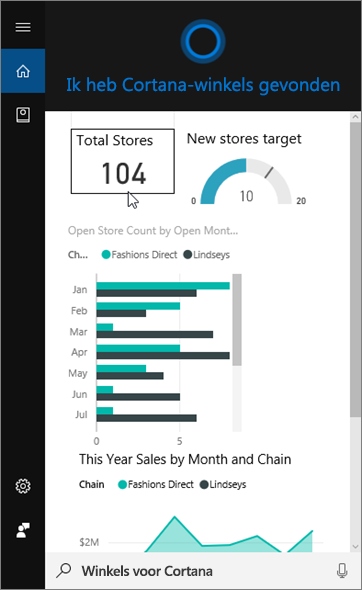
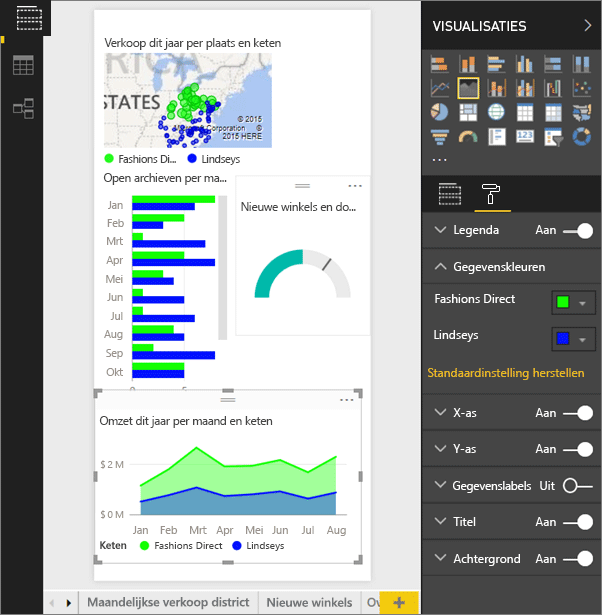
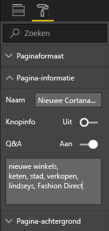
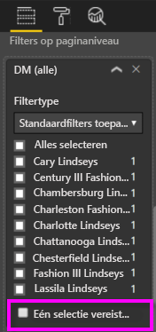

# De Power BI-service of Power BI Desktop gebruiken om een aangepaste antwoordpagina voor Cortana te maken
Gebruik de volledige mogelijkheden van Power BI om speciale rapportpagina’s te maken, genaamd *Cortana-antwoordpagina’s* (soms *Cortana-antwoordkaarten*) die specifiek zijn ontworpen om vragen over Cortana te beantwoorden.

> [!IMPORTANT]
> Als u de preview-versie van het Cortana- en Power BI-**dashboard** uitprobeert, kunt u de rest van dit artikel overslaan. Er zijn geen installatievereisten voor Cortana om uw Power BI-dashboards te doorzoeken.
> 
> 

## Voordat u begint
U hebt 4 documenten die u bij het installeren en gebruik van Cortana voor Power BI begeleiden. Begin met het lezen van artikel 1 als u dit nog niet hebt gedaan. Artikel 2 is met name belangrijk omdat hierin enkele stappen worden beschreven die u moet nemen voordat u kunt beginnen met het gebruiken van Cortana-antwoordpagina’s.

**Artikel 1**: [Leer hoe Cortana en Power BI samen werken](service-cortana-intro.md)

**Artikel 2**: [Voor het zoeken in Power BI-rapporten: de integratie van Cortana, Power BI en Windows inschakelen](service-cortana-enable.md)

**Artikel 3**: dit artikel

**Artikel 4**: [Problemen oplossen](service-cortana-troubleshoot.md)

## Een Cortana-antwoordpagina maken die speciaal is ontworpen voor Cortana
Een *Cortana-antwoordpagina* in een rapport heeft een formaat dat specifiek is afgestemd op Cortana zodat het in een Cortana-scherm kan worden weergegeven als een antwoord op een vraag. U maakt als volgt een antwoordpagina voor Cortana:

1. U kunt het beste beginnen met een [lege rapportpagina](power-bi-report-add-page.md).
2. Selecteer in het venster **Visualisaties** het verfroller-pictogram en kies **Paginagrootte** > **Type** > **Cortana**.
   
    
3. Maak een visueel element of een groep visuele elementen die u in Cortana wilt weergeven als antwoord op een bepaalde vraag (of een verzameling vragen).
4. Zorg ervoor dat alle visuele elementen binnen de paginaranden passen. Wijzig eventueel de weergave-instellingen, gegevenslabels, kleuren en achtergronden.  
   
    
5. Geef de pagina een naam en voeg alternatieve namen toe. Cortana gebruikt deze namen wanneer het naar resultaten zoekt. Selecteer in het deelvenster **Visualisaties** het pictogram met de verfroller en kies **Paginagegevens**. Schakel Q&A voor dit visuele element in door de schuifregelaar op **Aan** te zetten.
   
    
   
   > [!TIP]
   > U kunt de resultaten verbeteren door woorden die worden gebruikt als kolomnamen te vermijden.
   > 
   > 
6. Als uw rapport paginaniveaufilters heeft, kunt u eventueel **Enkelvoudige selectie vereisen** instellen. In Cortana wordt dit rapport dan alleen als een antwoord weergegeven als één, en uitsluitend één, van de filteritems in de vraag wordt vermeld. **Enkelvoudige selectie vereisen** vindt u onder aan het deelvenster **Filters**.
   
   > [!NOTE]
   > U hoeft **Enkelvoudige selectie vereisen** niet in te stellen, als u wilt dat in Cortana een rapport wordt weergegeven op basis van de paginaniveaufilters. Voor 'omzet weergeven voor Charlotte Lindseys' bijvoorbeeld wordt de antwoordpagina weergegeven, ongeacht of u de instelling Enkelvoudige selectie vereisen hebt geselecteerd.
   > 
   > 
   
     
   
      Als u Cortana bijvoorbeeld vraagt:
   
   * "verkoop weergeven met winkelnaam," deze antwoordpagina verschijnt niet omdat u geen items in de vereiste filter voor paginaniveau hebt opgenomen.
   * "verkoop weergeven voor Cary Lindseys en Charlotte Lindseys," deze antwoordpagina verschijnt niet omdat u meer dan één item in de vereiste filter voor paginaniveau hebt opgegeven.
   * "verkoop weergeven voor Charlotte Lindseys," deze antwoordpagina verschijnt.
     
     = "verkoop weergeven" deze antwoordpagina verschijnt niet omdat u geen items in de vereiste filter voor paginaniveau hebt opgenomen.

> [!IMPORTANT]
> U moet [de gegevensset inschakelen voor Cortana](service-cortana-enable.md) zodat Cortana toegang heeft tot uw Cortana-antwoordpagina.
> 
> 

## Hoe worden de resultaten in Cortana geordend?
Resultaten met hoog scorende antwoorden (zoals een volledige match met een opgegeven paginanaam) verschijnen eerst als een *beste match* in Cortana. Er kunnen meerdere beste matches voorkomen als er meerdere Cortana-antwoordpagina's in Power BI zijn. Gemiddeld of laag scorende antwoorden, zoals antwoorden die niet zijn gebaseerd op een antwoordpagina of een vraag met woorden die niet begrepen worden door Power BI, worden weergegeven als koppelingen onder beste matches in Cortana.

> [!NOTE]
> Wanneer een nieuwe gegevensset of aangepaste Cortana-antwoordpagina wordt toegevoegd aan Power BI en ingeschakeld voor Cortana, kan het tot 30 minuten duren voordat resultaten verschijnen in Cortana. Door aan en af te melden bij Windows 10 of op een andere manier het Cortana-proces in Windows 10 te herstarten, wordt nieuwe inhoud onmiddellijk weergegeven.
> 
> 

## Volgende stappen
[Cortana gebruiken met Power BI](service-cortana-intro.md)

Lukt het niet om Cortana samen met Power BI te gebruiken?  Probeer de [probleemoplosser van Cortana](service-cortana-troubleshoot.md).

Nog vragen? [Misschien dat de Power BI-community het antwoord weet](http://community.powerbi.com/)

