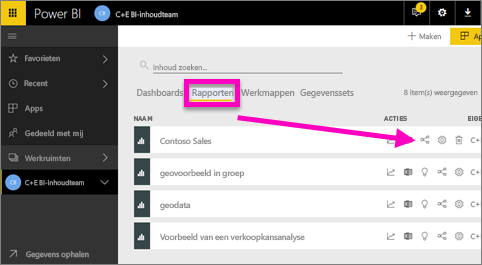
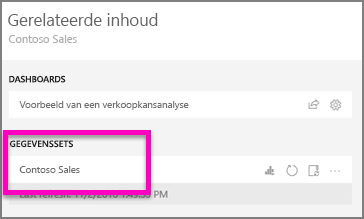
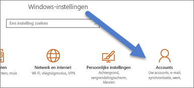

# Cortana inschakelen voor toegang tot Power BI-rapporten (en de onderliggende gegevenssets)
U hebt de [inleiding tot Cortana en Power BI](service-cortana-intro.md) gelezen (als dat niet het geval is, kunt u deze beter eerst lezen en later terugkomen). En nu wilt u het zelf proberen.  Voordat u in Cortana vragen in de natuurlijke taal kunt stellen en antwoorden kunt krijgen uit opgeslagen gegevens in Power BI-***rapporten***, moet er aan enkele vereisten zijn voldaan. U moet in het bijzonder het volgende doen.

> [!NOTE]
> Als u de preview-versie van Cortana en het Power BI-***dashboard*** uitprobeert, kunt u de rest van dit artikel overslaan. Er zijn geen installatievereisten voor Cortana om uw Power BI-dashboards te doorzoeken.
> 
> 

In de Power BI-service

* Schakel een of meer gegevenssets voor Cortana in (rapporten zijn gebaseerd op gegevenssets, zodat Cortana toegang tot deze gegevenssets moet hebben).

In Microsoft Windows

* Controleer of Windows 10 versie 1511 of hoger wordt uitgevoerd.
* Zorg ervoor dat Power BI en Windows met elkaar kunnen communiceren. Dit betekent dat uw account met Windows moet zijn verbonden.

## De Power BI-service gebruiken om Cortana in te schakelen voor toegang tot rapportpagina's in Power BI
Het inschakelen van rapporten in Power BI zodat ze voor Cortana toegankelijk zijn, is een eenvoudig proces.  U hoeft eigenlijk alleen maar de onderliggende gegevensset van het rapport in te schakelen door Cortana inschakelen om deze gegevensset te openen te selecteren. Daarna kan elke gebruiker met toegang tot de gegevensset in Power BI via de gewone functies voor delen, apps en inhoudspakketten van Power BI antwoorden uit het rapport krijgen met Cortana in Windows 10.

U moet zich aanmelden bij de Power BI-service (niet Power BI Desktop) en deze stappen herhalen voor elke gegevensset waartoe Cortana toegang moet hebben.

1. Bepaal welke gegevensset(s) u wilt inschakelen. Selecteer in de inhoudslijst voor rapporten het rapport dat toegankelijk moet worden voor Cortana en kies het pictogram **Gerelateerde items weergeven**   .
   
    
2. De gegevensset die is gekoppeld aan dit rapport, is **Contoso Sales**.
   
    
3. Selecteer **weglatingstekens (...) > instellingen** aan de rechterkant van de naam van de gegevensset.  
   
    
4. Selecteer **Q&A en Cortana** > **Cortana toegang geven tot deze gegevensset** > **Toepassen**.
   
   
   
   In dit voorbeeld wordt Cortana ingeschakeld voor de Contoso Sales-gegevensset.
   
   > [!NOTE]
   > Wanneer een nieuwe gegevensset of Cortana-antwoordkaart wordt toegevoegd aan Power BI en wordt ingeschakeld voor Cortana, kan het tot 30 minuten duren voordat er resultaten worden weergegeven. Als u zich bij Windows 10 afmeldt en opnieuw aanmeldt of als u het Cortana-proces in Windows 10 op een andere manier opnieuw start, wordt nieuwe inhoud onmiddellijk weergegeven.
   > 
   > Als u een gegevensset voor Cortana inschakelt en deze gegevensset onderdeel is van een inhoudspakket of app waarvan u eigenaar bent, moet u opnieuw publiceren voor uw collega's om gebruik met Cortana mogelijk te maken.
   > 
   > 

## Uw Power BI-referenties toevoegen aan Windows
U moet werken met Windows 10 versie 1511 of hoger.

1. Bepaal welke Windows 10-versie wordt uitgevoerd. Open **Instellingen**.
    

    En selecteer vervolgens **Systeem > Over**. Aan de onderkant van het scherm ziet u **Windows-specificaties > Versie**

   * Als u Windows 10 versie 1511 (Windows-update van 10 november 2015) of hoger (niet hoger dan 1607) hebt, voegt u uw werk- of schoolaccount en Microsoft-account toe (voer onderstaande stappen 2 en 3 uit).
   * Als u Windows 10 versie 1607 (Windows-update van 10 juli 2016) of hoger hebt, voegt u uw werk- of schoolaccount toe (voer alleen onderstaande stap 2 uit).
1. Voeg uw werk- of schoolaccount toe voor Cortana.
   
   * Open **Instellingen** > **Accounts**.
     
       
   * Schuif naar beneden en selecteer **Een account voor werk of school toevoegen**. Of selecteer op de pagina **Accounts** de optie **Werk of school openen > Verbinding maken**.
     
     

Cortana gebruikt dit werk- of schoolaccount om Power BI te controleren op mogelijke antwoorden op uw vragen in Cortana.

## Volgende stappen
[Cortana-*antwoordkaarten* maken in Power BI](service-cortana-answer-cards.md)

[Integratieproblemen met Cortana en Power BI oplossen](service-cortana-troubleshoot.md)

Nog vragen? [Misschien dat de Power BI-community het antwoord weet](http://community.powerbi.com/)

