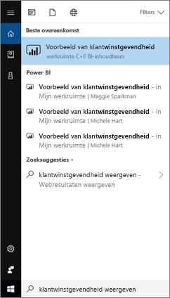
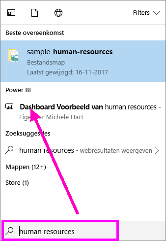
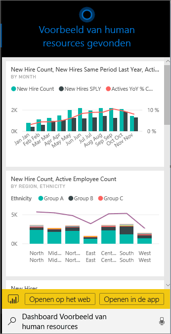
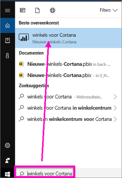
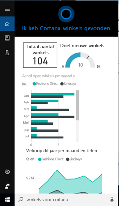
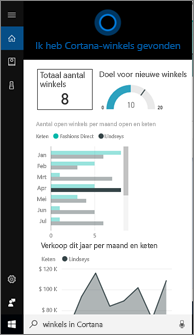
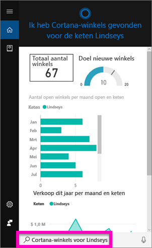
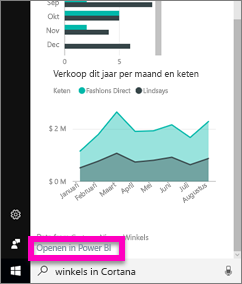
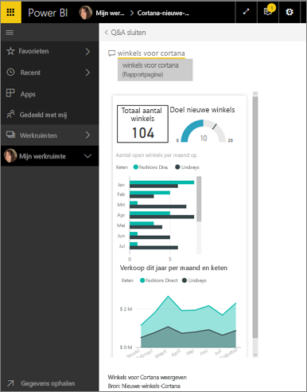

# Uw Power BI-gegevens snel vinden en weergeven met Cortana voor Power BI
Gebruik Cortana op uw Windows 10-apparaten om direct antwoord te krijgen op uw belangrijke zakelijke vragen. Door de integratie met Power BI kan Cortana belangrijke gegevens rechtstreeks ophalen uit Power BI-dashboards en -rapporten. U hebt alleen maar Windows 10, versie november 2015 of later, Cortana, Power BI en toegang tot minimaal één gegevensset nodig.

## Bekijk een voorbeeld van de nieuwe Cortana-zoekervaring voor *dashboards* voor Windows 10
U kunt nu al een tijdje [met Cortana gebruiken bepaalde typen rapportpagina's ophalen](service-cortana-answer-cards.md). Er is nu een **nieuwe ervaring** toegevoegd: de mogelijkheid om ook dashboards op te halen. Probeer het uit en [geef feedback ](mailto:pbicortanasg@microsoft.com). De *nieuwe ervaring* wordt op termijn uitgebreid zodat u ook met Cortana kunt zoeken in rapporten.  Een van de belangrijkste voordelen van de nieuwe ervaring is dat u er niets speciaals voor hoeft te doen: u hoeft Cortana niet in te schakelen of Windows 10 te configureren - het werkt gewoon.

> [!NOTE]
> Als het niet 'gewoon werkt', raadpleegt u het [artikel Probleemoplossing](service-cortana-troubleshoot.md) voor hulp.
> 
> 

De onderliggende technologie maakt gebruikt van de [Azure Search-service van Microsoft](). Deze zoekservice biedt extra mogelijkheden, zoals slimme classificatie, foutcorrectie en automatisch aanvullen.

Beide Cortana-ervaringen zullen naast elkaar bestaan.

## Cortana voor Power BI-documentatie
Er zijn 4 documenten die u helpen bij het instellen en gebruiken van Cortana voor Power BI. Deze reeks artikelen begeleidt u bij stappen om het volgende te doen

**Artikel 1** (dit artikel): informatie over hoe Cortana en Power BI samenwerken

**Artikel 2**: [Zoeken in Power BI-rapporten: de integratie van Cortana - Power BI - Windows inschakelen](service-cortana-enable.md)

**Artikel 3**: [Zoeken in Power BI-rapporten: *speciale Cortana-antwoordkaarten maken*](service-cortana-answer-cards.md)

**Artikel 4**: [Problemen oplossen](service-cortana-troubleshoot.md)

## Hoe werken Cortana en Power BI samen?
Wanneer u met Cortana een vraag stelt, kan Cortana in Power BI zoeken naar antwoorden. In Power BI kan Cortana uitgebreide gegevensgestuurde antwoorden vinden in Power BI-rapporten (die een speciaal type rapportpagina bevatten genaamd een *Cortana-antwoordkaart*) en in Power BI-dashboards.

Als Cortana een overeenkomst vindt, geeft het de naam van het dashboard of de rapportpagina weer in uw Cortana-scherm. Het dashboard of de rapportpagina kan worden geopend in Power BI. Rapportpagina's kunnen ook direct in Cortana worden bestudeerd: ze zijn interactief.

### Cortana en dashboards (de *nieuwe ervaring*)
Cortana vindt antwoorden in de dashboards die van u zijn en in dashboards die met u zijn gedeeld. Stel Cortana vragen met behulp van titels, trefwoorden, namen van eigenaren, werkruimtenamen, app-namen en meer.

Uw vraag moet uit ten minste 2 woorden bestaan aan de hand waarvan Cortana een antwoord kan zoeken. Dus als u in een dashboard met een naam van één woord (Marketing) zoekt, voegt u het woord 'toon' of 'Power BI' of '<owner name>' toe aan uw vraag, zoals in 'toon Marketing weer' of 'michele hart voorbeeld'. 

Als uw dashboard een titel heeft die uit meer dan één woord bestaat, retourneert Cortana dat dashboard alleen als uw zoekopdracht overeenkomt met ten minste twee van de woorden of als uw dashboard overeenkomt met een van de woorden plus de naam van de eigenaar. Voor een dashboard met de naam 'Voorbeeld van klantwinstgevendheid': 

* retourneert 'toon klant' *geen* Power BI-dashboardresultaat.   
* zoekzinnen als 'toon winstgevendheid klant', 'klant p', 'klant s', 'winstgevendheid voorbeeld', 'michele hart voorbeeld', 'toon klantwinstgevendheid voorbeeld' en 'toon klant p' retourneren *wel* een Power BI-resultaat.
* Als u het woord 'powerbi' toevoegt, telt dat als een van de twee vereiste woorden. 'Power BI voorbeeld' retourneert dus *wel* een Power BI-resultaat. 
  
    

### Cortana en rapporten
 Cortana kan antwoorden vinden in rapporten met [pagina's die speciaal zijn ontworpen voor weergave door Cortana](service-cortana-answer-cards.md). Stel eenvoudig vragen door de titel of trefwoorden uit een van deze speciale rapportpagina's te gebruiken.  

De onderliggende technologie voor rapporten maakt gebruik van [Power BI Q&A van Microsoft](consumer/end-user-q-and-a.md).

Wanneer u een vraag stelt in Cortana, beantwoordt Power BI die vraag aan de hand van rapportpagina's die speciaal zijn ontworpen voor Cortana. Mogelijke antwoorden worden door Cortana direct bepaald aan de hand van de Cortana-*antwoordkaarten* die al zijn gemaakt in Power BI.  Als u een antwoord verder wilt bestuderen, opent u eenvoudig een resultaat in Power BI.

> [!NOTE]
> Voordat Cortana naar antwoorden kan zoeken in uw Power BI-rapporten, [schakelt u deze functie in met de Power BI-service en stelt u Windows in om te communiceren met Power BI](service-cortana-enable.md).  
> 
> 

## Met Cortana antwoorden krijgen vanuit Power BI
1. Begin in Cortana. U kunt op veel verschillende manieren Cortana *openen*: Selecteer het Cortana-pictogram in de taakbalk (hieronder afgebeeld), gebruik spraakopdrachten of tik op het zoekpictogram op uw mobiele Windows-apparaat.
   
     
2. Als Cortana gereed is, typt of spreekt u uw vraag op de zoekbalk van Cortana. Cortana geeft de beschikbare resultaten weer. Als er een Power BI-dashboard is dat overeenkomt met de vraag, wordt dit weergegeven onder **Beste match** of **Power BI**.
   
     
   
   > [!NOTE]
   > Op dit moment wordt alleen Engels ondersteund.
   > 
   > 
3. Selecteer het dashboard om dit te openen in Cortana.

    

    U kunt de indeling wijzigen door [de *telefoonweergave* van het dashboard](service-create-dashboard-mobile-phone-view.md) te wijzigen. 

1. Met Cortana hebt u ook de opties om het dashboard in de Power BI-service of de mobiele Power BI-app te openen. Open het dashboard in de Power BI-service door **Openen op het web** te selecteren. 
   
      
4. We gebruiken Cortana nu om een rapport te zoeken. We moeten iets weten uit een [rapport dat een pagina heeft met een Cortana-antwoordkaart ](service-cortana-answer-cards.md). In dit voorbeeld heeft een rapport met de naam 'Cortana-nieuwe-winkels' een Cortana-antwoordkaartpagina met de naam 'cortana winkels'.  
   
     Typ of spreek uw vraag in de zoekbalk van Cortana. Cortana geeft de beschikbare resultaten weer. Als er een Power BI-rapportpagina is die overeenkomt met de vraag, wordt deze weergegeven onder **Beste match** of **Power BI**. En in dit voorbeeld worden het .pbix-bestand (met de back-up) die ik heb gebruikt om de antwoordkaart te maken, ook weergegeven -- onder **Documenten**.
   
      
5. Selecteer de rapportpagina **Cortana winkels** om deze weer te geven in het Cortana-venster.
   
       
   
    Vergeet niet dat een *antwoordkaart* een speciaal type Power BI-rapportpagina is die is gemaakt door de eigenaar van een gegevensset.  Zie [Een Cortana-antwoordkaart maken](service-cortana-answer-cards.md) voor meer informatie.
6. Maar dat is niet alles. Werk met de visualisaties op de antwoordkaart zoals u dat ook in Power BI zou doen.
   
   * Selecteer bijvoorbeeld een element op één visualisatie om kruislings te filteren en markeer de andere visualisaties op de antwoordkaart.
     
     
   * Of gebruik natuurlijke taal om de resultaten te filteren.  Vraag bijvoorbeeld 'Cortana winkels voor Lindseys' en u ziet dat de kaart wordt gefilterd zodat alleen de gegevens voor de keten Lindseys worden weergegeven.
     
     
7. Ga verder met verkennen. Schuif omlaag in het Cortana-venster en selecteer **Openen in Power BI**.
   
     
8. De rapportpagina wordt geopend in Power BI.    
     

## Overwegingen en probleemoplossing
* Cortana heeft geen toegang tot Cortana-kaarten die niet zijn [ingeschakeld voor Power BI](service-cortana-enable.md).
* Lukt het niet om Cortana te laten werken met Power BI?  Probeer de [probleemoplosser van Cortana](service-cortana-troubleshoot.md).
* Cortana voor Power BI is momenteel alleen beschikbaar in het Engels.
* Cortana voor Power BI is alleen beschikbaar op mobiele Windows-apparaten.

Nog vragen? [Misschien dat de Power BI-community het antwoord weet](http://community.powerbi.com/)

## Volgende stappen
[De integratie van Cortana - Power BI - Windows voor rapporten inschakelen](service-cortana-enable.md)

