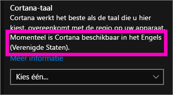
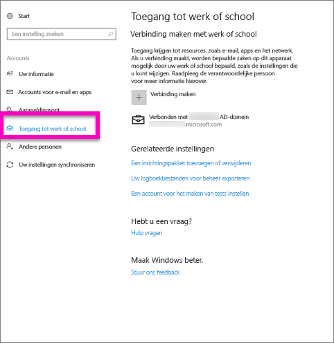
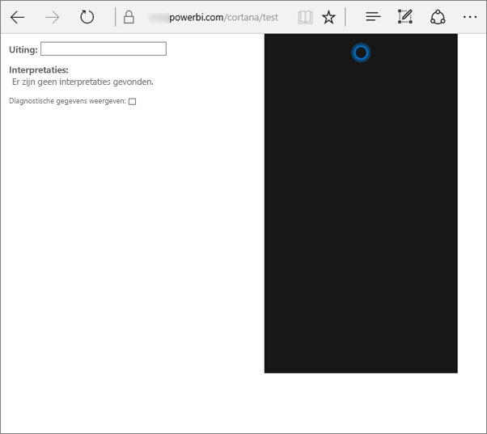
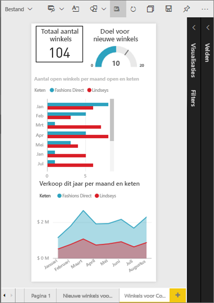
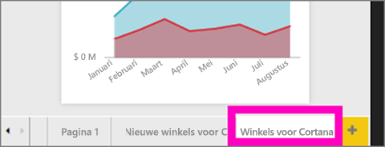
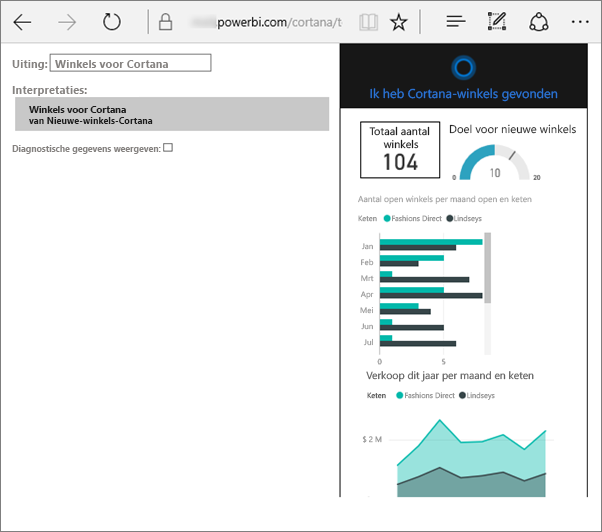
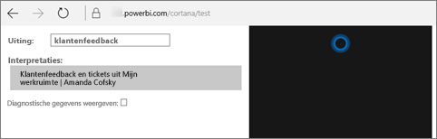

# Problemen met Cortana voor Power BI oplossen
Dit artikel maakt deel uit van een serie. Wij raden u aan de volgende drie artikelen te lezen als u dat nog niet hebt gedaan.

**Artikel 1**: [Begrijpen hoe Cortana en Power BI samenwerken om te zoeken naar Power BI-dashboards en -rapporten](service-cortana-intro.md)

**Artikel 2**: [Zoeken in rapporten: de integratie van Cortana, Power BI en Windows inschakelen](service-cortana-enable.md)

**Artikel 3**: [Zoeken in rapporten: speciale *Cortana-antwoordkaarten maken*](service-cortana-answer-cards.md)

Als u dan nog steeds problemen hebt bij het integreren van Cortana met Power BI, bent u hier op de juiste plaats. Volg de onderstaande stappen om het probleem op te sporen en op te lossen.

## Waarom vindt Cortana geen antwoorden uit mijn Power BI-rapporten of -dashboards?
1. Hebt u een Power BI-account?  Als dat niet het geval is, [meldt u zich aan voor een gratis proefversie](https://powerbi.microsoft.com/get-started/).
2. Werkt Cortana?  Ziet u het Cortana-pictogram in de taakbalk?

    

    Als u het pictogram selecteert, wordt Cortana dan geopend met een veld waarin u tekst kunt typen?
3. Hebt u ten minste 2 woorden in de zoekopdracht gebruikt? Cortana heeft ten minste 2 woorden of zinnen nodig om antwoorden te vinden in Power BI. Probeer 'show' toe te voegen aan het begin van uw vraag.
4. Als uw dashboard een titel heeft die uit meer dan één woord bestaat, retourneert Cortana dat dashboard alleen als uw zoekopdracht overeenkomt met ten minste twee van de woorden. Voor een dashboard met de naam 'Omzet FY16':

   * levert 'show omzet' *geen* resultaat op uit Power BI.   
   * 'show me omzet fy16', 'omzet fy16', 'show omzet fy16' en 'show me omzet f' produceren *wel* een resultaat uit Power BI.    
   * Als u het woord 'powerbi' toevoegt, telt dat als een van de twee vereiste woorden. 'powerbi omzet' levert dus *wel* een Power BI-resultaat op.
5. Hebt u toegangsrechten of bewerkingsmachtigingen voor rapporten of dashboards? Voor rapporten is het belangrijk dat er een [antwoordkaart](service-cortana-answer-cards.md) bestaat voor de inhoud die u probeert te zoeken.  Voor dashboards moet de inhoud die u wilt zoeken, zich bevinden in **Gedeeld met mij**, een app-werkruimte of **Mijn werkruimte**. [Gebruik het hulpprogramma voor probleemoplossing](#try-the-cortana-troubleshooting-tool) om het probleem te identificeren.
6. Gebruikt u een mobiel apparaat?  Momenteel wordt de integratie van Power BI en Cortana alleen ondersteund op mobiele Windows-apparaten.
7. Is Cortana geconfigureerd voor Engels?  De huidige integratie van Cortana en Power BI ondersteunt alleen Engels. Open Cortana en selecteer het tandwielpictogram om Instellingen weer te geven. Schuif omlaag naar **Cortana-taal** en zorg ervoor dat deze is ingesteld op een van de Engelse taalvarianten.

   
8. Hebt u meer dan 100 rapporten ingeschakeld voor Cortana?  Cortana doorzoekt maximaal 100 rapporten in totaal.  Om ervoor te zorgen dat uw rapport wordt doorzocht, verplaatst of kopieert u het naar **Mijn werkruimte**, aangezien Cortana daar het eerste zoekt.
9. Misschien moet u iets langer wachten. De eerste keer dat u een query typt, is het model mogelijk nog *koud*. Wacht een paar seconden zodat de gegevens in het geheugen kunnen worden geladen en probeer het opnieuw.
10. Voor dashboards kan het maximaal 24 uur duren voordat deze toegankelijk zijn voor Cortana.    
11. Voor rapporten geldt dat als er een nieuwe gegevensset of aangepaste antwoordkaart wordt toegevoegd aan Power BI en deze wordt ingeschakeld voor Cortana, het tot 30 minuten kan duren voordat er resultaten worden weergegeven in Cortana. Als u zich afmeldt en opnieuw aanmeldt bij Windows 10, of als u het Cortana-proces in Windows 10 op een andere manier opnieuw start, wordt nieuwe rapportinhoud onmiddellijk weergegeven.  
12. De Power BI-beheerder kan ervoor hebben gekozen Cortana uit te schakelen. Neem contact op met de beheerder om te vragen of dit het geval is.

## Alleen rapporten: waarom vindt Cortana geen antwoorden uit mijn Power BI-rapporten?
1. Als u op zoekt bent naar antwoorden in rapporten, zijn er dan wel rapporten beschikbaar met Cortana-**antwoordkaarten**? Antwoordkaarten zijn de enige manier voor Cortana om antwoorden te vinden in uw Power BI-rapporten.  Informatie over het maken van een antwoordkaart vindt u in [Use Power BI service or Power BI Desktop to create a custom Answer Page for Cortana](service-cortana-answer-cards.md) (Cortana-antwoordkaarten maken in Power BI-service en Power BI Desktop).
2. Gebruikt u Windows versie 1511 of hoger?  Controleer dit door Windows-instellingen te openen en **Systeem > Over** te selecteren. Update uw versie van Windows als u een oudere versie hebt.
3. Zijn uw Windows- en Power BI-accounts gekoppeld? Dit kan ingewikkeld zijn. Volg de instructies in [Cortana inschakelen voor Power BI](service-cortana-enable.md#add-your-power-bi-credentials-to-windows).
4. Zijn de onderliggende gegevenssets ingeschakeld voor Cortana? Misschien heeft een collega een gegevensset gedeeld die al door hem of haar is ingeschakeld voor Cortana. Maar als dat niet zo is, leest u hier [hoe u gegevenssets inschakelt voor Cortana](service-cortana-enable.md). Het is snel en eenvoudig.

## Alleen dashboards: waarom vindt Cortana geen antwoorden uit mijn Power BI-dashboards?
1. Zorg ervoor dat u bent verbonden met uw werkaccount. Power BI heeft deze verbinding nodig om uw toegangsmachtigingen voor gegevens te kunnen verifiëren. Om te controleren of u verbonden bent met uw werkaccount, of om dat alsnog te doen, gebruikt u het zoekvak van Windows om naar 'Verbinding maken met werk of school' te navigeren.  

    
2. Hebt u toegang tot Cortana? Selecteer het zoekvak van Windows en geef Cortana toegangsmachtigingen voor uw gegevens.

## Hulpprogramma voor probleemoplossing van Cortana proberen
Lukt het nog steeds niet?  Dan is het nu een goed moment om het hulpprogramma voor probleemoplossing van Cortana te gebruiken en het probleem nader te identificeren.

### Problemen bij het ophalen van antwoorden uit een rapport?
1. Voor rapporten geldt dat u het hulpprogramma voor probleemoplossing pas moet uitvoeren nadat u de filters voor **paginaniveau**op de antwoordkaarten van Cortana hebt ingesteld op **Eén selectie vereist**. Zie [Cortana-antwoordkaarten maken](service-cortana-answer-cards.md) voor meer informatie.
2. Open het hulpprogramma voor probleemoplossing door '/cortana/test' toe te voegen aan het einde van de URL voor de Power BI-service. De URL moet er nu als volgt uitzien:

   app.powerbi.com/cortana/test

   
3. Als u problemen met rapporten wilt oplossen, typt u in het veld **Utterance** de naam van een Cortana-antwoordkaart, ***precies zoals deze wordt weergegeven op het tabblad Power BI***.

   

    

   
4. Soms gebeurt er niets nadat u de eerste keer iets hebt getypt in het veld **Utterance**. Dit kan gebeuren omdat het systeem nog niet helemaal klaar is. Knip en plak de tekst dan nogmaals in het veld **Utterance** of typ deze opnieuw. In dit voorbeeld is de naam van onze antwoordkaart **Cortana stores**. Als u **Cortana stores** in het veld plakt of typt, levert dit één resultaat op dat wordt weergegeven in het veld **Interpretations**. Klik erop om de antwoordkaart weer te geven in het Cortana-venster; in dit geval **Cortana stores**.

   

   Omdat de tekst een resultaat heeft opgeleverd, weten we nu dat Cortana **wel** is ingeschakeld in Power BI. Hierdoor kunnen we het probleem beperken tot Windows, de taalinstelling van Cortana of meer dan 100 ingeschakelde gegevenssets voor Cortana.

### Problemen bij het ophalen van antwoorden uit een dashboard?
Zoekt u een dashboard dat met u is gedeeld?  Open Power BI > **Gedeeld met mij** en zoek de naam van het dashboard.  Typ die naam vervolgens in het veld **Utterances**.

#### Bekende problemen met het hulpprogramma voor probleemoplossing
* Als het hulpprogramma niet direct de gewenste resultaten ophaalt, plakt u de query in het tekstvak Utterance.
* De query moet uit minimaal twee woorden bestaan.  Als uw query te kort is, kunt u het woord 'show' toevoegen.
* Sommige queryreeksen met voorzetsels werken mogelijk niet (bijvoorbeeld 'omzet per artikel'). Probeer andere querytermen zonder voorzetsels en die betekenisvol/uniek zijn.

Nog vragen? [Misschien dat de Power BI-community het antwoord weet](http://community.powerbi.com/)
