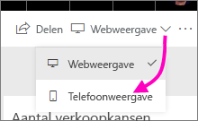
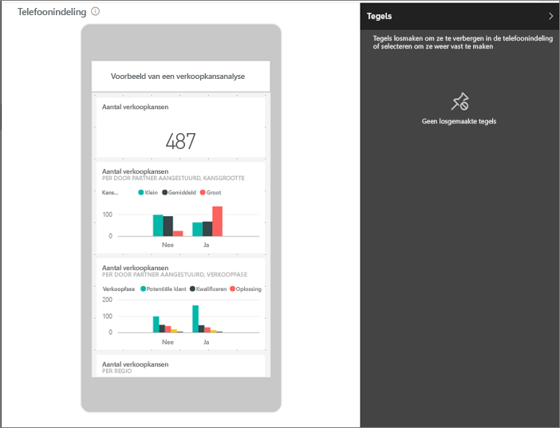
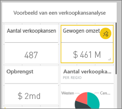
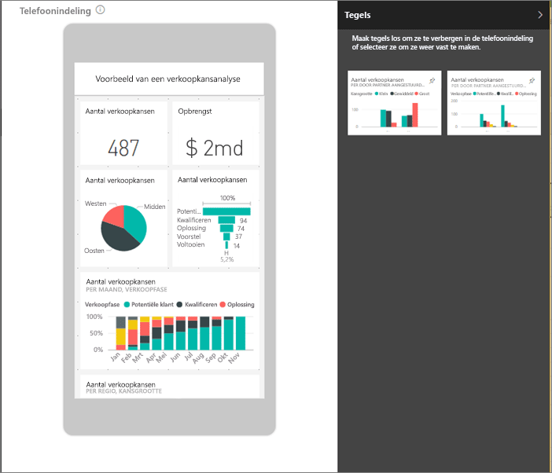
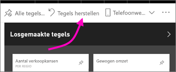

# Een weergave van een Power BI-dashboard maken die is geoptimaliseerd voor mobiele telefoons
Wanneer u dashboards in de mobiele Power BI-app op een telefoon weergeeft, ziet u dat de dashboardtegels achter elkaar worden weergegeven en allemaal dezelfde grootte hebben. In de Power BI-service kunt u een aangepaste weergave voor uw eigen dashboards maken, met name voor telefoons.

Als u de telefoon draait, wordt het dashboard weergegeven zoals in de service, niet zoals u het voor de telefoon hebt ontworpen.

> [!NOTE]
> Wanneer u de telefoonweergave bewerkt, kan iedereen die het dashboard weergeeft op een telefoon, de wijzigingen die u aanbrengt in real time zien. Als u bijvoorbeeld alle tegels op dashboard in de telefoonweergave losmaakt, bevat het dashboard op de telefoon plotseling geen tegels meer. 
> 
> 

## Een telefoonweergave van een dashboard maken
1. Open een dashboard in de Power BI-service.
2. Selecteer in de rechterbovenhoek de pijl naast **Webweergave** en selecteer vervolgens **Telefoonweergave**.

    

    Als u niet de eigenaar van het dashboard bent, wordt deze optie niet weergegeven.

    

    De weergave voor het bewerken van het telefoondashboard wordt geopend. Hier kunt tegels losmaken, het formaat van tegels wijzigen en de tegels opnieuw schikken om ze aan te passen aan de telefoonweergave. De webversie van het dashboard verandert niet.

1. Selecteer een tegel om deze te slepen, los te maken of het formaat ervan te wijzigen. Zoals u ziet worden de andere tegels verplaatst wanneer u een tegel sleept.
   
    
   
    De losgemaakte tegels worden in het venster Losgemaakt geplaatst. Hier blijven ze staan totdat u ze terugzet.
   
    
2. Als u van gedachten verandert, selecteert u **Tegels herstellen** om de eerdere volgorde en grootte weer te herstellen.
   
    
   
    Als u de bewerkingsweergave voor de telefoon opent in de Power BI-service, verander de grootte en vorm van de tegels op een telefoon enigszins. Als u wilt terugkeren naar de exacte staat voordat u het dashboard in de bewerkingsweergave voor de telefoon opende, selecteert u **Tegels herstellen**.
3. Als u tevreden met de indeling van het telefoondashboard, selecteert u in de rechterbovenhoek de pijl naast **Telefoonweergave** en selecteert u **Webweergave**.
   
    De telefoonindeling wordt automatisch door Power BI opgeslagen.

## Volgende stappen
* [Rapporten maken die zijn geoptimaliseerd voor de mobiele Power BI-apps](desktop-create-phone-report.md)
* [Responsieve visuals maken die zijn geoptimaliseerd voor elke grootte](visuals/desktop-create-responsive-visuals.md)
* Hebt u nog vragen? [Misschien dat de Power BI-community het antwoord weet](http://community.powerbi.com/)

