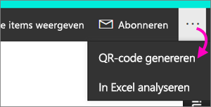
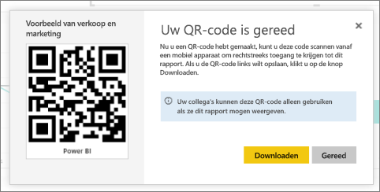

# Een QR-code voor een rapport in Power BI maken voor gebruik in de mobiele apps
QR-codes in Power BI kunnen alles in de praktijk rechtstreeks verbinden met gerelateerde BI-gegevens. Er is geen navigatie of zoekopdracht nodig.

U kunt een QR-code maken in de Power BI-service voor alle rapporten, zelfs voor een rapport dat niet kan worden bewerkt. Vervolgens plaatst u de QR-code in een belangrijke locatie. U kunt hem bijvoorbeeld in een e-mailbericht plakken of afdrukken en op een specifieke locatie ophangen. 

Collega's met wie u het rapport hebt gedeeld, kunnen de QR-code met [hun mobiele apparaat](mobile-apps-qr-code.md) scannen voor rechtstreekse toegang tot het rapport. Ze kunnen de QR-codescanner in de Power BI-app gebruiken, of een andere QR-scanner die op hun apparaat is geïnstalleerd.

## Een QR-code voor een rapport maken
1. Open een rapport in de Power BI-service.
2. Selecteer het beletselteken (...) in de rechterbovenhoek en selecteer **QR-code genereren**. 
   
    
3. Er verschijnt een dialoogvenster met de QR-code. 
   
    
4. Hier kunt u de QR-code scannen of downloaden en opslaan, zodat u: 
   
   * De QR-code kunt toevoegen aan een e-mailbericht of een ander document, of 
   * De QR-code kunt afdrukken en ophangen op een specifieke locatie. 

## De QR-code afdrukken
Power BI genereert de QR-code als een JPG-bestand dat direct kan worden afgedrukt. 

1. Selecteer **Downloaden** en open vervolgens het JPG-bestand op een computer die is verbonden met een printer.  
   
   > [!TIP]
   > Het JPG-bestand heeft dezelfde naam als de tegel. Bijvoorbeeld ‘Voorbeeld van verkoop en marketing.jpg’.
   > 
   > 
2. Druk het bestand af op 100% of 'werkelijke grootte’.  
3. Knip de QR-code uit langs de rand en lijm deze op een plaats die relevant is voor het rapport. 

## Volgende stappen
* [Verbinding maken met Power BI-gegevens uit de praktijk](mobile-apps-data-in-real-world-context.md) met de mobiele apps
* [Een Power BI QR-code scannen met uw mobiele apparaat](mobile-apps-qr-code.md)
* [Een QR-code voor een tegel maken](service-create-qr-code-for-tile.md)
* Vragen? [Misschien dat de Power Bi-community het antwoord weet](http://community.powerbi.com/)

