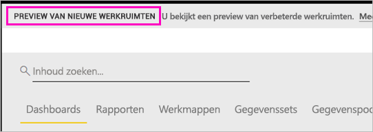
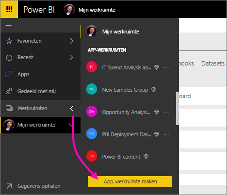
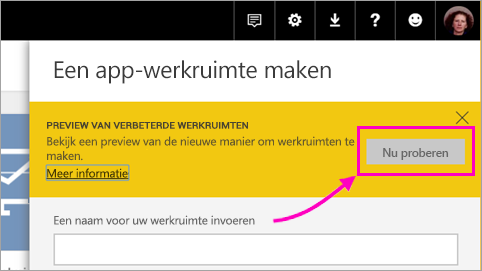
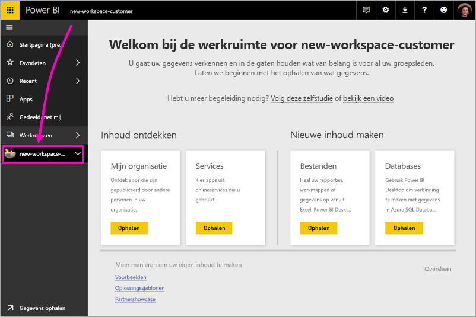
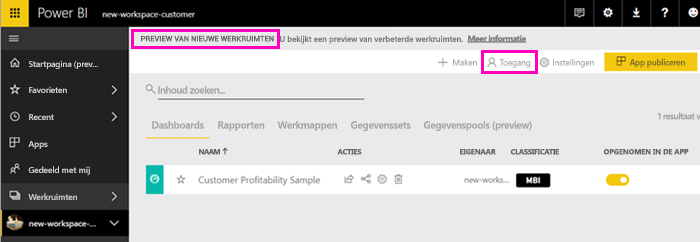
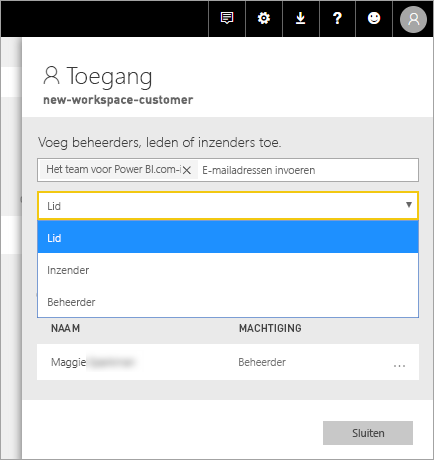
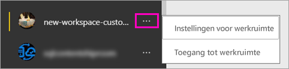

# De nieuwe werkruimten maken (preview) in Power BI

In Power BI is een preview-versie van een nieuwe werkruimte-ervaring beschikbaar. Werkruimten zijn nog steeds plaatsen om samen met collega's verzamelingen dashboards en rapporten te maken die u kunt bundelen in *apps* en naar uw hele organisatie of naar specifieke personen of groepen kunt distribueren. 

Met de preview voor nieuwe werkruimten kunt u:

- Werkruimterollen toewijzen aan gebruikersgroepen: beveiligingsgroepen, distributielijsten, Office 365-groepen en personen.
- Een werkruimte in Power BI maken zonder een Office 365-groep te maken.
- Gedetailleerdere werkruimterollen gebruiken voor flexibeler beheer van machtigingen in een werkruimte.
 
Wanneer u een van de nieuwe werkruimten maakt, maakt u geen onderliggende, gekoppelde Office 365-groep. Alle werkruimtebeheer vindt plaats in Power BI, niet in Office 365. U kunt nog steeds een Office 365-groep aan de werkruimte toevoegen om gebruikerstoegang tot inhoud via Office 365-groepen te blijven beheren. U kunt echter daarnaast beveiligingsgroepen of distributielijsten gebruiken en personen rechtstreeks toevoegen in Power BI, zodat u de toegang tot werkruimten op allerlei manieren kunt beheren Omdat werkruimtebeheer nu via Power BI verloopt, besluiten Power BI-beheerders wie in een organisatie werkruimten kan maken. Raadpleeg de [sectie Werkruimten in het artikel over de Power BI-beheerportal](service-admin-portal.md#workspace-settings) voor meer informatie. 

U voegt gebruikersgroepen of personen aan de nieuwe werkruimten toe als leden, inzenders of beheerders. Iedereen in een gebruikersgroep krijgt de rol die u hebt gedefinieerd. Als een persoon zich in verschillende gebruikersgroepen bevindt, krijgt hij/zij het hoogste niveau van de machtigingen die door de rol worden toegewezen.  Zie [Rollen in de nieuwe werkruimten](#roles-in-the-new-workspaces) verderop in dit artikel voor een uitleg over de verschillende rollen.

Iedereen die u aan een app-werkruimte toevoegt, heeft een Power BI Pro-licentie nodig. Deze gebruikers kunnen in de werkruimte samenwerken aan dashboards en rapporten die u wilt publiceren naar een breder publiek of zelfs uw hele organisatie. Als u inhoud naar anderen binnen uw organisatie wilt distribueren, kunt u Power BI Pro-licenties toewijzen aan die gebruikers of de werkruimte in een Power BI Premium-capaciteit plaatsen.

Voor de nieuwe werkruimten worden enkele functies anders ontworpen. Zie [Functies van de app-werkruimten die anders werken](#app-workspace-features-that-work-differently) verderop in dit artikel voor een uitleg van de wijzigingen die naar verwachting definitief zijn, samen met de preview. Omdat dit een preview-functie is, zijn er enkele beperkingen waarmee u rekening moet houden. Zie [Bekende problemen](#known-issues) verderop in dit artikel voor een uitleg van de huidige beperkingen. 

## Implementatie van nieuwe app-werkruimten

Tijdens de preview-periode kunnen oude en nieuwe werkruimten naast elkaar bestaan en kunt u beide maken. Wanneer de preview voor nieuwe werkruimten wordt beëindigd en ze algemeen beschikbaar zijn, zijn oude werkruimten nog steeds een tijdje mogelijk. U kunt ze niet meer maken en u moet zich erop voorbereiden dat uw werkruimten naar de infrastructuur voor nieuwe werkruimten moeten worden gemigreerd. Maar maakt u zich geen zorgen, u krijgt enkele maanden de tijd om de migratie te voltooien.

## Een van de nieuwe app-werkruimten maken

1. Maak eerst de app-werkruimte. Selecteer **Werkruimten** > **App-werkruimte maken**.
   
     

2. Selecteer in **Voorbeeld weergeven van verbeterde werkruimten** de optie **Nu proberen**.
   
     

2. Geef een naam op voor de werkruimte. Als de naam niet beschikbaar is, kunt u deze bewerken tot een unieke aanduiding.
   
     De app heeft dezelfde naam als de werkruimte.
   
1. U kunt desgewenst een afbeelding toevoegen. De bestandsgrootte moet minder dan 45 kB zijn.
 
    

1. Selecteer **Opslaan**.

    In het **welkomstscherm** voor uw nieuwe werkruimte, kunt u gegevens toevoegen. 

    

1. Selecteer bijvoorbeeld **Voorbeelden** > **Voorbeeld van klantwinstgevendheid**.

    U ziet nu in de lijst met werkruimte-inhoud **Voorbeeld van nieuwe werkruimten**. Omdat u een beheerder bent, ziet u ook een nieuwe actie, **Toegang verkrijgen**.

    

1. Selecteer **Toegang verkrijgen**.

1. Voeg aan deze werkruimten beveiligingsgroepen, distributielijsten, Office 365-groepen of personen toe als leden, inzenders of beheerders. Zie [Rollen in de nieuwe werkruimten](#roles-in-the-new-workspaces) verderop in dit artikel voor een uitleg over de verschillende rollen.

    

9. Selecteer **Toevoegen** > **Sluiten**.

1. De werkruimte wordt gemaakt en in Power BI geopend. De werkruimte wordt weergegeven in de lijst met werkruimten waarvan u lid bent. Omdat u een beheerder bent, kunt u het weglatingsteken (...) selecteren om terug te gaan en wijzigingen aan werkruimte-instellingen aanbrengen, bijvoorbeeld nieuwe leden toevoegen of machtigingen van leden wijzigen.

     

## Inhoud toevoegen aan uw app-werkruimte

Nadat u een app-werkruimte nieuwe stijl hebt gemaakt, is het tijd om hieraan inhoud toe te voegen. In de werkruimte nieuwe stijl voegt u op dezelfde manier inhoud toe als in de werkruimte oude stijl, met één uitzondering. In beide app-werkruimten kunt u bestanden uploaden of ermee verbinding maken, net zoals in uw Mijn werkruimte. In de nieuwe werkruimten kunt u echter geen verbinding maken met organisatie-inhoudspakketten of inhoudspakketten van derden, zoals Microsoft Dynamics CRM, Salesforce of Google Analytics. In de huidige werkruimten kunt u wel verbinding maken met inhoudspakketten.

Wanneer u inhoud bekijkt in de inhoudslijst van een app-werkruimte, wordt de naam van de app-werkruimte als eigenaar weergegeven.

### Verbinding maken met services van derden in nieuwe werkruimten (preview)

In de nieuwe werkruimte-ervaring ligt de focus nu op apps. Gebruikers kunnen met apps voor services van derden gemakkelijk gegevens verkrijgen van de services die ze gebruiken, zoals Microsoft Dynamics CRM, Salesforce of Google Analytics.
Organisatie-apps leveren gebruikers de benodigde interne gegevens. Wij zijn van plan om mogelijkheden aan organisatie-apps toe te voegen, zodat gebruikers de inhoud kunnen aanpassen die ze in de apps vinden. Op die manier zijn er geen inhoudspakketten meer nodig. 

U kunt met de nieuwe werkruimte-ervaring geen organisatie-inhoudspakketten maken of gebruiken. In plaats daarvan kunt u de geleverde apps gebruiken om verbinding te maken met services van derden, of u kunt uw interne teams vragen apps te leveren voor inhoudspakketten die u momenteel gebruikt. 

## Rollen in de nieuwe werkruimten

U kunt met rollen bepalen wie wat kan doen in een werkruimte, zodat teams kunnen samenwerken. U kunt met nieuwe werkruimten rollen toewijzen aan personen en aan gebruikersgroepen: beveiligingsgroepen, Office 365-groepen en distributielijsten. 

Wanneer u rollen aan een gebruikersgroep toewijst, hebben de personen in de groep toegang tot de inhoud. Als u gebruikersgroepen nest, zijn alle ingesloten gebruikers gemachtigd. Aan een gebruiker die zich in verschillende gebruikersgroepen met verschillende rollen bevindt, wordt de machtiging met de meeste rechten toegewezen. 

De nieuwe werkruimten bieden drie rollen: beheerders, leden en inzenders.

**Beheerders kunnen:**

- De werkruimte bijwerken en verwijderen. 
- Personen, met inbegrip van andere beheerders, toevoegen/verwijderen.
- Alles doen wat leden kunnen doen.

**Leden kunnen:** 

- Leden of anderen met minder machtigingen toevoegen.
- Apps publiceren en bijwerken.
- Items en apps delen.
- Anderen toestaan items opnieuw te delen.
- Alles doen wat inzenders kunnen doen.

**Inzenders kunnen:** 

- Inhoud in de werkruimte maken, bewerken en verwijderen. 
- Rapporten publiceren naar de werkruimte, inhoud verwijderen.
- Kunnen nieuwe personen geen toegang geven tot inhoud; kunnen geen nieuwe inhoud delen, maar kunnen delen met iemand met wie de werkruimte, het item of de app al wordt gedeeld. 
- Kunnen de leden van de groep niet wijzigen.
 
We implementeren overal in de service werkstromen Toegang aanvragen, zodat gebruikers die geen toegang hebben deze kunnen aanvragen. Werkstromen Toegang aanvragen bestaan momenteel voor dashboards, rapporten en apps.

## Een app distribueren

Wanneer de inhoud klaar is, kunt u kiezen welke dashboards en rapporten u wilt publiceren. Vervolgens publiceert u deze als een *app*. U kunt vanuit elke werkruimte een app maken. Uw collega's kunnen uw app op een aantal verschillende manieren verkrijgen. U kunt de app automatisch installeren in de Power BI-accounts van uw collega's als uw Power BI-beheerder u hiervoor toestemming geeft. Anders kunnen ze uw app zoeken en installeren vanuit Microsoft AppSource of kunt u de app via een directe koppeling verzenden. Ze ontvangen automatisch updates en u kunt bepalen hoe vaak de gegevens worden vernieuwd. Zie [Apps met dashboards en rapporten publiceren in Power BI](service-create-distribute-apps.md) voor meer informatie.

## Oude app-werkruimten converteren naar nieuwe app-werkruimten

Tijdens de preview-periode kunt u uw oude app-werkruimten niet automatisch converteren naar nieuwe werkruimten. U kunt echter een nieuwe app-werkruimte maken en uw inhoud naar de nieuwe locatie publiceren. 

Wanneer de nieuwe werkruimten algemeen beschikbaar zijn, kunt u ervoor kiezen de oude werkruimten automatisch te migreren. Op een bepaald moment nadat de nieuwe werkruimten algemeen beschikbaar zijn geworden, moet u de oude werkruimten migreren.

## Veelgestelde vragen over Power BI-apps

### Hoe verschillen de nieuwe app-werkruimten van de huidige app-werkruimten?
* Wanneer u app-werkruimten maakt, worden er geen bijbehorende entiteiten in Office 365 gemaakt, zoals bij de huidige werkruimten. (U kunt nog steeds een Office 365-groep aan uw werkruimte toevoegen door een rol toe te wijzen.) 
* U kunt in de huidige app-werkruimten alleen personen toevoegen aan de leden- en beheerderlijsten. In de nieuwe app-werkruimten kunt u meerdere AD-beveiligingsgroepen, distributielijsten of Office 365-groepen toevoegen aan deze lijsten om het beheer van gebruikers eenvoudiger te maken. 
- U kunt een organisatie-inhoudspakket maken op basis van een huidige app-werkruimte. U kunt geen organisatie-inhoudspakket op basis van de nieuwe app-werkruimten maken.
- U kunt een organisatie-inhoudspakket gebruiken op basis van een huidige app-werkruimte. U kunt geen organisatie-inhoudspakket op basis van de nieuwe app-werkruimten gebruiken.
- Bepaalde mogelijkheden zijn bij de preview-versie nog niet ingeschakeld voor de nieuwe app-werkruimten. Zie de volgende sectie [Andere geplande nieuwe werkruimtefuncties](service-create-the-new-workspaces.md#other-planned-new-app-workspace-preview-features) voor meer informatie.

## Geplande preview-functies voor nieuwe app-werkruimten

Aan sommige andere nieuwe app-werkruimtefuncties van de preview-versie wordt nog gewerkt. Deze zijn bij de introductie van de preview-versie nog niet beschikbaar:

- Geen knop **Werkruimte verlaten**.
- Metrische gegevens over gebruik worden nog niet ondersteund.
- Hoe Premium werkt: u kunt werkruimten in een Premium-capaciteit toewijzen en maken, maar voor het verplaatsen van een werkruimte tussen capaciteiten, gaat u naar de instellingen van de werkruimte.
- Het insluiten van SharePoint-webonderdelen wordt nog niet ondersteund.
- Geen knop **OneDrive** voor Office 365-groepen in Gegevens/bestanden ophalen.

## Functies van de app-werkruimten die anders werken

Sommige functies werken in de nieuwe app-werkruimten anders dan in de huidige app-werkruimten. Deze verschillen zijn doorgevoerd op basis van feedback die we van klanten hebben ontvangen en maken een flexibelere benadering voor de samenwerking met werkruimten mogelijk:

- Leden kunnen wel of niet opnieuw delen: vervangen door de rol Inzender
- Alleen-lezenwerkruimten: in plaats van dat u gebruikers alleen-lezentoegang geeft tot een werkruimte, wijst u gebruikers de toekomstig beschikbare rol Lezer toe. Hiermee krijgen ze vergelijkbare alleen-lezentoegang tot de inhoud in een werkruimte.

## Bekende problemen

De volgende problemen zijn bekend en er wordt aan een oplossing gewerkt:

- Gratis gebruikers of gebruikersgroepen die zijn toegevoegd als geadresseerden van abonnementen voor e-mails, ontvangen mogelijk geen e-mails terwijl het wel de bedoeling is dat ze deze ontvangen. Het probleem treedt op wanneer de werkruimte van de nieuwe werkruimte-preview zich in een Premium-capaciteit bevindt, terwijl de Mijn werkruimte van de gebruiker die het abonnement maakt, zich niet in een Premium-capaciteit bevindt. Als de Mijn werkruimte zich in een Premium-capaciteit bevindt, ontvangen gratis gebruikers en gebruikersgroepen de e-mails.
- Nadat een werkruimte van een Premium-capaciteit naar een gedeelde capaciteit is verplaatst, blijven gratis gebruikers en gebruikersgroepen soms e-mailberichten ontvangen, wat niet de bedoeling is. Het probleem treedt op wanneer de Mijn werkruimte van de gebruiker waarmee het abonnement wordt gemaakt, zich in een Premium-capaciteit bevindt.

## Volgende stappen

- [De huidige werkruimten maken](service-create-workspaces.md)
* [Apps in Power BI installeren en gebruiken](service-install-use-apps.md)
* Vragen? [Misschien dat de Power BI-community het antwoord weet](http://community.powerbi.com/)
