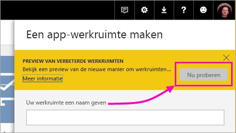
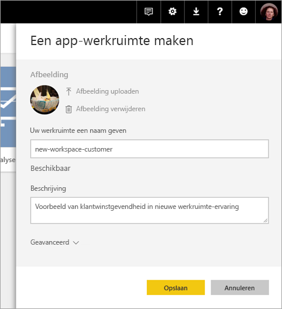
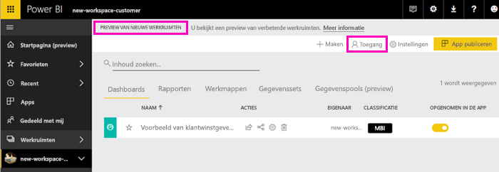
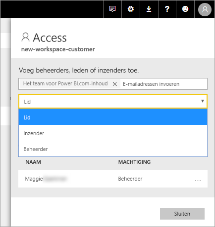
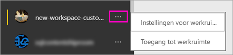

# De nieuwe werkruimten maken (preview) in Power BI

In Power BI is een preview-versie van een nieuwe werkruimte-ervaring beschikbaar. Werkruimten zijn nog steeds plaatsen om samen met collega's verzamelingen dashboards en rapporten te maken die u kunt bundelen in *apps* en naar uw hele organisatie of naar specifieke personen of groepen kunt distribueren. 

Met de preview voor nieuwe werkruimten kunt u:

- Werkruimterollen toewijzen aan gebruikersgroepen: beveiligingsgroepen, distributielijsten, Office 365-groepen en personen.
- Een werkruimte in Power BI maken zonder een Office 365-groep te maken.
- Gedetailleerdere werkruimterollen gebruiken voor flexibeler beheer van machtigingen in een werkruimte.

Lees het artikel [Nieuwe werkruimten (preview)](service-new-workspaces.md) voor meer achtergrondinformatie.

## Een van de nieuwe app-werkruimten maken

1. Maak eerst de app-werkruimte. Selecteer **Werkruimten** > **App-werkruimte maken**.
   
     

2. Selecteer in **Voorbeeld weergeven van verbeterde werkruimten** de optie **Nu proberen**.
   
     

2. Geef een naam op voor de werkruimte. Als de naam niet beschikbaar is, kunt u deze bewerken tot een unieke aanduiding.
   
     De app heeft dezelfde naam als de werkruimte.
   
1. U kunt desgewenst een afbeelding toevoegen. De bestandsgrootte moet minder dan 45 kB zijn.
 
    

1. Selecteer **Opslaan**.

    In het **welkomstscherm** voor uw nieuwe werkruimte, kunt u gegevens toevoegen. 

    

1. Selecteer bijvoorbeeld **Voorbeelden** > **Voorbeeld van klantwinstgevendheid**.

    U ziet nu in de lijst met werkruimte-inhoud **Voorbeeld van nieuwe werkruimten**. Omdat u een beheerder bent, ziet u ook een nieuwe actie, **Toegang verkrijgen**.

    

1. Selecteer **Toegang verkrijgen**.

1. Voeg aan deze werkruimten beveiligingsgroepen, distributielijsten, Office 365-groepen of personen toe als leden, inzenders of beheerders. Zie [Rollen in de nieuwe werkruimten](service-new-workspaces.md#roles-in-the-new-workspaces) voor een uitleg over de verschillende rollen.

    

9. Selecteer **Toevoegen** > **Sluiten**.

1. De werkruimte wordt gemaakt en in Power BI geopend. De werkruimte wordt weergegeven in de lijst met werkruimten waarvan u lid bent. Omdat u een beheerder bent, kunt u het weglatingsteken (...) selecteren om terug te gaan en wijzigingen aan werkruimte-instellingen aanbrengen, bijvoorbeeld nieuwe leden toevoegen of machtigingen van leden wijzigen.

     

## Inhoud toevoegen aan uw app-werkruimte

Nadat u een app-werkruimte nieuwe stijl hebt gemaakt, is het tijd om hieraan inhoud toe te voegen. In de werkruimte nieuwe stijl voegt u op dezelfde manier inhoud toe als in de werkruimte oude stijl, met één uitzondering. In beide app-werkruimten kunt u bestanden uploaden of ermee verbinding maken, net zoals in uw Mijn werkruimte. In de nieuwe werkruimten kunt u echter geen verbinding maken met organisatie-inhoudspakketten of inhoudspakketten van derden, zoals Microsoft Dynamics CRM, Salesforce of Google Analytics. In de huidige werkruimten kunt u wel verbinding maken met inhoudspakketten.

Wanneer u inhoud bekijkt in de inhoudslijst van een app-werkruimte, wordt de naam van de app-werkruimte als eigenaar weergegeven.

### Verbinding maken met services van derden in nieuwe werkruimten (preview)

In de nieuwe werkruimte-ervaring ligt de nadruk nu op *apps*. Gebruikers kunnen met apps voor services van derden gemakkelijk gegevens verkrijgen van de services die ze gebruiken, zoals Microsoft Dynamics CRM, Salesforce of Google Analytics.
Organisatie-apps leveren gebruikers de benodigde interne gegevens. Wij zijn van plan om mogelijkheden aan organisatie-apps toe te voegen, zodat gebruikers de inhoud kunnen aanpassen die ze in de apps vinden. Op die manier zijn er geen inhoudspakketten meer nodig. 

U kunt met de nieuwe werkruimte-ervaring geen organisatie-inhoudspakketten maken of gebruiken. In plaats daarvan kunt u de geleverde apps gebruiken om verbinding te maken met services van derden, of u kunt uw interne teams vragen apps te leveren voor inhoudspakketten die u momenteel gebruikt. 

## Een app distribueren

Wanneer de inhoud klaar is, kunt u kiezen welke dashboards en rapporten u wilt publiceren. Vervolgens publiceert u deze als een *app*. U kunt vanuit elke werkruimte een app maken. Uw collega's kunnen uw app op een aantal verschillende manieren verkrijgen. U kunt de app automatisch installeren in de Power BI-accounts van uw collega's als uw Power BI-beheerder u hiervoor toestemming geeft. Anders kunnen ze uw app zoeken en installeren vanuit Microsoft AppSource of kunt u de app via een directe koppeling verzenden. Ze ontvangen automatisch updates en u kunt bepalen hoe vaak de gegevens worden vernieuwd. Zie [Apps met dashboards en rapporten publiceren in Power BI](service-create-distribute-apps.md) voor meer informatie.

## Oude app-werkruimten converteren naar nieuwe app-werkruimten

Tijdens de preview-periode kunt u uw oude app-werkruimten niet automatisch converteren naar nieuwe werkruimten. U kunt echter een nieuwe app-werkruimte maken en uw inhoud naar de nieuwe locatie publiceren. 

Wanneer de nieuwe werkruimten algemeen beschikbaar zijn, kunt u ervoor kiezen de oude werkruimten automatisch te migreren. Op een bepaald moment nadat de nieuwe werkruimten algemeen beschikbaar zijn geworden, moet u de oude werkruimten migreren.

## Volgende stappen
* Lees meer over het [organiseren van werk in de nieuwe werkruimten (preview) in Power BI](service-new-workspaces.md)
* [De huidige werkruimten maken](service-create-workspaces.md)
* [Apps in Power BI installeren en gebruiken](service-create-distribute-apps.md)
* Vragen? [Misschien dat de Power BI-community het antwoord weet](http://community.powerbi.com/)
