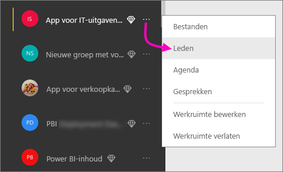
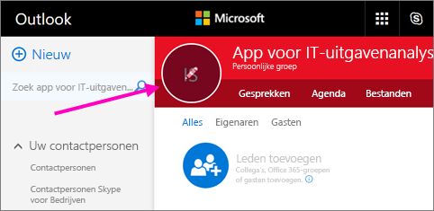
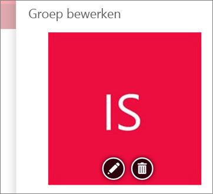
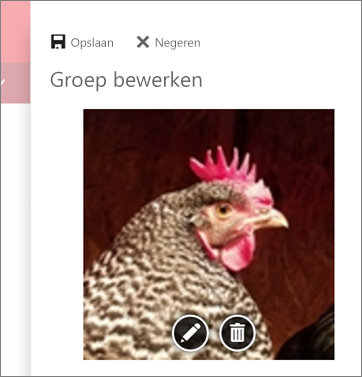
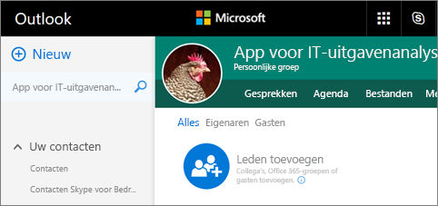
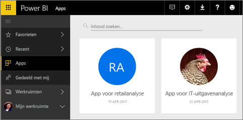

# Werkruimten maken met uw collega's in Power BI

U kunt in Power BI *werkruimten* maken. Dit zijn plaatsen waar u samen met collega's verzamelingen dashboards en rapporten kunt maken en verfijnen. Vervolgens bundelt u de verzameling in *apps* die u kunt distribueren naar uw hele organisatie of naar specifieke personen of groepen. 

Wanneer u een werkruimte maakt, maakt u een onderliggende, gekoppelde Office 365-groep. Alle werkruimtebeheer vindt plaats in Office 365. U kunt collega's als leden of beheerders toevoegen aan deze werkruimten. In de werkruimte kan iedereen samenwerken aan dashboards, rapporten en andere artikelen die u wilt publiceren naar een breder publiek. Iedereen die u aan een app-werkruimte toevoegt, heeft een Power BI Pro-licentie nodig. 

**Wist u dat?** Met Power BI is een preview-versie van een nieuwe werkruimte-ervaring beschikbaar. Lees [Werk organiseren in de nieuwe werkruimten (preview)](service-new-workspaces.md) voor meer informatie over de nieuwe werkruimten. 

## Video: apps en app-werkruimten
<iframe width="640" height="360" src="https://www.youtube.com/embed/Ey5pyrr7Lk8?showinfo=0" frameborder="0" allowfullscreen></iframe>

## Een app-werkruimte maken op basis van een Office 365-groep

Als u een app-werkruimte maakt, wordt deze gebaseerd op een Office 365-groep.

[!INCLUDE [powerbi-service-create-app-workspace](./includes/powerbi-service-create-app-workspace.md)]

Wanneer u de werkruimte maakt, kan het ongeveer een uur duren voordat de werkruimte aan Office 365 is doorgegeven. 

### Een afbeelding toevoegen aan uw Office 365-app-werkruimte (optioneel)
Power BI maakt standaard een kleine gekleurde cirkel voor uw app met de initialen van de app. Maar misschien wilt u deze aanpassen met een afbeelding. U hebt een licentie voor Exchange Online nodig om een afbeelding toe te voegen.

1. Selecteer **Werkruimten**, selecteer het weglatingsteken (...) naast de naam van de werkruimte, en selecteer vervolgens **Leden**. 
   
     
   
    Het Office 365 Outlook-account voor de werkruimte wordt in een nieuw browservenster geopend.
2. Wanneer u de muisaanwijzer op de gekleurde cirkel in de linkerbovenhoek plaatst, verandert deze in een potloodpictogram. Selecteer het.
   
     
3. Selecteer het potloodpictogram opnieuw en zoek de afbeelding die u wilt gebruiken.
   
     

4. Selecteer **Opslaan**.
   
     
   
    De afbeelding vervangt de gekleurde cirkel in het Office 365 Outlook-venster. 
   
     
   
    In een paar minuten verschijnt de afbeelding ook in de app in Power BI.
   
     

## Inhoud toevoegen aan uw app-werkruimte

Nadat u een app-werkruimte hebt gemaakt, is het tijd om er inhoud aan toe te voegen. Toevoegen van inhoud werkt hetzelfde als inhoud toevoegen aan uw Mijn werkruimte, behalve dat andere personen in de werkruimte de inhoud ook kunnen zien en bewerken. Een groot verschil is dat wanneer u klaar bent, u de inhoud als app kunt publiceren. Wanneer u inhoud bekijkt in de inhoudslijst van een app-werkruimte, wordt de naam van de app-werkruimte als eigenaar weergegeven.

### Verbinding maken met services van derden in app-werkruimten

Apps worden geleverd voor alle services van derden die door Power BI worden ondersteund, zodat u eenvoudig de gegevens kunt ophalen uit de services die u gebruikt, zoals Microsoft Dynamics CRM, Salesforce of Google Analytics. U kunt organisatie-apps publiceren om uw gebruikers de gegevens te leveren die ze nodig hebben.

In de huidige werkruimten kunt u ook verbinding maken met organisatie-inhoudspakketten en inhoudspakketten van derden, zoals Microsoft Dynamics CRM, Salesforce of Google Analytics. Overweeg uw organisatie-inhoudspakketten naar apps te migreren.

## Een app distribueren

Wanneer de inhoud klaar is, kunt u kiezen welke dashboards en rapporten u wilt publiceren. Vervolgens publiceert u deze als een *app*. Uw collega's kunnen uw apps op een aantal verschillende manieren krijgen. U kunt ze automatisch installeren in de Power BI-accounts van uw collega's als uw Power BI-beheerder u toestemming geeft. Anders kunnen ze uw apps zoeken en installeren vanuit Microsoft AppSource of kunt u de apps via een directe koppeling verzenden. Ze ontvangen automatisch updates en u kunt bepalen hoe vaak de gegevens worden vernieuwd. Zie [Apps met dashboards en rapporten publiceren in Power BI](service-create-distribute-apps.md) voor meer informatie.

## Veelgestelde vragen over Power BI-apps

### Hoe verschillen apps van organisatie-inhoudspakketten?
Apps zijn verbeterde organisatie-inhoudspakketten. Als u al organisatie-inhoudspakketten hebt, blijven deze gewoon naast apps werken. Apps en inhoudspakketten verschillen op enkele belangrijke punten. 

* Nadat zakelijke gebruikers een inhoudspakket hebben geïnstalleerd, verliest deze de gegroepeerde identiteit; de groep is nu alleen nog een lijst met dashboards en rapporten afgewisseld met andere dashboards en rapporten. Apps behouden daarentegen ook na de installatie hun groepering en identiteit. Deze groepering maakt het eenvoudig voor zakelijke gebruikers om ze in de toekomst opnieuw te openen.
* U kunt meerdere inhoudspakketten vanuit elke werkruimte maken, maar een app heeft een een-op-eenrelatie met de werkruimte. 
* We willen organisatie-inhoudspakketten op termijn afschaffen. Daarom raden we u aan vanaf nu apps te maken.  
* Met de preview-versie voor een nieuwe werkruimte-ervaring maken wij een begin om de organisatie-inhoudspakketten af te schaffen. U kunt deze in de preview-werkruimten niet gebruiken of maken.

Zie [Hoe verschillen de nieuwe app-werkruimten van bestaande app-werkruimten?](service-new-workspaces.md#how-are-the-new-workspaces-different-from-current-workspaces) om de twee te vergelijken. 

## Volgende stappen
* [Apps in Power BI installeren en gebruiken](service-create-distribute-apps.md)
- [De nieuwe werkruimten maken (preview)](service-create-the-new-workspaces.md)
* Vragen? [Misschien dat de Power BI-community het antwoord weet](http://community.powerbi.com/)
