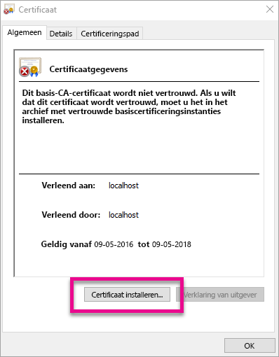
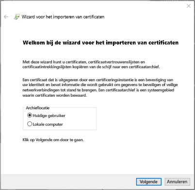
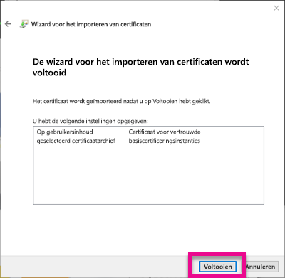
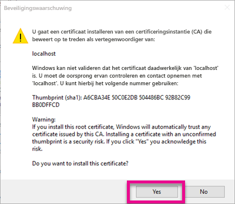
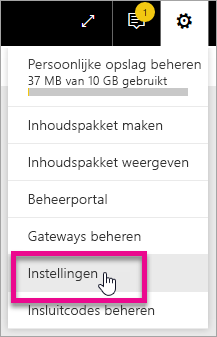
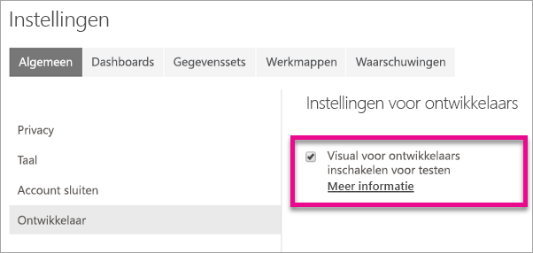
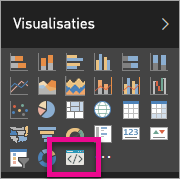

# <a name="use-developer-tools-to-create-custom-visuals"></a>Aangepaste visuals maken met ontwikkelhulpprogramma's
Met aangepaste visuals kunt voldoen aan de behoeften van uw gebruikers en het ontwerp van uw app handhaven. Leer hoe u ontwikkelhulpprogramma's kunt gebruiken om aangepaste visuals voor Power BI te maken.

> [!NOTE]
> U kunt dit document gebruiken om aan de slag te gaan. Zie de referentie-informatie in [Git-opslagplaats voor Power BI-visuals](https://github.com/Microsoft/PowerBI-visuals) voor meer gedetailleerde informatie.
> 
> 

## <a name="requirements"></a>Vereisten
* NodeJS 4.0+ vereist (5.0 of hoger aanbevolen) [NodeJS downloaden](https://nodejs.org)

## <a name="install-nodejs-and-the-power-bi-tools"></a>NodeJS en de Power BI-hulpprogramma's installeren
Als u een aangepaste visual wilt maken, moet u NodeJS installeren. NodeJS is vereist om de opdrachtregelprogramma's uit te voeren.

1. Download en installeer [NodeJS](https://nodejs.org). Versie 4.0 of later is vereist, maar u kunt het beste 5.0 of later installeren.
2. Installeer de opdrachtregelprogramma's. Typ de volgende opdracht achter een opdrachtprompt.
   
        npm install -g powerbi-visuals-tools
3. U kunt controleren of de hulpprogramma's zijn geïnstalleerd door de volgende opdracht uit te voeren zonder parameters.
   
        pbiviz
   
    Als het goed is, wordt de Help-uitvoer weergegeven.
   
    <pre><code>
         +syyso+/
    oms/+osyhdhyso/
    ym/       /+oshddhys+/
    ym/              /+oyhddhyo+/
    ym/                     /osyhdho
    ym/                           sm+
    ym/               yddy        om+
    ym/         shho /mmmm/       om+
     /    oys/ +mmmm /mmmm/       om+
    oso  ommmh +mmmm /mmmm/       om+
   ymmmy smmmh +mmmm /mmmm/       om+
   ymmmy smmmh +mmmm /mmmm/       om+
   ymmmy smmmh +mmmm /mmmm/       om+
   +dmd+ smmmh +mmmm /mmmm/       om+
         /hmdo +mmmm /mmmm/ /so+//ym/
               /dmmh /mmmm/ /osyhhy/
                 //   dmmd
                       ++
   
       PowerBI Custom Visual Tool
   
    Usage: pbiviz [options] [command]
   
    Commands:
   
    new [name]        Create a new visual
    info              Display info about the current visual
    start             Start the current visual
    package           Package the current visual into a pbiviz file
    update [version]  Updates the api definitions and schemas in the current visual. Changes the version if specified
    help [cmd]        display help for [cmd]
   
    Options:
   
    -h, --help      output usage information
    -V, --version   output the version number
    --install-cert  Install localhost certificate
    </code></pre>

<a name"ssl-setup"></a>

### <a name="server-certificate-setup"></a>Servercertificaat instellen
Als u een livevoorbeeld van de visual wilt weergeven, hebt u een vertrouwde HTTPS-server nodig. Voordat u kunt beginnen, moet u een SSL-certificaat installeren zodat er visuele assets in uw webbrowser kunnen worden geladen. 

> [!NOTE]
> Dit is een eenmalige instelling voor uw ontwikkelwerkstation.
> 
> 

Als u een certificaat wilt *toevoegen*, voert u de volgende opdracht uit.

    pbiviz --install-cert

**Windows OS**

1. Selecteer **Certificaat installeren...**.
   
    
2. Selecteer achtereenvolgens **Huidige gebruiker** en **Volgende**.
   
    
3. Selecteer **Alle certificaten in het onderstaande archief opslaan** en selecteer vervolgens **Bladeren...**.
4. Selecteer **Vertrouwde basiscertificeringsinstanties**  en selecteer vervolgens **OK**. Selecteer **Volgende**.
   
    
5. Selecteer **Voltooien**.
   
    
6. Selecteer **Ja** in het dialoogvenster Beveiligingswaarschuwing.
   
    
7. Sluit alle browsers die u hebt geopend.

> [!NOTE]
> Als het certificaat niet wordt herkend, moet u de computer mogelijk opnieuw opstarten.
> 
> 

**OSX**

1. Als de vergrendeling in de linkerbovenhoek is vergrendeld, selecteert u deze om te ontgrendelen. Zoek naar *localhost* en dubbelklik op het certificaat.
   
    
2. Selecteer **Altijd vertrouwen** en sluit het venster.
   
    
3. Voer uw gebruikersnaam en wachtwoord in. Selecteer **Instellingen bijwerken**.
   
    
4. Sluit alle browsers die u hebt geopend.

> [!NOTE]
> Als het certificaat niet wordt herkend, moet u de computer mogelijk opnieuw opstarten.
> 
> 

## <a name="enable-live-preview-of-developer-visual"></a>Livevoorbeeld van de visual voor ontwikkelaars inschakelen
Volg de onderstaande stappen om een livevoorbeeld van uw aangepaste visual weer te geven. Zodoende kan de visual in Power BI-service worden gebruikt wanneer u rapporten bewerkt.

1. Ga naar [app.powerbi.com](https://app.powerbi.com) en meld u aan.
2. Selecteer het **tandwielpictogram** en selecteer vervolgens **Instellingen**.
   
    
3. Selecteer **Ontwikkelaar** en selecteer vervolgens **Visueel element voor ontwikkelaars inschakelen voor testen**.
   
    
4. Selecteer in het deelvenster **Visualisatie** de optie **Visueel element voor ontwikkelaars**.
   
    
   
   > [!NOTE]
   > Hiervoor moet u `pbiviz start` hebben uitgevoerd vanuit de visualmap op uw ontwikkelcomputer. Zie [Een nieuwe visual maken](#create-a-new-visual) in dit artikel voor meer informatie over het maken van een visual.
   > 
   > 
5. Selecteer de visual in het rapportcanvas. U kunt gegevens op dezelfde manier binden als voor andere visuals.

U kunt nu beginnen met het ontwikkelen van uw visual.

## <a name="create-a-new-visual"></a>Een nieuwe visual maken
U kunt een nieuw project voor een visual maken door de volgende opdracht uit te voeren.

```
pbiviz new My Visual name
```

U kunt *Mijn visualnaam* vervangen door de naam die u de visual wilt geven. Dit kan later worden gewijzigd door de `name` en `displayName` de velden in het gegenereerde `pbiviz.json`-bestand te wijzigen.

Met deze opdracht wordt er een nieuw map gemaakt in de map waar de opdracht is uitgevoerd. Er wordt een eenvoudig startersjabloon voor uw visual gegenereerd. Zodra de opdracht is voltooid, kunt u de map openen en uw favoriete editor gebruiken om aan uw nieuwe visual te werken.

## <a name="testing-your-visual-in-power-bi"></a>Uw visual testen in Power BI
U kunt uw visual in de Power BI-service testen in de rapporten en dashboards.

<a name="running-your-visual"></a>

### <a name="running-your-visual"></a>Uw visual uitvoeren
Ga als volgt te werk om uw visual uit te voeren:

1. Open een prompt.
2. Wijzig de map in de visualmap. Dit is de map met het `pbiviz.json`-bestand.
3. Voer de volgende opdracht uit.
   
    ```
    pbiviz start
    ```
   
    

Als u zich op de verkeerde locatie bevindt, wordt er een fout weergegeven die vergelijkbaar is met de volgende.

```
    error  LOAD ERROR Error: pbiviz.json not found. You must be in the root of a visual project to run this command.
        at e (C:\Users\[user]\AppData\Roaming\npm\node_modules\powerbi-visuals-tools\lib\VisualPackage.js:67:35)
        at Function.loadVisualPackage (C:\Users\[user]\AppData\Roaming\npm\node_modules\powerbi-visuals-tools\lib\VisualPackage.js:62:16)
        at Object.<anonymous> (C:\Users\[user]\AppData\Roaming\npm\node_modules\powerbi-visuals-tools\bin\pbiviz-start.js:43:15)
        at Module._compile (module.js:556:32)
        at Object.Module._extensions..js (module.js:565:10)
        at Module.load (module.js:473:32)
        at tryModuleLoad (module.js:432:12)
        at Function.Module._load (module.js:424:3)
        at Module.runMain (module.js:590:10)
        at run (bootstrap_node.js:394:7)
```

### <a name="viewing-your-visual-in-power-bi"></a>Uw visual weergeven in Power BI
Als u de visual wilt weergeven in een rapport, gaat u naar het betreffende rapport en selecteert de visual in het deelvenster **Visualisaties**.

> [!NOTE]
> Voordat u dit doet, moet u eerst de opdracht `pbiviz start` uitvoeren, zoals wordt beschreven in de sectie [Uw visual uitvoeren](#running-your-visual).
> 
> 


Vervolgens wordt de startersjabloon voor de visual weergegeven.


| Werkbalkoptie | Beschrijving |
| --- | --- |
| Visual vernieuwen |Als de functie voor automatisch opnieuw laden is uitgeschakeld, vernieuwt u de visual handmatig. |
| Automatisch opnieuw laden in-/uitschakelen |Wanneer deze optie is ingeschakeld en u het visualbestand opslaat, wordt de visual automatisch bijgewerkt. |
| DataView weergeven |Hiermee geeft u de onderliggende u de visuele onderliggende gegevensweergave voor foutopsporing weer. |
| Hulp vragen |Documentatie in GitHub |
| Feedback verzenden |Laat ons weten wat we kunnen doen om de gebruikerservaring te verbeteren. (GitHub-account vereist) |

## <a name="package-your-visual-for-use-in-power-bi-desktop-and-distribution"></a>Uw visual verpakken voor gebruik in Power BI Desktop en om te distribueren
Voordat u uw visual in [Power BI Desktop](https://powerbi.microsoft.com/desktop/) kunt laden of met de community kunt delen in de [galerie met Power BI-visuals](https://visuals.powerbi.com), moet u een `pbiviz`-bestand genereren.

Ga als volgt te werk om uw visual te verpakken:

1. Open een prompt.
2. Wijzig de map in de visualmap. Dit is de map met het `pbiviz.json`-bestand.
3. Voer de volgende opdracht uit.
   
    ```
    pbiviz package
    ```

Met deze opdracht maakt u een `pbiviz` in de `dist/`-map van uw visualproject. Als er al een `pbiviz`-bestand aanwezig is, wordt dit overschreven.

## <a name="updating-the-visuals-api-version"></a>De API-versie van de visuals bijwerken
Wanneer u een visual met `pbiviz new` maakt, worden de juiste API-typedefinities en JSON-schema's naar de map van uw visual gekopieerd. U kunt de opdracht `pbiviz update` gebruiken om deze bestanden indien nodig bij te werken. Dit kan handig zijn wanneer we een oplossing voor een eerdere versie van de API uitbrengen of als u wilt bijwerken naar de nieuwste API-versie.

### <a name="updating-your-existing-api-version"></a>Uw bestaande API-versie bijwerken
Als er een update voor een bestaande API wordt uitgebracht, kunt u als volgt de nieuwste versie downloaden.

```
#Update your version of pbiviz
npm install -g powerbi-visuals-tools

#Run update from the root of your visual project, where pbiviz.json is located
pbiviz update
```

Hiermee downloadt u de nieuwste hulpprogramma's van NPM, die onder andere de bijgewerkt bijgewerkte typedefinities en schema's bevatten. Als u `pbiviz update` gebruikt, wordt de eigenschap `apiVersion` in uw *pbiviz.json*-bestanden overschreven met de nieuwste versie.

### <a name="upgrading-to-a-different-api-version"></a>Bijwerken naar een andere API-versie
U kunt bijwerken naar een andere API-versie door dezelfde als hierboven te volgen. U kunt expliciet aangeven welke API-versie u wilt gebruiken.

```
#Update your version of pbiviz
npm install -g powerbi-visuals-tools

#Run update from the root of your visual project, where pbiviz.json is located
pbiviz update 1.2.0
```

Hiermee wordt uw API bijgewerkt naar API-versie 1.2.0. U kunt `1.2.0` vervangen door de versie die u wilt gebruiken.

> [!WARNING]
> Voor hulpprogramma's wordt standaard de stabiele versie van de API gebruikt. Alle latere versies dan de standaard-API-versie zijn instabiel en onderhevig aan veranderingen. Ze vertonen mogelijk onverwacht gedrag en ook het gedrag in de Power BI-service en Power BI Desktop kan verschillen. Zie het [wijzigingenlogboek](https://github.com/Microsoft/PowerBI-visuals/blob/master/ChangeLog.md) voor de huidige stabiele versie van de API. Zie het [implementatieschema](https://github.com/Microsoft/PowerBI-visuals/blob/master/Roadmap/README.md) voor meer informatie over de pre-release versies.
> 
> 

## <a name="inside-the-visual-project"></a>In het visualproject
Uw visualproject is de map die wordt gemaakt wanneer u de opdracht `pbiviz new` uitvoert. 

### <a name="file-structure"></a>Bestandsstructuur
| Item | Beschrijving |
| --- | --- |
| assets/ |Hiermee slaat u de elementen van de visual op (pictogram, schermafbeeldingen, enzovoort). |
| dist/ |Wanneer u `pbiviz package` uitvoert, wordt hier het pbiviz-bestand gegenereerd. |
| src/ |De TypeScript-code voor uw visual. |
| style/ |Minder stijlen voor uw visual. |
| .gitignore |Hiermee geeft u Git de instructie om de bestanden in de opslagplaats die niet hoeven worden bijgehouden, te negeren. |
| capabilities.json |Wordt gebruikt om de [mogelijkheden](https://github.com/Microsoft/PowerBI-visuals/blob/master/Capabilities/Capabilities.md) van uw visual te definiëren. |
| package.json |Wordt door [NPM](https://www.npmjs.com/) gebruikt om modules te beheren. |
| pbiviz.json |Hoofdconfiguratiebestand. |
| tsconfig.json |Instellingen voor de TypeScript-compiler. Meer informatie over [tsconfig.json](https://www.typescriptlang.org/docs/handbook/tsconfig-json.html). |

### <a name="pbivizjson"></a>pbiviz.json
Dit bestand is het hoofdconfiguratiebestand voor uw visual. Heb bestand bevat metagegevens en informatie over de bestanden die nodig hebt om uw visual te bouwen.

```
{
    "visual": {
        "name": "myVisual", // internal visual name (should not contain spaces)
        "displayName": "My Visual!", // visual name displayed to user (used in gallery)
        "guid": "PBI_CV_xxxxxxx", // a unique id for this visual MUST BE UNIQUE
        "visualClassName": "Visual" // the entry class for your visual
        "version": "1.0.0", // visual version. Should be semantic version (increment if you update the visual)
        "description": "", // description used in gallery
        "supportUrl": "", // url to where users can get support for this visual
        "gitHubUrl": "" // url to the source in github (if applicable)
    },
    "apiVersion": "1.0.0", //API version this visual was created with
    "author": {
        "name": "", // your name
        "email": "" // your e-mail
    },
    "assets": {
        "icon": "assets/icon.png" // relative path to your icon file (20x20 png)
    },
    "style": "style/visual.less", // relative path to your less file
    "capabilities": "capabilities.json" // relative path to your capabilities definition 
}
```

### <a name="visual-source-typescript"></a>Bron van de visual (TypeScript)
De code van de visual moet worden geschreven in TypeScript. Dit is een superset van JavaScript die ondersteuning biedt voor meer geavanceerde functies en vroege toegang tot ES6/ES7-functionaliteit.

Alle TypeScript-bestanden moeten worden opgeslagen in de map `src/` en worden toegevoegd aan de `files`-matrix in `tsconfig.json`. Zodoende kan de TypeScript-compiler ze laden en bepalen in welke volgorde ze moeten worden geladen.

Zodra uw visual is gebouwd, wordt alle TypeScript gecompileerd in één JavaScript-bestand. Zodoende kunt u vanuit andere bestanden naar geëxporteerde elementen verwijzen zonder dat u `require` handmatig hoeft uit te voeren, zolang beide bestanden maar vermeld worden in tsconfig.

U kunt zoveel bestanden en klassen maken als u nodig hebt om de visual te maken.

Meer informatie over [TypeScript](http://www.typescriptlang.org/).

### <a name="visual-style-less"></a>Stijl van de visual (Less)
Voor de vormgeving van de visual worden Cascading Style Sheets (CSS; trapsgewijze opmaakmodellen) gebruikt. Voor uw gemak gebruiken we de Less-precompiler die enkele geavanceerde functies ondersteunt, zoals nesten, variabelen, combinaties, voorwaarden, lussen, enzovoort. Als u geen van deze functies wilt gebruiken, kunt u plain CSS schrijven in het Less-bestand.

Alle Less-bestanden moeten worden opgeslagen in de map `style/`. Het bestand dat is opgegeven in veld `style` in uw `pbiviz.json`-bestand wordt geladen. Eventuele aanvullende bestanden moeten worden geladen met `@import`.

Meer informatie over [Less](http://lesscss.org/).

## <a name="debugging"></a>Foutopsporing
Zie de [handleiding voor foutopsporing](https://github.com/Microsoft/PowerBI-visuals/blob/master/tools/debugging.md) voor tips over het opsporen van fouten in uw aangepaste visual.

## <a name="submit-your-visual-to-appsource"></a>Uw visuals voor AppSource verzenden
U kunt uw visuals voor anderen beschikbaar stellen door ze naar AppSource te verzenden. Zie [Aangepaste visuals naar AppSource verzenden](developer/office-store.md) voor meer informatie over dit proces.

## <a name="troubleshooting"></a>Problemen oplossen
**Kan de opdracht pbiviz niet vinden (of een vergelijkbare fouten)**

Als u `pbiviz` uitvoert in uw terminal/via de opdrachtregel, wordt het Help-scherm weergegeven. Als dat niet het geval is, is de installatie niet verlopen. Zorg ervoor dat u hebt minimaal versie 4.0 van NodeJS hebt geïnstalleerd.

Zie [NodeJS en de Power BI-hulpprogramma's installeren](#install-nodejs-and-the-power-bi-tools) voor meer informatie.

**Kan de foutopsporingsvisual niet vinden op het tabblad Visualisaties**

De foutopsporingsvisual ziet eruit als een promptpictogram en bevindt zich op het tabblad **Visualisaties**.


Als de visual niet wordt weergegeven, controleert u of u deze hebt ingeschakeld in de instellingen van Power BI. 

> [!NOTE]
> De foutopsporingsvisual is momenteel alleen beschikbaar in de Power BI-service en niet in Power BI Desktop of de mobiele app. De verpakte visual werkt wel overal.
> 
> 

Zie [Livevoorbeeld van de visual voor ontwikkelaars inschakelen](#enable-live-preview-of-developer-visual) voor meer informatie.

**Kan geen contact maken met de server van het visuele element**

Gebruik de opdracht `pbiviz start` om de server van de visual via uw terminal/opdrachtregel uit te voeren vanuit de hoofdmap van het visualproject. Als de server wordt uitgevoerd, zijn uw SSL-certificaten waarschijnlijk niet goed geïnstalleerd.

Zie [Uw visual uitvoeren](#running-your-visual) of [Het servercertificaat installeren](#ssl-setup) voor meer informatie.

## <a name="next-steps"></a>Volgende stappen
[Visualisaties in Power BI](power-bi-report-visualizations.md)  
[Aangepaste visualisaties in Power BI](power-bi-custom-visuals.md)  
[Aangepaste visuals publiceren naar de Office Store](developer/office-store.md)  
[TypeScript](http://www.typescriptlang.org/)  
[Minder CSS](http://lesscss.org/)  

Nog vragen? [Misschien dat de Power BI-community het antwoord weet](http://community.powerbi.com/)

