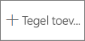
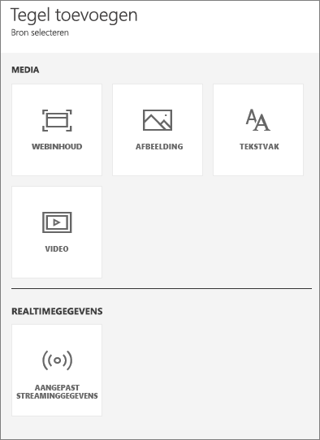
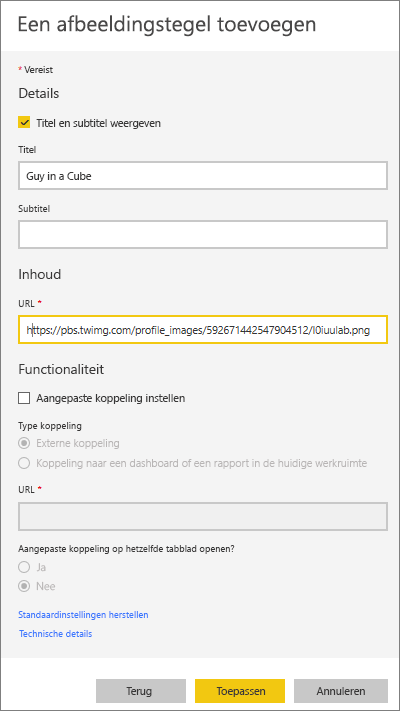
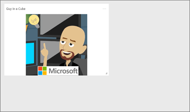
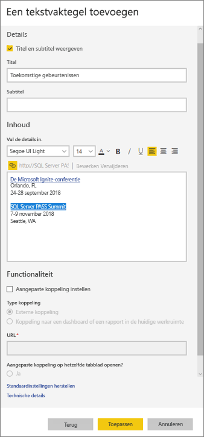
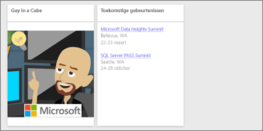
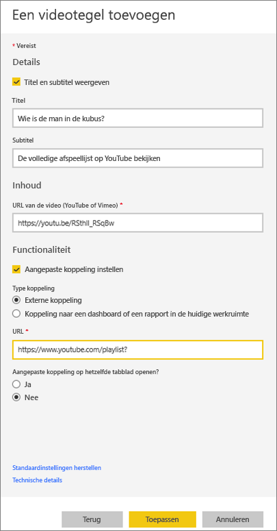
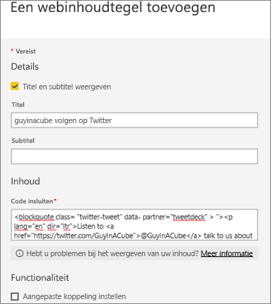
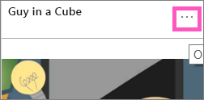
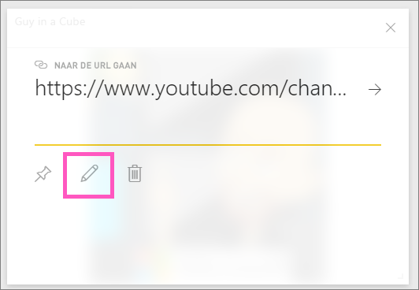

# <a name="add-image-text-video-and-more-to-your-dashboard"></a>Afbeeldingen, tekst, video en meer toevoegen aan uw dashboard
<iframe width="560" height="315" src="https://www.youtube.com/embed/e2PD8m1Q0vU" frameborder="0" allowfullscreen></iframe>


## <a name="add-tile"></a>Tegel toevoegen
Met het besturingselement **Tegel toevoegen** kunt u rechtstreeks een afbeelding, tekstvak, video, streaminggegevens of webcode aan uw dashboard toevoegen.

1. Selecteer **Tegel toevoegen** in de bovenste menubalk. Afhankelijk van de beschikbare ruimte, ziet u mogelijk alleen het plusteken .
   
    
2. Selecteer het type tegel dat u wilt toevoegen: **Afbeelding**, **Tekstvak**, **Video**, **Webinhoud** of **Aangepaste streaminggegevens**.
   
    

## <a name="add-an-image"></a>Een afbeelding toevoegen
Stel dat u uw bedrijfslogo wilt weergeven in uw dashboard of een andere afbeelding. U moet het afbeeldingsbestand dan online opslaan en koppelen aan het dashboard. Zorg ervoor dat er geen speciale referenties nodig zijn voor toegang tot het afbeeldingsbestand. Zo is bijvoorbeeld verificatie vereist voor OneDrive en SharePoint en kunt u afbeeldingen die daar zijn opgeslagen, niet op deze manier toevoegen aan een dashboard.  

1. Selecteer **Afbeelding** > **Volgende**.
2. Voeg informatie over de afbeelding toe in het deelvenster **Een afbeeldingstegel toevoegen**.
   
    
   
   * Als u een titel wilt weergeven boven de afbeelding, selecteert u *Titel en subtitel weergeven* en typt u een titel en/of subtitel.
   * Voer de URL van de afbeelding in.
   * Als u van de tegel een hyperlink wilt maken, schakelt u **Aangepaste koppeling instellen** in en voert u de URL in.  Als collega's op deze afbeelding of titel klikken, gaan ze naar deze URL.
   * Selecteer **Toepassen**.  Op het dashboard kunt u de afbeelding groter of kleiner maken en verplaatsen.
     
     

## <a name="add-a-text-box-or-dashboard-heading"></a>Een tekstvak of koptekst toevoegen
1. Selecteer **Tekstvak > Volgende**.
   
   > **OPMERKING**: als u een koptekst wilt toevoegen aan het dashboard, typt u de tekst in het tekstvak en vergroot u het lettertype.
   > 
2. Het tekstvak opmaken:
   
   * Als u een titel wilt weergeven boven het tekstvak, selecteert u **Titel en subtitel weergeven** en typt u een titel en/of subtitel.
   * Voer inhoud in voor het tekstvak en maak deze op.  
   * U kunt desgewenst een aangepaste koppeling instellen voor de titel. Een aangepaste koppeling kan een externe site of een dashboard of rapport in uw werkruimte zijn. In dit voorbeeld hebben we echter hyperlinks toegevoegd aan het tekstvak zelf en dus laten we **Aangepaste koppeling instellen** uitgeschakeld.

     
   
3. Selecteer **Toepassen**.  Op het dashboard kunt u het tekstvak groter of kleiner maken en verplaatsen.
   
   

## <a name="add-a-video"></a>Een video toevoegen
Wanneer u een videotegel van YouTube of Vimeo aan uw dashboard toevoegt, wordt de video direct op uw dashboard afgespeeld.

1. Selecteer **Video > Volgende**.
2. Voeg informatie over de video toe in het deelvenster **Een videotegel toevoegen**.
   
    
   
   * Als u een titel en subtitel wilt weergeven boven aan de videotegel, selecteert u *Titel en subtitel weergeven* en typt u een titel en/of subtitel. In dit voorbeeld voegen we een subtitel toe en maken we hier een hyperlink van die is gekoppeld aan de volledige afspeellijst op YouTube.
   * Voer de URL voor de video in.
   * Voeg een hyperlink voor de titel en de subtitel toe.  Misschien dat uw collega's na het zien van de ingesloten video de hele afspeellijst willen bekijken op YouTube. Dat kan door een koppeling naar de afspeellijst toe te voegen.
   * Selecteer **Toepassen**.  Op het dashboard kunt u de videotegel groter of kleiner maken en verplaatsen.
     
      
3. Selecteer de videotegel om de video af te spelen.
4. Selecteer de subtitel om naar de afspeellijst op YouTube te gaan.

## <a name="add-streaming-data"></a>Streaminggegevens toevoegen
<iframe width="560" height="315" src="https://www.youtube.com/embed/kOuINwgkEkQ" frameborder="0" allowfullscreen></iframe>

## <a name="add-web-content"></a>Webinhoud toevoegen
U kunt alle HTML-inhoud plakken of typen.  De inhoud wordt door Power BI als een tegel aan uw dashboard toegevoegd. Insluitcode kunt u handmatig invoeren of kopiëren en plakken van sites zoals Twitter, YouTube en embed.ly.

1. Selecteer **Webinhoud > Volgende**.
2. Voeg gegevens toe aan het deelvenster **Een webinhoudtegel toevoegen**.
   
    
   
   * Als u een titel wilt weergeven boven aan de tegel, selecteert u *Titel en subtitel weergeven* en typt u een titel en/of subtitel.
   * Voeg de insluitcode in. In dit voorbeeld kopiëren en plakken we een Twitter-feed.
3. Selecteer **Toepassen**.  Op het dashboard kunt u de tegel met webinhoud groter of kleiner maken en verplaatsen.
     
      

## <a name="tips-for-embedding-web-content"></a>Tips voor het insluiten van webinhoud
* Gebruik een beveiligde bron voor iframes. Als u de insluitcode voor het iframe invoert en vervolgens een lege tegel ziet, controleer dan of u **http** gebruikt voor de bron van het iframe.  Als dat zo is, wijzigt u dit in **https**.
  
  ```
  <iframe src="https://xyz.com">
  ```
* Pas de breedte en hoogte aan. Met deze insluitcode wordt er een video ingesloten en wordt de videospeler ingesteld op 560 x 315 pixels.  Deze grootte verandert niet als u de grootte van de tegel aanpast.
  
  ```
  <iframe width="560" height="315"
  src="https://www.youtube.com/embed/Cle_rKBpZ28" frameborder="0"
   allowfullscreen></iframe>
  ```
  
  Als u wilt dat de grootte van de speler wordt aangepast aan de tegelgrootte, stelt u de breedte en hoogte in op 100%.
  
  ```
  <iframe width="100%" height="100%"
  src="https://www.youtube.com/embed/Cle_rKBpZ28" frameborder="0"
   allowfullscreen></iframe>
  ```
* Met deze code wordt een tweet ingesloten en worden, behoudt als afzonderlijke koppelingen op het dashboard, koppelingen behouden voor de **AFK**-podcast, de **Twitter-pagina van @GuyInACube**, **Follow**,  **#analytics**, **reply**, **retweet** en **like**.  Als u de tegel zelf selecteert, gaat u naar de podcast op Twitter.
  
  ```
  <blockquote class="twitter-tweet" data-partner="tweetdeck">
  <p lang="en" dir="ltr">Listen to
  <a href="https://twitter.com/GuyInACube">@GuyInACube</a> talk to
  us about making videos about Microsoft Business Intelligence
  platform
  <a href="https://t.co/TmRgalz7tv">https://t.co/TmRgalz7tv </a>
  <a href="https://twitter.com/hashtag/analytics?src=hash">
  #analytics</a></p>&mdash; AFTK Podcast (@aftkpodcast) <a
  href="https://twitter.com/aftkpodcast/status/693465456531771392">
  January 30, 2016</a></blockquote> <script async src="//platform.twitter.com/widgets.js" charset="utf-8"></script>
  ```

## <a name="edit-a-tile"></a>Een tegel bewerken
U kunt een tegel als volgt wijzigen:

1. Beweeg de aanwijzer in de rechterbovenhoek van de tegel en selecteer de drie puntjes.
   
    
2. Selecteer Details bewerken om het deelvenster **Details van de tegel** opnieuw te openen en breng de wijzigingen aan.
   
    

## <a name="considerations-and-troubleshooting"></a>Aandachtspunten en probleemoplossing
* U kunt een tegel op een dashboard eenvoudiger verplaatsen door een titel en/of subtitel toe te voegen.
* Als u bepaalde inhoud wilt insluiten vanaf een website, maar de website geen insluitcode geeft om te kopiëren en plakken, gaat u naar embed.ly om te lezen hoe u de insluitcode genereert.

## <a name="next-steps"></a>Volgende stappen
[Dashboardtegels](service-dashboard-tiles.md)

Nog vragen? [Misschien dat de Power BI-community het antwoord weet](http://community.powerbi.com/).

