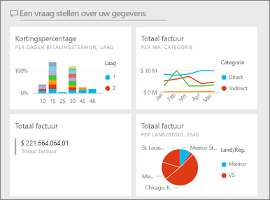
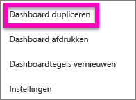
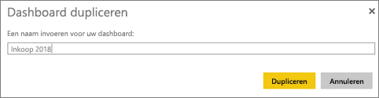
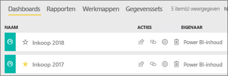

# Een kopie maken van een Power BI-dashboard

Er zijn veel verschillende redenen om een kopie te maken van een dashboard dat u bezit. De kopie wordt opgeslagen in de actieve (dezelfde) werkruimte. Misschien wilt u wijzigingen aanbrengen en de prestaties ten opzichte van het origineel testen. Of misschien wilt u enigszins verschillende versies distribueren per collega, regio of team. Misschien vindt een collega uw dashboardontwerpen zeer geslaagd en wil zij ze gebruiken om aan haar managers te rapporteren. Een andere reden zou zijn als u een nieuwe database met dezelfde gegevensstructuur en dezelfde gegevenstypen hebt en u het dashboard dat u al hebt gemaakt, opnieuw wilt gebruiken. Dat kan ook, maar vergt wel wat werk in Power BI Desktop. 

Dashboards die met u zijn gedeeld als app, kunnen niet worden gedupliceerd.

1. Open het dashboard.
2. Selecteer in de rechterbovenhoek de weglatingstekens (...) en kies **Dashboard dupliceren**.
   
   
3. Geef het dashboard en naam en selecteer **Dupliceren**. 
   
   
4. Het nieuwe dashboard wordt opgeslagen in dezelfde werkruimte als het origineel. 
   
   

## Volgende stappen
* [Tegels bewerken, verplaatsen en het formaat ervan wijzigen](service-dashboard-edit-tile.md) 
* [Tips voor het ontwerpen van een geweldig dashboard](service-dashboards-design-tips.md) 

Nog vragen? [Misschien dat de Power BI-community het antwoord weet](http://community.powerbi.com/).

