# Een Power BI-dashboard maken op basis van een rapport
U hebt [Dashboards in Power BI](service-dashboards.md) gelezen en u wilt nu uw eigen dashboard maken. Er zijn veel verschillende manieren om een dashboard te maken: op basis van een rapport, helemaal vanaf het begin, op basis van een gegevensset, door een bestaand dashboard te dupliceren, en meer.  

Het kan overweldigend zijn wanneer u voor het eerst met een dashboard aan de slag gaat, dus we gaan eerst een klein en eenvoudig dashboard maken door visualisaties vast te maken van een rapport dat al gemaakt is. Zodra u de snelstartgids hebt voltooid, zult u goed kunnen begrijpen wat de relatie tussen dashboards en rapporten is, hoe u de bewerkweergave in de rapporteditor kunt openen, hoe u tegels kunt vastmaken en hoe u tussen een dashboard en een rapport kunt navigeren. Gebruik vervolgens de koppelingen in de Inhoudsopgave aan de linkerkant of de **Volgende stappen** onderaan om verder te gaan met de moeilijkere onderwerpen.

## Wie mag een dashboard maken?
Het maken van een dashboard is een functie die beschikbaar is voor **Makers** en er zijn machtigingen nodig om het rapport te kunnen bewerken. Bewerkingsmachtigingen zijn beschikbaar voor makers van rapporten en voor de collega's die toegang hebben gekregen van de maker. Als David bijvoorbeeld een rapport maakt in workspaceABC en u vervolgens als lid van deze werkruimte toevoegt, zullen David en u allebei bewerkingsmachtigingen krijgen. Maar indien een rapport rechtstreeks met u is gedeeld of als onderdeel van een [Power BI-app](service-install-use-apps.md) (u **gebruikt** het rapport), kunt u geen tegels aan een dashboard vastmaken.

> **OPMERKING**: Dashboards zijn een functie van Power BI-service, niet van Power BI Desktop. Dashboards kunnen niet worden gemaakt in Power BI - Mobiel, maar wel worden [bekeken en gedeeld](consumer/mobile/mobile-apps-view-dashboard.md).
>
> 

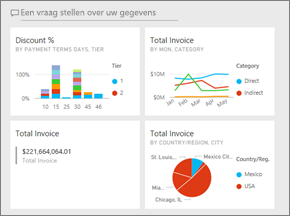

## Video: Een dashboard maken door visualisaties en afbeeldingen van een rapport vast te maken
Kijk hoe Amanda een nieuw dashboard maakt door visualisaties van een rapport vast te maken. Probeer het vervolgens zelf uit door de stappen onder de video te volgen met behulp van het voorbeeld van een Inkoopanalyse.

<iframe width="560" height="315" src="https://www.youtube.com/embed/lJKgWnvl6bQ" frameborder="0" allowfullscreen></iframe>

### Vereisten
Als u mee wilt doen, moet u de Excel-werkmap met het voorbeeld van een 'Inkoopanalyse' downloaden en die in de Power BI-service openen (app.powerbi.com).

## Een gegevensset met een rapport importeren
We gaan een van de Power BI-voorbeeldgegevenssets importeren en gebruiken om ons nieuwe dashboard te maken. Het voorbeeld dat we gebruiken is een Excel-werkmap met twee PowerView-bladen. Als de werkmap wordt geïmporteerd in Power BI, wordt er een gegevensset en een rapport toegevoegd aan uw werkruimte.  Het rapport wordt automatisch gemaakt op basis van de PowerView-werkbladen.

1. [Selecteer deze koppeling](http://go.microsoft.com/fwlink/?LinkId=529784) om het Excel-bestand met het voorbeeld van een inkoopanalyse te downloaden en op te slaan. We raden u aan het op te slaan in uw OneDrive voor bedrijven.
2. Open de Power BI-service (app.powerbi.com) in uw browser en meld u aan.
3. Selecteer **Mijn werkruimte**.
4. Selecteer in de linker navigatie **Gegevens ophalen**.

    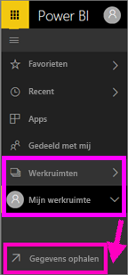
5. Selecteer **Bestanden**.

   
6. Navigeer naar de locatie waar u het Excel-bestand met het voorbeeld van een inkoopanalyse hebt opgeslagen. Selecteer het en kies **Verbinding maken**.

   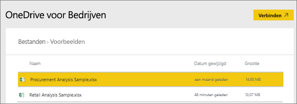
7. Selecteer voor deze oefening **Importeren**.

    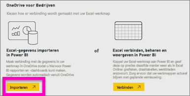
8. Wanneer het bericht wordt weergegeven dat het importeren is voltooid, selecteert u de **x** om het bericht te sluiten.

   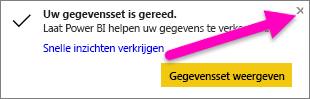

### Open het rapport en maak enkele tegels vast aan een dashboard
1. Blijf in dezelfde werkruimte en selecteer het tabblad **Rapporten**. Het zojuist geïmporteerde rapport wordt weergegeven met een geel sterretje. Selecteer de naam van het rapport om het te openen.

    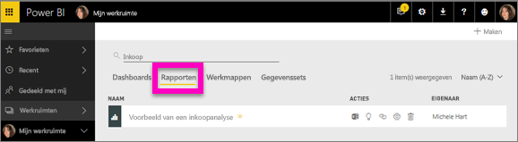
2. Het rapport wordt geopend in de [Leesweergave](service-reading-view-and-editing-view.md). Let op de twee tabbladen aan de onderkant: Discount Analysis (Kortingsanalyse) en Spend Overview (Uitgavenoverzicht). Elk tabblad vertegenwoordigt een pagina van het rapport.
    Selecteer **Rapport bewerken** om het rapport in de bewerkweergave te openen.

    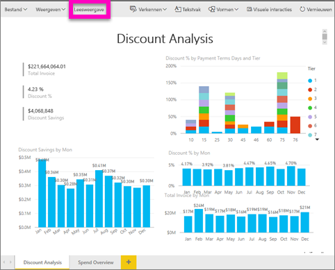
3. Wijs een visualisatie aan om de beschikbare opties zichtbaar te maken. Als u een visualisatie aan een dashboard wilt toevoegen, selecteert u het punaisepictogram .

    
4. Omdat we een nieuw dashboard maken, selecteert u de optie **Nieuw dashboard** en geeft u het een naam.

   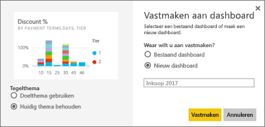
5. Wanneer u **Vastmaken** selecteert, wordt het nieuwe dashboard in de huidige werkruimte gemaakt. Wanneer het bericht **Aan dashboard vastgemaakt** wordt weergegeven, selecteert u **Naar dashboard gaan**. Als u wordt gevraagd of u het rapport wilt opslaan, kiest u **Opslaan**.

     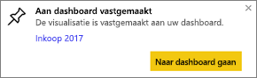
6. In Power BI wordt het nieuwe dashboard geopend en dat bevat één tegel - de visualisatie die u zojuist hebt vastgemaakt.

   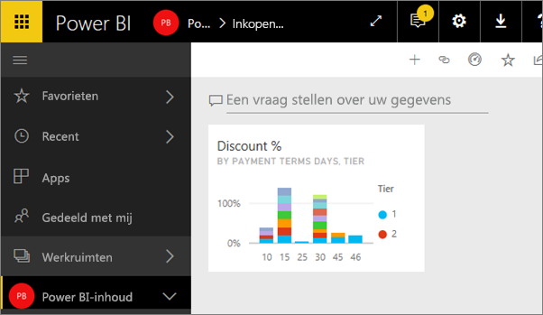
7. Selecteer de tegel om terug te gaan naar het rapport. Maak nog een paar tegels vast aan het nieuwe dashboard. Wanneer het venster **Aan dashboard vastmaken** verschijnt, selecteert u deze keer **Bestaand dashboard**.  

   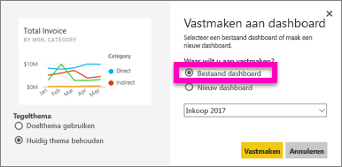

## Een volledige rapportpagina aan het dashboard vastmaken
U kunt [een hele rapportpagina vastmaken als *live-tegel*](service-dashboard-pin-live-tile-from-report.md) in plaats van één visueel element per keer vast te maken. Aan de slag.

1. Selecteer het tabblad **Uitgavenoverzicht** in de rapporteditor om de 2e pagina van het rapport te openen.

   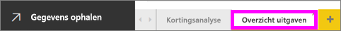

2. Deze visuele elementen moeten allemaal op uw dashboard komen.  Selecteer **Live-pagina vastmaken** in de rechterbovenhoek van de menubalk. Op een dashboard worden tegels van live-pagina’s telkens bijgewerkt wanneer de pagina wordt vernieuwd.

   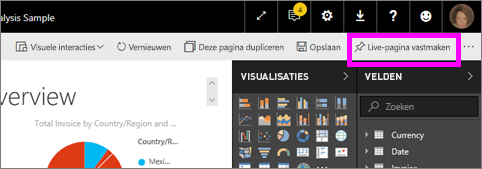

3. Wanneer het venster **Aan dashboard vastmaken** verschijnt, selecteert u **Bestaand dashboard**.

   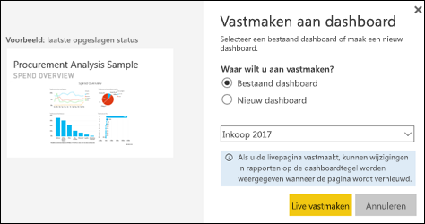

4. Wanneer het bericht verschijnt dat de bewerking is voltooid, selecteert u **Naar dashboard gaan**. Daar ziet u de tegels die u uit het rapport hebt vastgemaakt. In het onderstaande voorbeeld hebben we 2 tegels van pagina 1 van het rapport vastgemaakt en 1 live-tegel van pagina 2 van het rapport.

   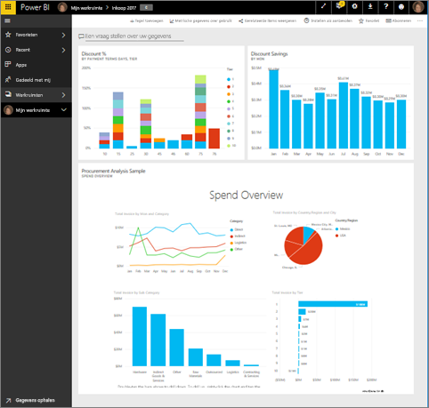

Gefeliciteerd, u hebt uw eerste dashboard gemaakt! Nu u een dashboard hebt, kunt u er nog veel meer mee doen.  Probeer een van de voorgestelde **Volgende stappen** hieronder, of ga er zelf mee spelen en verkennen.   

## Volgende stappen
* [Het formaat van tegels bewerken en ze verplaatsen](service-dashboard-edit-tile.md)
* [Alles over dashboardtegels](service-dashboard-tiles.md)
* [Uw dashboard delen door een app te maken](service-create-distribute-apps.md)
* [Power BI - basisconcepten](service-basic-concepts.md)
* [Tips voor het ontwerpen van een geweldig dashboard](service-dashboards-design-tips.md)

Nog vragen? [Misschien dat de Power BI-community het antwoord weet](http://community.powerbi.com/)
