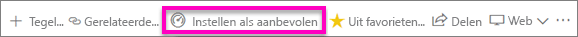
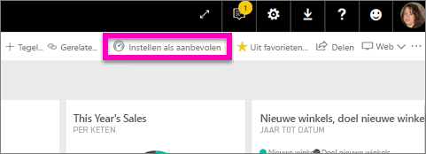
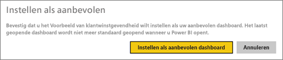
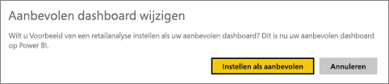
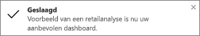
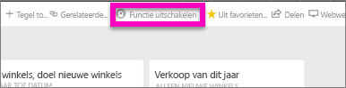

# Aanbevolen dashboards in de Power BI-service
## Een aanbevolen dashboard maken
Veel mensen hebben één dashboard dat ze vaker bezoeken dan andere.  Dit kan het dashboard zijn dat we gebruiken voor ons bedrijf, of een dashboard dat een verzameling tegels uit veel verschillende dashboards en rapporten bevat.

Als u een dashboard selecteert als *aanbevolen*, wordt het dashboard meteen weergegeven wanneer u de Power BI-service opent.  

U kunt ook meerdere dashboards selecteren en als *favorieten* instellen. Zie [Favoriete dashboards](service-dashboard-favorite.md).

> [!NOTE] 
>Dit onderwerp is van toepassing op Power BI-service en niet op Power BI Desktop.

Als u nog geen aanbevolen dashboard hebt ingesteld, opent Power BI het laatste dashboard dat u hebt gebruikt.  

### Ga als volgt te werk om een dashboard in te stellen als **aanbevolen**
Kijk mee terwijl Amanda een aanbevolen dashboard maakt en volg vervolgens de instructies onder de video om het zelf te proberen.

<iframe width="560" height="315" src="https://www.youtube.com/embed/G26dr2PsEpk" frameborder="0" allowfullscreen></iframe>

1. Open het dashboard dat u wilt instellen als *aanbevolen*. 
2. In de bovenste navigatiebalk ziet u **Instellen als aanbevolen** of alleen het pictogram Aanbevolen . Selecteer één van beide.
   
    
3. Bevestig uw selectie.
   
    

## Het aanbevolen dashboard wijzigen
Als u later van gedachten verandert, kunt u een nieuw dashboard instellen als aanbevolen dashboard.

1. Volg de stappen 1 en 2 hierboven.
   
    
2. Selecteer **Instellen als aanbevolen**. Als u de markering als aanbevolen van een dashboard ongedaan maakt, wordt het niet verwijderd uit uw werkruimte.  
   
    

## Het aanbevolen dashboard verwijderen
Als u een dashboard niet meer gemarkeerd wilt hebben als aanbevolen, ziet u hier hoe u de markering als aanbevolen van een dashboard verwijdert.

1. Open het momenteel aanbevolen dashboard.
2. Selecteer in de bovenste menubalk **Aanbevolen uitschakelen**.
   
    

Nu opent Power BI het laatste dashboard dat u hebt gebruikt.  

## Volgende stappen
[Een dashboard aan favorieten toevoegen](service-dashboard-favorite.md)

Hebt u nog vragen? [Misschien dat de Power BI-community het antwoord weet](http://community.powerbi.com/)

