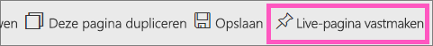
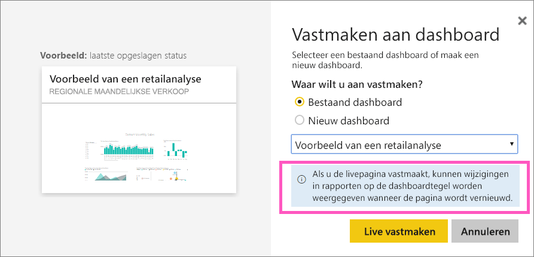
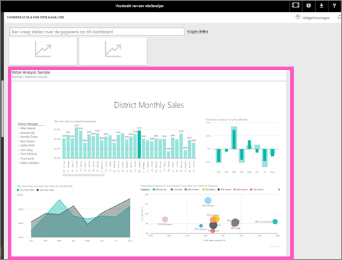

# Een volledige rapportpagina als een live-tegel aan een Power BI-dashboard vastmaken
Een andere manier om een nieuwe [dashboardtegel](service-dashboard-tiles.md) toe te voegen is door een volledige rapportpagina vast te maken. Dit is een eenvoudige manier om meer dan een visualisatie tegelijk vast te maken.  Ook zijn bij het vastmaken van een volledige pagina de tegels *live*; u kunt hiermee direct op het dashboard werken. En wijzigingen die u aan visualisaties aanbrengt in de rapporteditor, zoals een filter toevoegen of de velden wijzigen die worden gebruikt in de grafiek, worden ook in de dashboardtegel doorgevoerd.  

Live-tegels van rapporten vastmaken aan dashboards is alleen beschikbaar in de Power BI-service (app.powerbi.com).

> [!NOTE]
> U kunt geen tegels vastmaken voor rapporten die met u zijn gedeeld.
> 
> 

## Een rapportpagina vastmaken
Bekijk hoe Amanda een live-rapportpagina aan een dashboard vastmaakt. Volg vervolgens de stapsgewijze instructies onder de video om het zelf te proberen.

<iframe width="560" height="315" src="https://www.youtube.com/embed/EzhfBpPboPA" frameborder="0" allowfullscreen></iframe>

1. Open een rapport in de [bewerkweergave](service-interact-with-a-report-in-editing-view.md).
2. Selecteer zonder dat er visualisaties zijn geselecteerd **Live-pagina vastmaken** op de menubalk.
   
    
3. Maak de tegel aan een bestaand dashboard of aan een nieuw dashboard vast. Let op de gemarkeerde tekst: *Als u de live-pagina vastmaakt, kunnen wijzigingen in rapporten op de dashboardtegel worden weergegeven wanneer de pagina wordt vernieuwd.*
   
   * Bestaand dashboard: selecteer de naam van het dashboard in de vervolgkeuzelijst. Dashboards die met u zijn gedeeld, worden niet weergegeven in de vervolgkeuzelijst.
   * Nieuw dashboard: typ de naam van het nieuwe dashboard.
     
     
4. Selecteer **Live vastmaken**. Een bericht (rechtsboven) laat u weten dat de pagina als tegel aan uw dashboard is toegevoegd.

## Het dashboard openen om de vastgemaakte live-tegel te zien
1. Selecteer het dashboard met de nieuwe live-tegel in het navigatievenster. Daar kunt u bijvoorbeeld de volgende acties voor de vastgemaakt rapportpagina uitvoeren: [naam wijzigen, vergroten of verkleinen, koppelen en verplaatsen](service-dashboard-edit-tile.md).  
2. Interactie met de live-tegel.  In de onderstaande schermafbeelding heeft het selecteren van een balk in de kolomgrafiek als resultaat dat de andere visualisaties op de tegel kruislings zijn gefilterd en gemarkeerd.
   
    

## Volgende stappen
[Dashboards in Power BI](service-dashboards.md)

Hebt u nog vragen? [Misschien dat de Power BI-community het antwoord weet](http://community.powerbi.com/)

